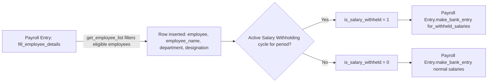

# Payroll Employee Detail

Payroll Employee Detail is the child table row representing a single employee included in a [[Payroll Entry]] run. It exists so a Payroll Entry can hold and display a concrete roster of employees (with a snapshot of their department/designation and their salary-withholding status) rather than re-querying eligibility live every time the entry is viewed or processed.

## Key Fields

| Field | Type | Purpose |
|---|---|---|
| `employee` | Link (Employee) | The employee included in this payroll run; identifies which [[Employee]] a Salary Slip will be created for. |
| `employee_name` | Data, fetched from `employee.employee_name` | Read-only display name, kept in sync via `fetch_from`. |
| `department` | Link (Department), fetched from `employee.department` | Read-only snapshot for filtering/reporting within the parent Payroll Entry. |
| `designation` | Data, fetched from `employee.designation` | Read-only snapshot, same purpose as department. |
| `is_salary_withheld` | Check | Set by `Payroll Entry.update_employees_with_withheld_salaries()` when an active [[Salary Withholding]] cycle exists for the employee over the payroll period; drives `Payroll Entry.has_bank_entries()` logic that separates withheld-salary payment from the normal bank entry. |

## Relationships

- [[Payroll Entry]] — parent document; this table is populated wholesale by `Payroll Entry.fill_employee_details()` (via `get_employee_list`) and read back by every downstream Payroll Entry method (`create_salary_slips`, `get_employees_with_unmarked_attendance`, `make_bank_entry`, etc.) to know which employees to act on.
- [[Employee]] — source of `employee_name`, `department`, `designation` via `fetch_from`; the row is meaningless without a valid Employee.
- [[Salary Withholding]] — indirectly, via the `is_salary_withheld` flag which mirrors whether the employee has an open withholding cycle for the run's dates.

## Logic — What Happens and Why

No controller logic exists in this doctype itself (`payroll_employee_detail.py`, not separately inspected here beyond the standard Frappe `Document` base, contains no custom overrides — the JSON defines no scripts and the doctype has `permissions: []`, `read_only: 1`, `quick_entry: 1`). All behavior affecting this table lives in the parent [[Payroll Entry]] controller:
- Rows are entirely replaced (`self.set("employees", employees)`) during `fill_employee_details`, not edited incrementally by a user in the normal flow.
- `is_salary_withheld` is the only field ever written outside of `fetch_from`, set in `update_employees_with_withheld_salaries` right after the roster is filled.
- `track_changes: 1` is set on the doctype, so edits to rows are recorded in the version history of the parent document.
- Being `read_only: 1` at the doctype level reinforces that this table is a generated snapshot, not a form the user is expected to hand-edit.

## Roles & Permissions

| Role | Can Do | Notes |
|---|---|---|
| — | — | `permissions: []` in `payroll_employee_detail.json` — no roles are defined directly on this child doctype. As a child table, access is governed entirely by the parent [[Payroll Entry]]'s permissions (HR Manager); the doctype's own `read_only: 1` flag additionally prevents ad hoc editing outside the parent form's controlled flows. |

## Mermaid: State/Flow

