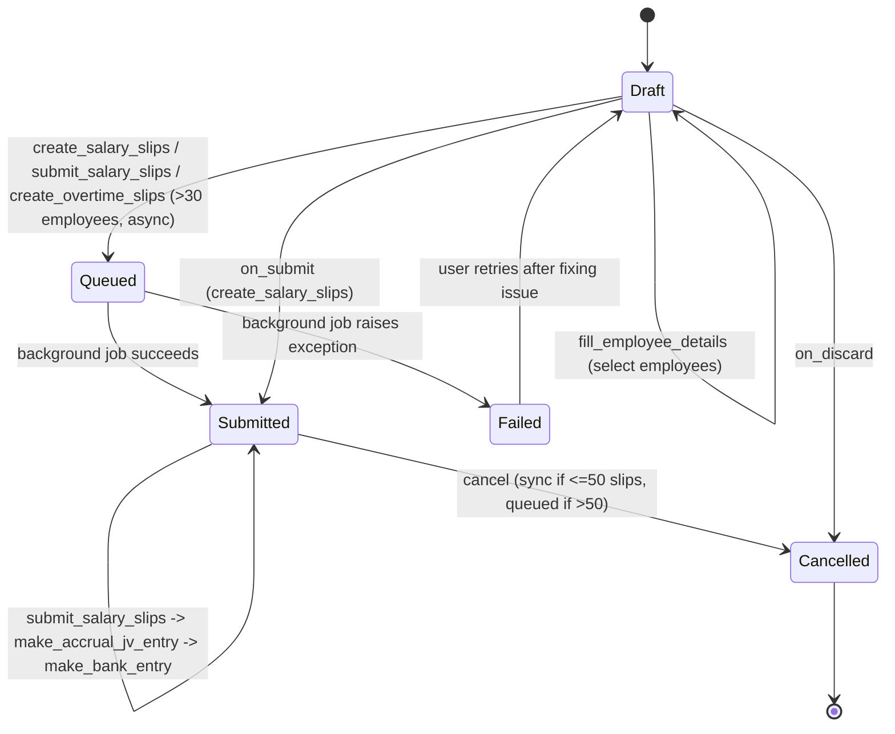

# Payroll Entry

Payroll Entry is the batch-processing control document that drives an entire payroll run for a group of employees over a period: it selects the eligible employees, generates their [[Salary Slip]]s, submits them, and posts the resulting accrual and bank-payment accounting entries as [[Journal Entry]] records. It exists so payroll is run once per company/period as a single auditable, submittable transaction rather than employees' salary slips being created and posted ad hoc.

## Key Fields

| Field | Type | Purpose |
|---|---|---|
| `company` | Link (Company) | Scopes employee selection and accounting company. |
| `branch`, `department`, `designation`, `grade` | Link | Optional filters narrowing which employees are pulled into the run. |
| `currency`, `exchange_rate` | Link/Float | Currency of the run; used to convert amounts into company currency for GL/journal postings. |
| `payroll_frequency` | Select (Monthly/Fortnightly/Bimonthly/Weekly/Daily) | Determines which [[Salary Structure]]s qualify and default start/end dates. Required unless `salary_slip_based_on_timesheet`. |
| `salary_slip_based_on_timesheet` | Check | Switches employee/structure filtering to timesheet-driven structures instead of frequency-driven ones. |
| `start_date`, `end_date` | Date | Payroll period boundaries; drives salary slip date range, attendance checks, and duplicate-slip checks. |
| `posting_date` | Date | Posting date used on created salary slips and on the accrual/bank Journal Entries. |
| `payroll_payable_account` | Link (Account) | Must be an account of type "Payable"; the payroll liability account credited by the accrual JV and debited by the bank JV. |
| `cost_center` | Link (Cost Center) | Default cost center for GL rows when no employee-level cost-center split exists. |
| `project` | Link (Project) | Propagated onto journal entry account rows. |
| `payment_account` | Link (Account), fetched from `bank_account.account` | Bank/cash account debited when payroll is paid out via `make_bank_entry`. |
| `bank_account` | Link (Bank Account) | Source of `payment_account`. |
| `deduct_tax_for_unsubmitted_tax_exemption_proof` | Check | Passed through to Salary Slip creation args, affecting tax calculation there. |
| `validate_attendance` | Check | If set, blocks submission unless attendance is marked for all payroll days per employee (`get_employees_with_unmarked_attendance`). |
| `employees` | Table ([[Payroll Employee Detail]]) | The selected employee roster for this run; `number_of_employees` is derived from its length. |
| `number_of_employees` | Int, read-only | `len(self.employees)`, set in `validate()`. |
| `salary_slips_created` / `salary_slips_submitted` | Check, hidden, no_copy | Internal progress flags toggled by the create/submit background jobs; drive UI buttons and `onload()` state. |
| `overtime_step` | Select ("" / Create / Submit) | Computed on `onload()` to prompt the user through Overtime Slip creation/submission before payroll if `create_overtime_slip` is enabled in Payroll Settings. |
| `status` | Select (Draft/Submitted/Cancelled/Queued/Failed) | Lifecycle status; `Queued`/`Failed` are used only by the background-job flows. |
| `error_message` | Text Editor, read-only | Populated by `log_payroll_failure` when a background salary-slip creation/submission job fails. |
| `amended_from` | Link (Payroll Entry) | Standard amendment link for a cancelled-then-recreated entry. |

## Relationships

- [[Payroll Employee Detail]] — child table, holds the roster of employees (and their `is_salary_withheld` flag) included in this run.
- [[Salary Slip]] — triggers creation of one Salary Slip per employee (`create_salary_slips` / `create_salary_slips_for_employees`); Salary Slips store back-reference `payroll_entry`; on cancel, linked Salary Slips are cancelled and deleted (`delete_linked_salary_slips`).
- [[Salary Structure]] / [[Salary Structure Assignment]] — used to determine eligible employees (`get_salary_structure`, `get_filtered_employees`) via active, submitted Salary Structure Assignments matching company/currency/frequency/payable account.
- [[Employee]] — filtered by company, status, date of joining/relieving date, department/branch/designation/grade to build the payroll population.
- [[Employee Cost Center]] — read via a Salary Structure Assignment subquery to split earnings/deductions/payable amounts across cost centers per employee (`get_payroll_cost_centers_for_employee`).
- [[Journal Entry]] — created and submitted for (a) the accrual entry across earnings/deductions/payable accounts (`make_accrual_jv_entry` → `make_journal_entry`), and (b) the bank/cash payment entry (`make_bank_entry` → `set_accounting_entries_for_bank_entry`); linked back to Salary Slips via `Salary Slip.journal_entry`. Cancelling the Payroll Entry cancels these Journal Entries (`cancel_linked_journal_entries`).
- [[Salary Component]] / [[Salary Component Account]] — earnings/deductions summed per component and mapped to GL accounts (`get_salary_component_account`, `get_salary_component_total`).
- [[Employee Advance]] — deductions tagged with an `additional_salary` referencing an Employee Advance are posted as separate advance-settlement JV rows against the employee as party (`get_advance_deduction`, `add_advance_deduction_entry`).
- [[Salary Withholding]] — employees with an active withholding cycle for the period are flagged `is_salary_withheld` (`update_employees_with_withheld_salaries`, `get_salary_withholdings`); withheld salary slips are excluded from the normal bank entry and paid separately via `make_bank_entry(for_withheld_salaries=True)`, then linked back with `link_bank_entry_in_salary_withholdings`. Cancelling the linked Journal Entry (via the `Journal Entry` `on_cancel` hook in `hrms/hooks.py`) calls `salary_withholding.update_salary_withholding_payment_status`, keeping withholding payment status in sync.
- [[Overtime Slip]] — optionally created and submitted for eligible employees before/around payroll (`create_overtime_slips`, `submit_overtime_slips`), tracked via `overtime_step` and linked back via `Overtime Slip.payroll_entry` (declared in `links` in payroll_entry.json).
- Loan repayments — if the `lending` app is installed, `process_loan_repayments_for_bank_entry` nets each employee's `Salary Slip.total_loan_repayment` out of the bank entry amount (loan repayment itself happens inside Salary Slip, not here).
- Payment Ledger Entry — cancelled alongside their parent Journal Entries on Payroll Entry cancellation (`cancel_linked_journal_entries`, `cancel_linked_payment_ledger_entries`).
- Company / Account / Bank Account / Cost Center / Project — standard master links controlling GL posting.

## Logic — What Happens and Why

**Employee selection (draft stage).** `fill_employee_details()` (whitelisted) builds a filter dict from company/branch/department/designation/grade/currency/dates/payable account/timesheet flag (`make_filters`) and calls `get_employee_list`, which: (1) finds active, submitted [[Salary Structure]]s matching company/currency/frequency/timesheet flag (`get_salary_structure`); (2) joins [[Employee]] to submitted [[Salary Structure Assignment]] rows matching those structures, the same payable account, and active employment dates spanning the payroll period (`get_filtered_employees`); (3) removes employees who already have a submitted Salary Slip for the exact same start/end dates (`remove_payrolled_employees`) to prevent duplicate payroll for a period. If no employees match, it throws with a detailed diagnostic message listing every filter used. `update_employees_with_withheld_salaries()` then flags employees with an open Salary Withholding cycle for the exact period.

**Attendance validation.** If `validate_attendance` is checked, `get_employees_with_unmarked_attendance()` computes, per employee, payroll days minus (holidays + marked attendance count) using each employee's actual joining/relieving-adjusted date range (`get_payroll_dates_for_employee`) and the company's default or employee's own holiday list; any employee with unmarked days is reported, and `before_submit()` throws to block submission if any exist. Business reason: payroll should not run for days where attendance is undetermined when the company opts into this control.

**Validate → before_submit → submit.** `validate()` recomputes `number_of_employees` and sets `status` from `docstatus`. `before_submit()` guards against duplicate Salary Slips for the same employee/date range (`validate_existing_salary_slips`, throws "Duplicate Entry"), verifies `payroll_payable_account` is of account_type "Payable" (`validate_payroll_payable_account`), and re-checks attendance. `on_submit()` sets status to "Submitted" and calls `create_salary_slips()`.

**Salary Slip creation.** `create_salary_slips()` (whitelisted) packages period/company/tax/currency args and either runs `create_salary_slips_for_employees` synchronously or, if more than 30 employees (or the `enqueue_payroll_entry` flag is set), sets status "Queued" and background-enqueues it. The worker (`create_salary_slips_for_employees`) skips employees who already have a non-cancelled Salary Slip for that period/company/payroll entry (`get_existing_salary_slips`), inserts a new Salary Slip per remaining employee, then sets `salary_slips_created=1` and status back to "Submitted". On any exception it rolls back, calls `log_payroll_failure` (writes an Error Log, stores the message in `error_message`, sets status "Failed"), and always publishes a `completed_salary_slip_creation` realtime event so the UI can refresh. This async/queued design exists because generating hundreds of salary slips synchronously would time out a web request.

**Salary Slip submission.** `submit_salary_slips()` (whitelisted) fetches unsubmitted slips matching this entry/date range/timesheet flag that have no `journal_entry` yet (`get_sal_slip_list`), and — again above a 30-employee threshold or the enqueue flag — either runs inline or enqueues `submit_salary_slips_for_employees`. That worker submits each slip (skipping/collecting as "unsubmitted" any with negative net pay or that fail validation), and if any were submitted, immediately calls `make_accrual_jv_entry(submitted)` to post the accrual JV, `email_salary_slip(submitted)` to notify employees if `Payroll Settings.email_salary_slip_to_employee` is enabled, and sets `salary_slips_submitted=1`. Failures behave like the creation job (rollback, `log_payroll_failure`, status "Failed"). `frappe.flags.via_payroll_entry` is set during this pass so Salary Slip's own controller can tell it's being submitted in bulk.

**Accrual Journal Entry (`make_accrual_jv_entry`).** For each submitted salary slip, earnings and deductions per Salary Component are totaled (`get_salary_component_total`), each split across the employee's cost centers (`get_payroll_cost_centers_for_employee`, falling back to Employee's or Department's `payroll_cost_center` or the Payroll Entry's own `cost_center`). If `Payroll Settings.process_payroll_accounting_entry_based_on_employee` is enabled, entries are additionally grouped per employee (`set_employee_based_payroll_payable_entries`) so the payable side posts one row per employee with Employee as `party`. Deductions linked to an Employee Advance via Additional Salary are split out into separate credit rows against the employee as party with `reference_type=Employee Advance` (so the JV settles the advance) rather than folding into the generic deductions total. The net payable amount is posted against `payroll_payable_account`. The resulting accounts list is passed to `make_journal_entry`, which creates, saves (`ignore_permissions=True`) and submits a Journal Entry of type "Journal Entry", and then calls `set_journal_entry_in_salary_slips` to stamp `journal_entry` back onto each submitted Salary Slip (so slips can't be re-picked into another accrual run — see `get_sal_slip_list`'s `journal_entry is null` filter). Any failure during save/submit is logged via `self.log_error("Journal Entry creation against Salary Slip failed")` and re-raised.

**Bank/Cash Entry (`make_bank_entry`).** Whitelisted; aggregates Salary Detail rows for submitted, non-statistical earnings/deductions of salary slips in the period (excluding or including `status == "Withheld"` rows depending on the `for_withheld_salaries` argument), nets loan repayments if the `lending` app is installed (`process_loan_repayments_for_bank_entry`), and if the net amount is positive, builds a Journal Entry crediting `payment_account` (type "Bank Entry" or "Cash Entry" depending on the account's `account_type`) and debiting `payroll_payable_account` (split per employee/cost-center when employee-wise accounting is enabled). For withheld salaries, it additionally calls `link_bank_entry_in_salary_withholdings` so the [[Salary Withholding]] record captures which bank entry paid it. `has_bank_entries()` (whitelisted) reports whether a Bank/Cash Entry already exists referencing this Payroll Entry, and whether any employees still have withheld salaries pending a separate bank entry — driving the UI's payment buttons.

**Overtime Slip integration.** If `Payroll Settings.create_overtime_slip` is on, `onload()` computes `overtime_step` ("Create" if eligible employees lack an Overtime Slip, "Submit" if unsubmitted Overtime Slips exist for this entry) so the form nudges the user through `create_overtime_slips()` / `submit_overtime_slips()` before running payroll; both follow the same inline-vs-enqueue-above-30 pattern as salary slip creation.

**Cancellation.** `cancel()` overrides the default: if more than 50 linked Salary Slips exist, cancellation is queued (`queue_action("cancel", timeout=3000)`) with a user-facing warning that failures revert status to Submitted; otherwise it cancels synchronously. `on_cancel()` sets `ignore_linked_doctypes = ("GL Entry", "Salary Slip", "Journal Entry")` (so Frappe's generic link-check doesn't block cancellation) and: (1) `delete_linked_salary_slips` — cancels then permanently deletes every linked Salary Slip; (2) `cancel_linked_journal_entries` — for every submitted Journal Entry referencing this Payroll Entry, first cancels its linked Payment Ledger Entries, then cancels the Journal Entry itself (`ignore_permissions=True`); cancelling that Journal Entry fires the framework-level `Journal Entry` `on_cancel` doc_event in `hrms/hooks.py`, which calls `salary_slip.unlink_ref_doc_from_salary_slip` (redundant safety since the slips are already deleted) and `salary_withholding.update_salary_withholding_payment_status` (keeps withholding payment state correct when its funding JV is reversed); (3) `cancel_linked_payment_ledger_entries` — cancels any remaining Payment Ledger Entries where this Payroll Entry is the *against* voucher. Finally it resets `salary_slips_created`/`salary_slips_submitted` to 0, sets status "Cancelled", and clears `error_message`. `on_discard()` (draft delete) just force-sets status "Cancelled" without side effects since nothing was ever submitted.

**Telemetry.** `hrms/hooks.py` registers `"Payroll Entry": {"on_submit": "hrms.telemetry.on_payroll_entry_submit"}` — a usage-analytics ping only, no business-logic effect.

**Other hook registrations (`hrms/hooks.py`).** Payroll Entry is listed in `period_closing_doctypes`, `accounting_dimension_doctypes` (so custom accounting dimensions apply to its journal rows via `get_accounting_dimensions`/`update_accounting_dimensions`), and `audit_trail_doctypes` (change history tracked for compliance) — these are framework-level configuration flags, not custom logic in this doctype's own controller. No regional override (`hrms.regional.*` or `@hrms.allow_regional`) is referenced anywhere in `payroll_entry.py`.

**Payroll period helpers.** `get_start_end_dates()` (whitelisted) computes default start/end dates from `payroll_frequency` and the fiscal year (via `get_month_details`), handling Monthly/Bimonthly (split at the 15th)/Weekly/Fortnightly/Daily. `get_end_date()` (whitelisted) is a client-facing helper for single-date-plus-frequency end-date calculation.

## Roles & Permissions

| Role | Can Do | Notes |
|---|---|---|
| [[HR Manager]] | Read, Write, Create, Submit, Cancel, Delete, Report, Share | Sole role defined in `permissions[]` in `payroll_entry.json`; no other role has explicit rights. Whitelisted methods (`fill_employee_details`, `create_salary_slips`, `submit_salary_slips`, `make_bank_entry`, etc.) additionally call `self.check_permission("write")`, so any user without HR Manager (or a custom role granted equivalent permissions) cannot invoke them even via API. |

## Mermaid: State/Flow

