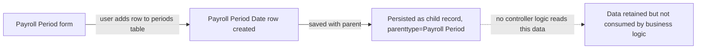

# Payroll Period Date

A pure child-table row representing one sub-date-range (`start_date`/`end_date` pair) inside the `periods` table field of [[Payroll Period]]. It exists as an optional finer-grained breakdown of a Payroll Period's overall date span (the field is a hidden section in the parent form by default), but no core Payroll/HR controller logic in this codebase reads or writes it — it is schema-only scaffolding.

## Key Fields

| Field | Type | Purpose |
|---|---|---|
| `start_date` | Date | Start of the sub-period row. |
| `end_date` | Date | End of the sub-period row. |

## Relationships

- [[Payroll Period]] — parent doctype; this table is the `periods` field on Payroll Period.

## Logic — What Happens and Why

`PayrollPeriodDate` has no overridden methods (`pass`-only controller). No `validate`, `on_update`, or cross-doctype side effects exist in code. The parent [[Payroll Period]]'s `validate()` does not iterate or validate rows of this child table. It functions purely as a data container field that a user could optionally populate for reference; no reader of this table was found elsewhere in `hrms`.

## Roles & Permissions

Inherits parent doctype's permissions ([[Payroll Period]]) — not independently permissioned in code (empty `permissions` array in JSON, standard for child tables).

## Mermaid: State/Flow

