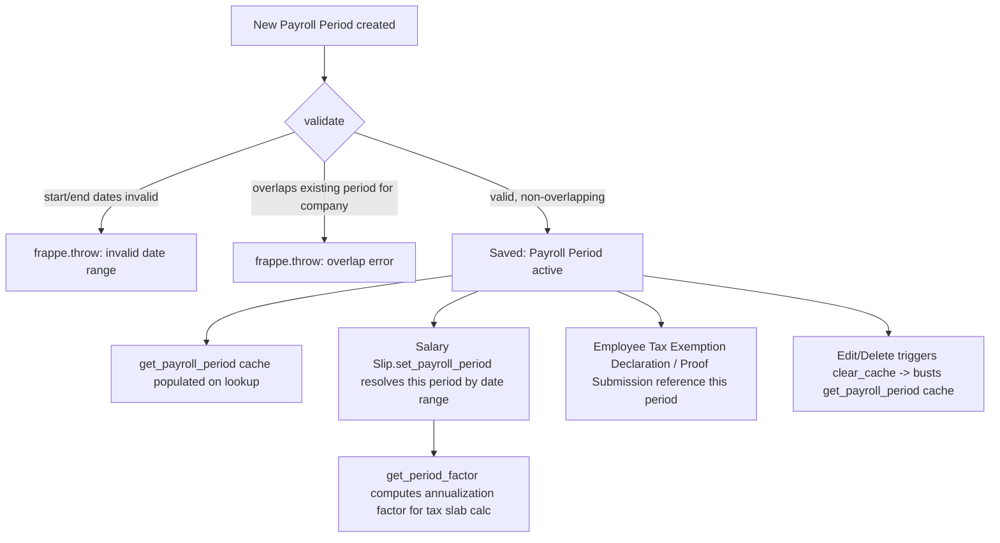

# Payroll Period

A Payroll Period defines a fiscal tax-computation window (typically a full year, e.g. India's April–March financial year) for one Company. It exists so that annual income tax calculations, tax slab application, and tax exemption declarations/proofs have a bounded date range to compute against — payroll itself runs per Salary Slip, but tax withholding needs to be pro-rated and reconciled across the whole period, not just a single slip's date range.

## Key Fields

| Field | Type | Purpose |
|---|---|---|
| `company` | Link (Company) | Scopes the period to one company; overlap validation is per-company. |
| `start_date` | Date | Start of the fiscal/tax period. |
| `end_date` | Date | End of the fiscal/tax period. |
| `periods` | Table ([[Payroll Period Date]]) | Optional sub-period breakdown table (hidden section by default; not populated by any core controller logic found). |

## Relationships

- [[Payroll Period Date]] — child table (`periods` field), holds optional sub-date-ranges.
- [[Company]] — linked from, one Payroll Period belongs to one Company.
- [[Salary Slip]] — linked from (`payroll_period` field on Salary Slip); used to compute tax period-factor and drives income-tax proration logic in `hrms.payroll.doctype.salary_slip.salary_slip`.
- [[Salary Structure Assignment]] — read for `payroll_period` in tax-exemption validation logic (`hrms.hr.doctype.employee_tax_exemption_declaration` / related, via `frappe.db.get_value("Payroll Period", ..., "start_date"/"end_date")`).
- [[Employee Tax Exemption Declaration]] — linked from (per the doctype's dashboard `get_data()`), an employee's tax exemption declaration is tied to a Payroll Period.
- [[Employee Tax Exemption Proof Submission]] — linked from (per dashboard `get_data()`).
- [[Income Tax Slab]] — used together with Payroll Period during annual tax computation on Salary Slip (not a direct field link on this doctype, but both are consumed together in tax logic).

## Logic — What Happens and Why

**Create/validate (`PayrollPeriod.validate`)**:
- `validate_from_to_dates("start_date", "end_date")` — standard Frappe check that `end_date` is not before `start_date`.
- `validate_overlap()` — queries all other Payroll Period rows for the same `company` and throws `frappe.throw` if the new/edited period's date range overlaps an existing period's range (checks start-within, end-within, or fully-enclosing overlap via Frappe Query Builder `between`/comparison logic). This exists because tax computation logic assumes exactly one Payroll Period matches any given date for a company — overlapping periods would make period lookups (`get_payroll_period`) ambiguous and corrupt annual tax proration.
- `clear_cache()` override additionally busts the `get_payroll_period()` redis cache (`get_payroll_period.clear_cache()`) whenever a Payroll Period document changes, since that function is decorated `@redis_cache()`.

**Client-side (`payroll_period.js`)**: on a new (unsaved) document, `set_start_date` auto-fills `start_date` to the day after the most recent existing Payroll Period's `end_date` (or the company's fiscal-year start default if none exist), and editing `start_date` auto-computes `end_date` as `start_date + 12 months - 1 day`. This is UX convenience only — the real overlap/date validation happens server-side in `validate()`.

**Module-level helper functions (not doctype methods, but the doctype's real business logic surface)**:
- `get_payroll_period_days(start_date, end_date, employee, company)` — finds the Payroll Period whose range fully contains `[start_date, end_date]` for the employee's company, then computes `actual_no_of_days` and `working_days` (subtracting holidays unless [[Payroll Settings]]' `include_holidays_in_total_working_days` is enabled). Used to determine total available working/calendar days within the tax period for pro-rating.
- `get_payroll_period(from_date, to_date, company)` — cached (`@redis_cache()`) lookup returning the single Payroll Period record covering a date range for a company; called from `Salary Slip.set_payroll_period` (in `hrms/payroll/doctype/salary_slip/salary_slip.py`) to attach `self.__payroll_period` to a slip for tax calculation.
- `get_period_factor(...)` — computes `total_sub_periods` and `remaining_sub_periods` (e.g., how many of 12 monthly sub-periods, or day-based fractions, remain in the year from the employee's joining/relieving date through the slip's date range). This factor is core to annualizing partial-year income for tax-slab calculation — e.g., an employee joining mid-year should have their tax computed on annualized-then-prorated income, not raw slip income. Adjusts for employee `date_of_joining`/`relieving_date` clipping the effective period boundaries.

**Regional read (not a hook/override)**: `hrms.regional.india.utils` reads Payroll Period dates directly — `frappe.db.get_value("Payroll Period", doc.payroll_period, "start_date")` and the equivalent for `end_date` — for HRA/tax exemption period calculations (e.g. validating Salary Structure Assignment effective dates fall within the payroll period, and computing exemption periods). This is a plain read, not a doctype hook.

**No hooks.py doc_events**: grepped `hrms/hooks.py` — no `doc_events` entries for "Payroll Period". It appears only in `company_data_to_be_ignored` (a list of doctypes excluded from company-linked-data cleanup when deleting a Company), unrelated to business logic.

**Cancel/delete**: no `on_cancel`/`on_trash` logic defined; deletion is a plain document delete (subject to link-exists constraints from Salary Slip/tax exemption records referencing it).

## Roles & Permissions

| Role | Can Do | Notes |
|---|---|---|
| [[System Manager]] | Create, Read, Write, Delete, Email, Export, Print, Report, Share | Full rights. |
| [[HR Manager]] | Create, Read, Write, Delete, Email, Export, Print, Report, Share | Full rights, same as System Manager. |
| [[HR User]] | Create, Read, Write, Delete, Email, Export, Print, Report, Share | Full rights, same as System Manager. |
| [[Employee]] | Read, Email, Export, Print, Report, Share | Read-only visibility; cannot create/write/delete. |

## Mermaid: State/Flow

