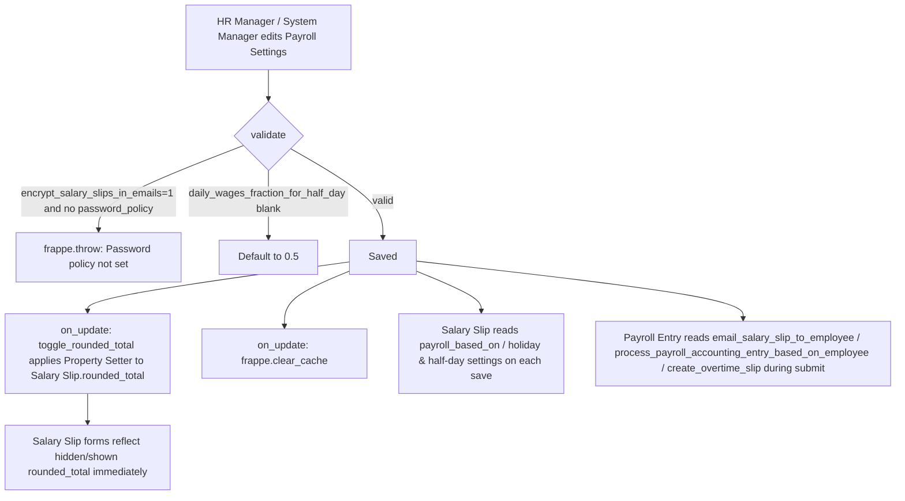

# Payroll Settings

A Single doctype (one global record, no list) holding company-wide configuration that governs how [[Salary Slip]] working-day/absence calculations, tax-slip emailing, and [[Payroll Entry]] accounting/overtime behavior work. It exists so that these cross-cutting policy decisions — e.g. "is payroll based on Leave or Attendance", "email password-protect salary slips" — are centralized once instead of configured per Salary Structure or per run.

## Key Fields

| Field | Type | Purpose |
|---|---|---|
| `payroll_based_on` | Select (Leave/Attendance) | Drives whether [[Salary Slip]]'s working-day/payment-day calculation (`get_working_days_details` in `salary_slip.py`) uses Leave Application records or Attendance records as the source of absence data. |
| `consider_unmarked_attendance_as` | Select (Present/Absent) | Only relevant when `payroll_based_on = Attendance`; tells Salary Slip how to treat days with no Attendance record at all. |
| `include_holidays_in_total_working_days` | Check | If enabled, holidays count toward total working days on a Salary Slip (reduces per-day salary rate); if disabled, holidays are excluded from the working-day denominator. |
| `consider_marked_attendance_on_holidays` | Check | Only active when the above is enabled; if checked, an explicit Absent attendance marked on a holiday still deducts a payment day instead of holidays being auto-paid. |
| `max_working_hours_against_timesheet` | Float | Caps the working hours Salary Slip will accept per day when computing timesheet-based salary (used with [[Salary Slip Timesheet]]/[[Timesheet]] hourly-rate calculation). |
| `daily_wages_fraction_for_half_day` | Float (default 0.5) | Fraction of a full day's wage paid for a half-day; used throughout Salary Slip's leave-without-pay (LWP) and half-day absence math. Re-defaulted to 0.5 in `validate()` if left blank. |
| `disable_rounded_total` | Check | Hides/disables the `rounded_total` field on [[Salary Slip]] via a Property Setter applied in `on_update` → `toggle_rounded_total()`. |
| `show_leave_balances_in_salary_slip` | Check | Controls whether Salary Slip populates its `leave_details` ([[Salary Slip Leave]]) child table on save (`set_leave_details`/related logic checked via `frappe.db.get_single_value("Payroll Settings", "show_leave_balances_in_salary_slip")`). |
| `email_salary_slip_to_employee` | Check (default 1) | Controls whether [[Salary Slip]] and [[Payroll Entry]] auto-email the generated slip PDF to the employee's preferred email on submit. |
| `sender` / `sender_copy` | Link (Email Account) | Outgoing email account(s) used when emailing salary slips; `sender` is filtered to `enable_outgoing=1` accounts in the form's `set_query`. |
| `sender_email` | Data (fetched, read-only) | Fetched from `sender.email_id`. |
| `email_template` | Link (Email Template) | Template used for the salary-slip email body. |
| `encrypt_salary_slips_in_emails` | Check | If enabled, the emailed Salary Slip PDF is password-protected; requires `password_policy` to be set (enforced in `validate_password_policy()`). |
| `password_policy` | Data | Pattern (e.g. `SAL-{first_name}-{date_of_birth.year}`) used by `generate_password_for_pdf()` to build the per-employee PDF password; client-side `validate` on the form strips spaces/double-hyphens and normalizes to hyphen-joined tokens. |
| `process_payroll_accounting_entry_based_on_employee` | Check | Controls whether [[Payroll Entry]] books the Payroll Payable GL entry per-employee vs. as one consolidated entry (read via `frappe.db.get_single_value` in `payroll_entry.py`). |
| `mandatory_benefit_application` | Check | If enabled, flexible benefit components on Salary Slip are only considered if an Employee Benefit Application exists for the employee (enforced in Salary Slip logic near `mandatory_benefit_application` checks). |
| `create_overtime_slip` | Check | If enabled, [[Payroll Entry]] triggers `create_overtime_slips()` / `create_overtime_slips_for_employees()` as part of payroll processing to auto-generate overtime slips for eligible employees. |

## Relationships

- [[Salary Slip]] — heavily driven by this Single: `payroll_based_on`, `include_holidays_in_total_working_days`, `consider_marked_attendance_on_holidays`, `daily_wages_fraction_for_half_day`, `consider_unmarked_attendance_as` control `get_working_days_details`/absence-day math; `disable_rounded_total` toggles a Property Setter on Salary Slip's `rounded_total` field; `email_salary_slip_to_employee`, `encrypt_salary_slips_in_emails`, `password_policy` control the emailed-PDF flow; `show_leave_balances_in_salary_slip` controls population of the `leave_details` child table; `mandatory_benefit_application` gates flexible-benefit component inclusion; `max_working_hours_against_timesheet` caps timesheet-based salary hours.
- [[Payroll Entry]] — `email_salary_slip_to_employee`, `process_payroll_accounting_entry_based_on_employee`, and `create_overtime_slip` are read via `frappe.db.get_single_value("Payroll Settings", ...)` to control emailing, GL booking granularity, and overtime-slip auto-creation during a payroll run.
- [[Email Account]] — linked via `sender`/`sender_copy`.
- [[Email Template]] — linked via `email_template`.

## Logic — What Happens and Why

**`validate()`**:
- `validate_password_policy()` — if both `email_salary_slip_to_employee` and `encrypt_salary_slips_in_emails` are checked, `password_policy` must be set, else `frappe.throw(_("Password policy for Salary Slips is not set"))`. Rationale: encryption is meaningless without a password-generation pattern, and failing at settings-save time (rather than at slip-email time) surfaces the misconfiguration immediately.
- Defaults `daily_wages_fraction_for_half_day` to `0.5` if falsy, guaranteeing downstream Salary Slip math always has a usable fraction even if the field was cleared.

**`on_update()`**:
- `toggle_rounded_total()` — casts `disable_rounded_total` to int and calls `make_property_setter()` twice against the Salary Slip doctype (`rounded_total` field), toggling both `hidden` and `print_hide` properties. This is a live schema mutation of Salary Slip's UI, not just a settings flag — it globally hides/shows a field across all Salary Slip forms/print views the moment settings are saved.
- `frappe.clear_cache()` — clears the whole bench cache so the property-setter change and other settings reads take effect immediately for all users/sessions.

**Client-side (`payroll_settings.js`)**:
- `refresh`: restricts the `sender` Link field's query to Email Accounts with `enable_outgoing=1`.
- `encrypt_salary_slips_in_emails` change: toggles `password_policy` field's `reqd` property live.
- `validate`: sanitizes `password_policy` input — warns if it contains spaces or `--`, then auto-rewrites it by splitting on spaces/hyphens and rejoining with single hyphens, before the value reaches the server-side `validate_password_policy` check.

**No `doc_events` in `hooks.py`** for "Payroll Settings" — confirmed by grep; all cross-doctype effects happen via direct reads (`frappe.db.get_single_value`) from Salary Slip and Payroll Entry code, not via hook wiring.

**Regional check**: no references to Payroll Settings found in `hrms/regional/india/setup.py`, `hrms/regional/india/utils.py`, or `hrms/regional/united_arab_emirates/setup.py`.

## Roles & Permissions

| Role | Can Do | Notes |
|---|---|---|
| [[System Manager]] | Create, Read, Write, Email, Print, Share | Full configuration rights (Single doctype has no delete/submit semantics). |
| [[HR Manager]] | Read, Write | Can view and change settings; no explicit create/email/print rights listed in JSON (irrelevant for a Single doctype which always exists as one record). |

## Mermaid: State/Flow

