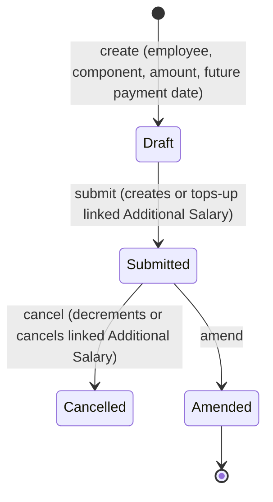

# Retention Bonus

Records a promised bonus for keeping an employee on staff through a future date, and — on submit — automatically converts that promise into a payable Additional Salary on the specified payment date. It exists so retention deals negotiated with an employee are tracked as a formal, auditable HR document rather than a manual payroll adjustment, while still flowing through the same Additional Salary payment mechanism as any other one-off earning.

## Key Fields

| Field | Type | Purpose |
|---|---|---|
| `employee` | Link (Employee) | Recipient; must be active. |
| `salary_component` | Link (Salary Component) | Earning component the bonus is paid under. |
| `bonus_amount` | Currency | Amount, must be non-negative. |
| `bonus_payment_date` | Date | Must not be in the past at validation time. |
| `company` | Link (Company) | For GL/company scoping (fetched into the created Additional Salary). |
| `date_of_joining` | Data (fetched) | Read-only context field from Employee. |

## Relationships

- [[Employee]] — linked from; validated active.
- [[Additional Salary]] — triggers: created (or amount incremented if one already exists for the same employee/component/date) on submit; amount decremented or the Additional Salary cancelled on cancel.
- [[Salary Component]] — linked from (must be an Earning-suitable component).

## Logic — What Happens and Why

**Validate (`validate()`):**
- `validate_active_employee` — no retention bonus for an inactive employee.
- Throws if `bonus_payment_date` is before today — a retention bonus is inherently forward-dated (it rewards staying, so it can't be scheduled in the past).

**Submit (`on_submit()`):**
- Looks up whether an Additional Salary already exists matching this employee, salary component, bonus payment date, company, submitted, undisabled, and referencing this Retention Bonus doctype/name (`get_additional_salary`).
- If none exists, creates a new Additional Salary (non-overwrite) with `payroll_date = bonus_payment_date`, `ref_doctype`/`ref_docname` pointing back to this Retention Bonus, and submits it immediately — this is what actually gets the bonus into the employee's next Salary Slip.
- If one already exists (e.g., a second Retention Bonus for the same employee/component/date), its amount is incremented by this bonus's amount instead of creating a duplicate, and the merged reference is stored via `db_set("additional_salary", ...)`. Note: the `additional_salary` field write path exists in code but isn't declared in the doctype's field list — effectively a no-op field reference in current schema.

**Cancel (`on_cancel()`):**
- Finds the same linked Additional Salary; if found, subtracts this bonus's amount from it. If the result is exactly zero, the Additional Salary is cancelled outright; otherwise its amount is reduced in place (handles the merged-bonus case cleanly).

## Roles & Permissions

| Role | Can Do | Notes |
|---|---|---|
| [[System Manager]] | read/write/create/delete/submit/cancel/amend | Full control. |
| [[HR Manager]] | read/write/create/delete/submit/cancel | Full lifecycle. |
| [[HR User]] | read/write/create/delete/submit/cancel | Same as HR Manager per JSON. |
| [[Employee]] | read | View-only — presumably to see their own bonus (not enforced to "own records only" in code; relies on standard employee-self permission restriction elsewhere in the framework). |

## Mermaid: State/Flow

