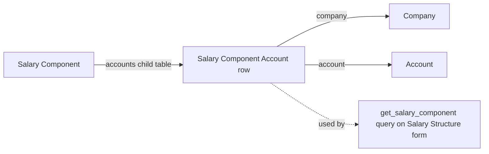

# Salary Component Account

A child-table row on [[Salary Component]] that maps one company to the GL account that component's amount should post against. It exists so a single Salary Component master (e.g. "Provident Fund") can post to a different ledger account per company in a multi-company setup, driving the debit/credit lines of the Journal Entry created for payroll.

## Key Fields

| Field | Type | Purpose |
|---|---|---|
| `company` | Link → Company | The company this account mapping applies to. |
| `account` | Link → Account | The Bank/Cash/Payable account this component posts to for that company; used to auto-fill the account in the Salary Journal Entry when this component's payout mode is selected. |

## Relationships

- [[Salary Component]] — parent/child: this is the `accounts` child table of Salary Component.
- Account — links to: the target ledger account for accounting entries.
- Company — links to: scopes the mapping to one company.

## Logic — What Happens and Why

No controller logic of its own — `SalaryComponentAccount` is a bare `Document` subclass (`pass`). All validation of these rows happens at the parent level: `Salary Component.validate_accounts()` warns if a non-statistical component has no account set for any row, since accounts are needed to post amounts to the general ledger during payroll accounting, but this is a soft warning rather than an enforced constraint.

`hrms.payroll.doctype.salary_structure.salary_structure.get_salary_component()` (used by the Salary Structure form's component-selection query) reads this table to resolve the account/company pairing for a chosen component, filtering to company-agnostic rows or rows matching the structure's company.

## Roles & Permissions

No `permissions` array defined on this child doctype (`istable: 1`) — access is governed entirely by the parent [[Salary Component]] doctype's permissions.

## Mermaid: State/Flow

