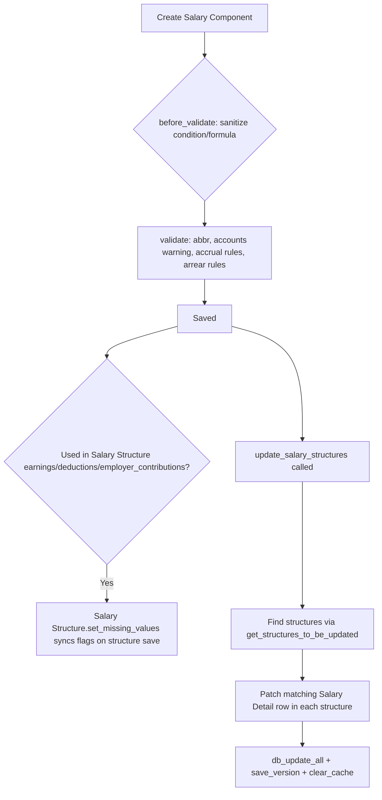

# Salary Component

A master record for one line item that can appear on a payslip — an earning (Basic, HRA), a deduction (PF, TDS), or an employer contribution (employer PF). It centralizes how that line is computed (fixed amount vs. Python formula/condition), how it is taxed, whether it is a flexible benefit, and which GL accounts it posts to, so every [[Salary Structure]] and [[Salary Slip]] that references it behaves consistently without re-specifying the rules per structure.

## Key Fields

| Field | Type | Purpose |
|---|---|---|
| `salary_component` | Data (autoname) | Unique component name; also the row identifier used by [[Salary Detail]]. |
| `salary_component_abbr` | Data | Short abbreviation used as a variable name inside other components' condition/formula expressions (e.g. `BS` for Basic Salary). |
| `type` | Select | `Earning` / `Deduction` / `Employer Contribution` — controls which Salary Structure table (earnings/deductions/employer_contributions) the component belongs to and which validations/UI apply. |
| `is_tax_applicable` | Check | Marks an earning as taxable income. |
| `variable_based_on_taxable_salary` | Check | Marks a deduction as the income-tax component whose amount is auto-computed from the employee's Income Tax Slab rather than a fixed amount/formula. |
| `is_income_tax_component` | Check | Included in the Income Tax Deductions report. |
| `exempted_from_income_tax` | Check | Full amount excluded from taxable income before tax calculation, without proof/declaration. |
| `statistical_component` | Check | Value computable/referenceable by other components' formulas but not added to earnings/deductions totals. |
| `accrual_component` | Check | Earning-only; amount accrues into the Employee Benefit Ledger instead of paying out immediately (used with flexible benefits). |
| `do_not_include_in_total` | Check | Excludes the amount from gross/total earnings or deductions (still shown on slip). |
| `do_not_include_in_accounts` | Check | Excludes the amount from the Journal Entry created for payroll accounting. |
| `depends_on_payment_days` | Check | Amount is prorated by actual payment days in the payroll period. |
| `condition` / `formula` | Code (PythonExpression) | Default condition/formula copied onto [[Salary Structure]] and [[Salary Detail]] rows. |
| `amount` | Currency | Default fixed amount when not formula-based. |
| `amount_based_on_formula` | Check | Switches the row between fixed `amount` and evaluated `formula`. |
| `is_flexible_benefit` | Check | Earning is offered as an employee-selectable flexible benefit. |
| `payout_method` | Select | For flexible benefits: accrue-and-payout-at-cycle-end, accrue-per-cycle-pay-on-claim, or allow-claim-for-full-amount. |
| `max_benefit_amount` | Currency | Yearly cap enforced across employees selecting this benefit. |
| `arrear_component` | Check | Component participates in arrear recalculation. |
| `round_to_the_nearest_integer` | Check | Rounds the computed amount. |
| `remove_if_zero_valued` | Check | Hides the row on the salary slip if amount is zero. |
| `disabled` | Check | Component excluded from new structures/selection. |
| `accounts` (child table) | Table → [[Salary Component Account]] | Per-company GL account mapping for this component. |

## Relationships

- [[Salary Component Account]] — parent/child: `accounts` child table, one row per company's GL account for this component.
- [[Salary Detail]] — linked from: every earnings/deductions/employer_contributions row on a [[Salary Structure]] or [[Salary Slip]] links back via `salary_component`, and several Salary Detail fields (`is_tax_applicable`, `depends_on_payment_days`, `do_not_include_in_total`, `accrual_component`, etc.) are `fetch_from` this doctype.
- [[Salary Structure]] — linked from: `earnings`, `deductions`, `employer_contributions` tables reference this component; `set_missing_values()` on Salary Structure re-syncs several flags from here on save.
- [[Employee Benefit Detail]] — linked from: flexible-benefit selections reference this component and respect `max_benefit_amount`.
- [[Leave Type]] (Leaves module) — linked from: a leave type's `earning_component` field points to the Salary Component used to pay out [[Leave Encashment]].

## Logic — What Happens and Why

**Create/Save (`validate`)**
- `before_validate()` sanitizes `condition` and `formula` via `sanitize_expression` (keeps a pre-sanitized copy in `_condition`/`_formula`) to prevent unsafe expressions while allowing multi-line, readable formulas in the form.
- `validate_abbr()` — auto-derives `salary_component_abbr` from the initials of `salary_component` if not set, then de-duplicates it against other components with `append_number_if_name_exists` (abbreviations must be unique because they act as variable names in other components' formulas).
- `validate_accounts()` — if the component is not statistical and any `accounts` row lacks an `account`, shows a non-blocking warning (accounts are needed for GL posting but are not hard-mandatory at save time).
- `validate_accrual_component()` — enforces: only `Earning` type components may set `accrual_component`; if `is_flexible_benefit` and `payout_method` requires accrual (`Accrue and payout...` or `Accrue per cycle...`), `accrual_component` must be checked, and conversely it must be off for `Allow claim for full benefit amount`. This keeps the benefit-ledger accrual mechanism internally consistent.
- `valide_arrear_component()` — a component cannot be both `variable_based_on_taxable_salary` (tax slab driven) and `arrear_component`, since tax amounts aren't retroactively "arrear-able" the same way fixed pay is.
- `on_update()` restores the original (pre-sanitized) `condition`/`formula` text via `db_set` so the form displays the human-authored multi-line version, not the sanitized single-line version used for evaluation.
- `clear_cache()` additionally clears the Salary Slip's `SALARY_COMPONENT_VALUES` and `TAX_COMPONENTS_BY_COMPANY` caches so salary slip generation immediately reflects component changes.

**Propagating changes to existing structures**
- `get_structures_to_be_updated()` — whitelisted method finding every non-cancelled [[Salary Structure]] that already has a [[Salary Detail]] row for this component (joins Salary Structure ↔ Salary Detail).
- `update_salary_structures(field, value, structures)` — whitelisted bulk-update: for each affected structure, checks write permission, locates the matching Salary Detail row (using `COMPONENT_TYPE_TO_PARENTFIELD` to pick earnings/deductions/employer_contributions), updates the given field, calls `db_update_all()`, records a version entry ("via Salary Component sync"), and clears the structure's cache so future Salary Slip generation picks up the new formula/condition/amount immediately. This lets an HR user change a component's formula once and cascade it to every structure using it, rather than editing each structure individually.

**Regional/hook overrides**
- `hrms/regional/india/setup.py` references "Salary Component" only to seed default India-specific components (e.g. HRA, Provident Fund) during setup — regional override exists (setup/fixture data, not runtime logic).
- No entry for "Salary Component" in `hrms/hooks.py` doc_events.

## Roles & Permissions

| Role | Can Do | Notes |
|---|---|---|
| [[HR User]] | read/write/create/export/print/report/share | Full functional access, no delete. |
| [[HR Manager]] | read/write/create/delete/export/print/report/share | Full access including delete. |
| [[Employee]] | read | View-only, e.g. to see component names on their own payslip. |

## Mermaid: State/Flow

