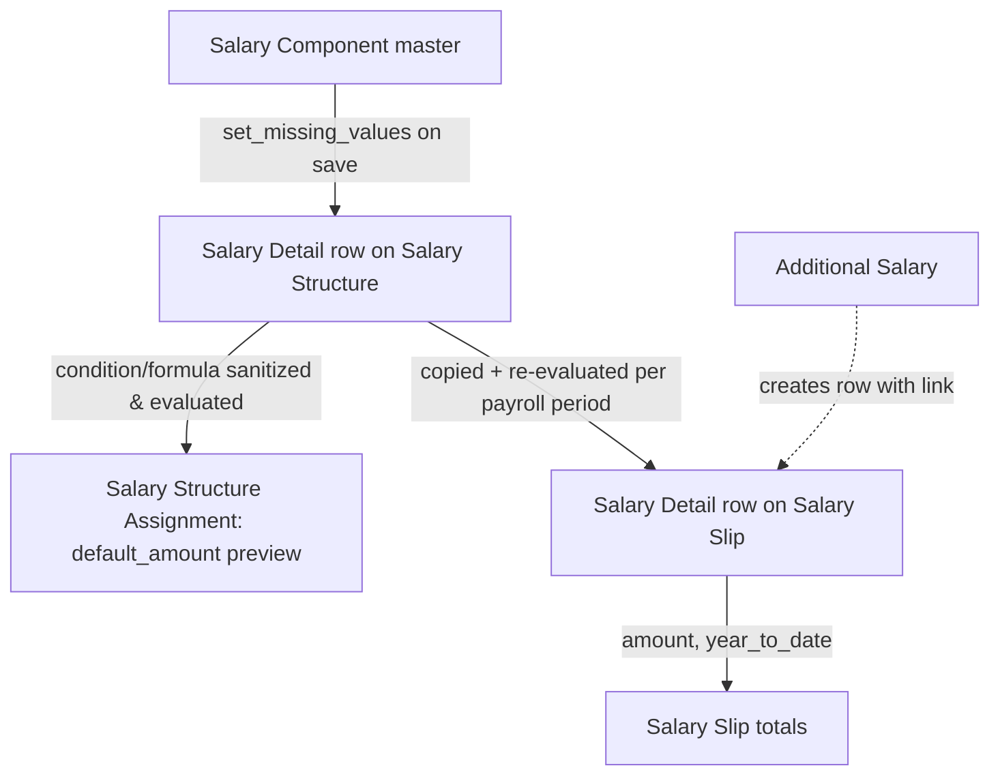

# Salary Detail

A child-table row representing one earning, deduction, or employer-contribution line — used identically inside both [[Salary Structure]] (as the template/default definition) and [[Salary Slip]] (as the actual computed value for one payroll run). It carries the component's condition/formula, the resulting amount, and a snapshot of the component's tax/accounting flags so downstream payroll logic doesn't need to re-fetch [[Salary Component]] on every evaluation.

## Key Fields

| Field | Type | Purpose |
|---|---|---|
| `salary_component` | Link → Salary Component | Which component this row represents. |
| `abbr` | Data (fetched) | The component's abbreviation, used as the variable name when this row's amount is referenced in other rows' formulas (Salary Structure context only). |
| `amount` | Currency | The computed/entered value for this row (on a Salary Slip, this is the actual payslip amount; on a Salary Structure, the default template amount). |
| `default_amount` | Currency | Salary Structure only — the un-prorated, full-cycle default amount before payment-days/timesheet adjustments. |
| `additional_amount` | Currency (hidden, read-only) | Extra amount injected via an Additional Salary record. |
| `condition` / `formula` | Code (PythonExpression) | Evaluated against the Salary Slip context to decide whether the row applies and what its amount is. |
| `amount_based_on_formula` | Check | Switches between fixed `amount` and evaluated `formula`. |
| `statistical_component` (fetched) | Check | Value is calculable/referenceable but excluded from totals. |
| `is_tax_applicable`, `variable_based_on_taxable_salary`, `exempted_from_income_tax`, `depends_on_payment_days`, `do_not_include_in_total`, `do_not_include_in_accounts`, `accrual_component`, `deduct_full_tax_on_selected_payroll_date`, `is_flexible_benefit` | Check (mostly fetched, read-only) | Snapshots of the parent Salary Component's flags, copied down so slip/structure logic evaluates consistently even if the master changes later. |
| `additional_salary` | Link → Additional Salary | If this row originates from a one-off Additional Salary entry rather than the structure. |
| `is_recurring_additional_salary` | Check | Marks the Additional Salary source as recurring. |
| `year_to_date` | Currency (read-only) | Cumulative amount for this component from the start of the payroll period/fiscal year to this slip's end date — used for tax and reporting purposes. |
| `tax_on_flexible_benefit`, `tax_on_additional_salary` | Currency (read-only) | Salary Slip deductions-only — tax attributed specifically to flexible-benefit or additional-salary amounts. |

## Relationships

- [[Salary Component]] — links to: `salary_component`; several fields are `fetch_from` it.
- [[Salary Structure]] — parent/child: rows live in the `earnings`, `deductions`, and `employer_contributions` tables of Salary Structure (as the default template).
- [[Salary Slip]] — parent/child: rows live in the equivalent tables of Salary Slip (as the computed payslip lines); Salary Slip's `process_salary_structure` evaluates each row's condition/formula against the slip's period context.
- [[Additional Salary]] — linked from: rows created because of a one-off/recurring Additional Salary entry carry that link.

## Logic — What Happens and Why

No controller logic of its own — `SalaryDetail` is a bare `Document` subclass (`pass`). All evaluation logic lives in the parent doctypes:
- On [[Salary Structure]], `validate_formula_setup()` warns if `formula` is set but `amount_based_on_formula` is disabled (formula would silently be ignored); `set_missing_values()` re-syncs the snapshot flags (`depends_on_payment_days`, `variable_based_on_taxable_salary`, `is_tax_applicable`, `is_flexible_benefit`, and — if amount/formula both blank — `amount_based_on_formula`/`formula`/`amount`) from the current [[Salary Component]] master whenever the structure is saved, so structure rows track master changes unless explicitly overridden with their own amount/formula. `validate_payment_days_based_dependent_component()` blocks saving a row whose formula references another payment-days-prorated component's abbreviation while also being payment-days-dependent itself, to avoid double-prorating the same underlying value.
- On [[Salary Structure Assignment]], `_evaluate_component_table()` (used by CTC/gross preview) evaluates each row's `condition`/`formula` via a sandboxed `_safe_eval`, using each row's `abbr` to expose its `default_amount` to later rows in the same and subsequent tables (earnings → deductions → employer_contributions), mirroring how the Salary Slip itself resolves formulas.
- Condition/formula sanitization for these rows happens via `sanitize_expression`, called both from `Salary Structure.sanitize_condition_and_formula_fields()` and per-row evaluation, to prevent unsafe Python expressions while still allowing readable multi-line authoring in the form.

## Roles & Permissions

No `permissions` array defined on this child doctype (`istable: 1`) — access is governed by the parent doctype ([[Salary Structure]] or [[Salary Slip]]) permissions.

## Mermaid: State/Flow

