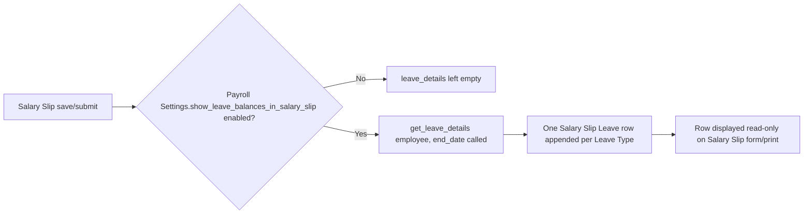

# Salary Slip Leave

A read-only snapshot row, one per [[Leave Type]], recording an employee's leave balance position (allocated, expired, used, pending, available) as of the moment a given [[Salary Slip]] was generated. It exists so a Salary Slip preserves historical leave-balance context (visible to the employee on their payslip) independent of the Leave Type's balance changing later.

## Key Fields

| Field | Type | Purpose |
|---|---|---|
| `leave_type` | Link ([[Leave Type]]) | Which leave type this row's balances refer to; read-only. |
| `total_allocated_leaves` | Float | Total leaves allocated to the employee for this type as of the slip's end date. |
| `expired_leaves` | Float | Leaves that expired without use. |
| `used_leaves` | Float | Leaves consumed. |
| `pending_leaves` | Float | Leaves in applications still pending approval. |
| `available_leaves` | Float | Remaining balance after used/expired/pending are accounted for. |

All value fields are `read_only` and `no_copy` — they are computed and stamped at generation time, never hand-edited or carried over when a Salary Slip is copied.

## Relationships

- [[Salary Slip]] — parent doctype; this table is the `leave_details` field on Salary Slip.
- [[Leave Type]] — linked via `leave_type`.
- [[Leave Application]] — indirectly, the source of `used_leaves`/`pending_leaves` figures.
- [[Leave Allocation]] — indirectly, the source of `total_allocated_leaves`/`expired_leaves`/`available_leaves` figures for the leave type.

## Logic — What Happens and Why

`SalarySlipLeave` itself has no overridden methods (`pass`-only). All logic lives in the parent: [[Salary Slip]]'s controller resets `self.set("leave_details", [])` and repopulates it from `get_leave_details(self.employee, self.end_date, True)` (in `hrms.hr.doctype.leave_application.leave_application`), iterating the returned `leave_allocation` dict to append one row per leave type — but only when [[Payroll Settings]]' `show_leave_balances_in_salary_slip` is enabled (`frappe.db.get_single_value("Payroll Settings", "show_leave_balances_in_salary_slip")`). This exists so employees can see their standing leave balance alongside their pay without needing separate access to the Leave module, and it's gated by a company-wide setting because not every organization wants payslips cluttered with leave data.

## Roles & Permissions

Inherits parent doctype's permissions (Salary Slip) — not independently permissioned in code (empty `permissions` array in JSON).

## Mermaid: State/Flow

