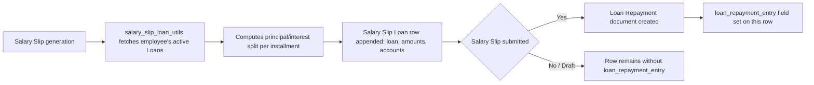

# Salary Slip Loan

A child-table row on [[Salary Slip]] recording one active employee [[Loan]]'s repayment installment (principal, interest, total payment) that is being deducted in this specific payslip, plus a link to the resulting [[Loan Repayment]] entry once processed. It exists so a Salary Slip can carry multiple concurrent loan deductions (an employee may have more than one active loan) with full traceability back to accounting.

## Key Fields

| Field | Type | Purpose |
|---|---|---|
| `loan` | Link ([[Loan]]), required, read-only | The loan this installment belongs to. |
| `loan_product` | Link ([[Loan Product]]) | Fetched from `loan.loan_product`; classifies the loan type. |
| `loan_account` | Link ([[Account]]) | GL account the loan principal is tracked against. |
| `interest_income_account` | Link ([[Account]]) | GL account interest income is booked to. |
| `principal_amount` | Currency | Principal portion of this installment. |
| `interest_amount` | Currency | Interest portion of this installment. |
| `total_payment` | Currency | Total amount deducted for this loan in this slip (principal + interest); the only non-read-only value field. |
| `loan_repayment_entry` | Link ([[Loan Repayment]]) | Set once a corresponding Loan Repayment document is created/linked; `no_copy`, read-only. |

## Relationships

- [[Salary Slip]] — parent doctype; this table is presumably the `loans`/loan-deduction field on Salary Slip (source of loan-repayment integration logic in `hrms/payroll/doctype/salary_slip/salary_slip_loan_utils.py`, imported by `salary_slip.py`).
- [[Loan]] — linked via `loan`.
- [[Loan Product]] — fetched via `loan.loan_product`.
- [[Account]] — linked via `loan_account` and `interest_income_account`.
- [[Loan Repayment]] — linked via `loan_repayment_entry`, created/updated by loan-repayment processing logic.

## Logic — What Happens and Why

`SalarySlipLoan` itself has no overridden methods (`pass`-only). The real logic lives in `hrms.payroll.doctype.salary_slip.salary_slip_loan_utils` (imported into `salary_slip.py`), which populates this table by fetching the employee's active loans for the slip period, computing the amortization split (principal vs. interest) per installment, and — on Salary Slip submit — creating/linking a [[Loan Repayment]] document per row, writing its name back into `loan_repayment_entry`. This exists so loan EMI deductions are automatically synchronized between payroll processing and the Loan module's own repayment/accounting ledger, avoiding manual reconciliation between payslip deductions and loan balances.

## Roles & Permissions

Inherits parent doctype's permissions (Salary Slip) — not independently permissioned in code (empty `permissions` array in JSON).

## Mermaid: State/Flow

