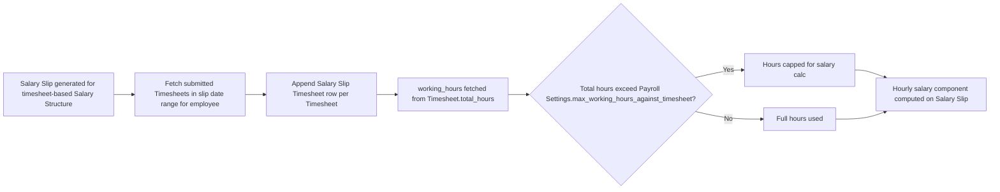

# Salary Slip Timesheet

A child-table row on [[Salary Slip]] linking one [[Timesheet]] (and its total working hours) that contributed to this payslip's hourly-rate salary calculation. It exists for salary structures billed/paid on a timesheet basis, so a Salary Slip can reference every timesheet it consumed and how many hours each contributed.

## Key Fields

| Field | Type | Purpose |
|---|---|---|
| `time_sheet` | Link ([[Timesheet]]), required | The timesheet included in this slip's hours calculation. |
| `working_hours` | Float, read-only | Fetched from `time_sheet.total_hours`; `no_copy` so it isn't duplicated when a slip is copied. |

## Relationships

- [[Salary Slip]] — parent doctype; this table is the timesheet-linkage field on Salary Slip.
- [[Timesheet]] — linked via `time_sheet`; `working_hours` is fetched (`fetch_from: time_sheet.total_hours`) directly from it.

## Logic — What Happens and Why

`SalarySlipTimesheet` itself has no overridden methods (`pass`-only). Salary Slip's controller populates this table when generating a slip for an employee whose salary structure is timesheet-based: it pulls submitted Timesheets for the employee within the slip's date range, appends one row per timesheet, and sums `working_hours` (capped against [[Payroll Settings]]' `max_working_hours_against_timesheet`) to drive the hourly-rate salary component calculation. This exists so hourly/timesheet-billed employees are paid strictly for logged and approved hours, with full audit traceability from the payslip back to the exact timesheets used.

## Roles & Permissions

Inherits parent doctype's permissions (Salary Slip) — not independently permissioned in code (empty `permissions` array in JSON).

## Mermaid: State/Flow

