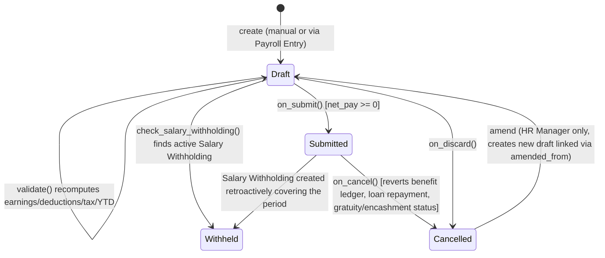

# Salary Slip

The pay statement issued to an employee for one payroll period: it is the document of record for what an employee earned, what was deducted, how much income tax was withheld, and what loan repayments were made, for one start/end date range. It exists because payroll must be auditable and submittable per employee per period — once submitted it drives accounting (loan repayment entries), statutory reporting (income tax breakup, year-to-date figures), and payment communication (emailed payslip), and it can be withheld (e.g. pending exit formalities) without being cancelled.

## Key Fields

| Field | Type | Purpose |
|---|---|---|
| `employee` / `employee_name` | Link / Read Only | Employee this slip is for; fetched details snapshot department/branch/designation/company at slip time |
| `start_date` / `end_date` | Date | Payroll period boundaries for this slip |
| `payroll_frequency` | Select | Monthly/Fortnightly/Bimonthly/Weekly/Daily — drives `get_start_end_dates` if end_date not set |
| `salary_structure` | Link | Resolved active [[Salary Structure]] used to source earnings/deductions |
| `payroll_entry` | Link | Parent [[Payroll Entry]] run that generated this slip, if bulk-created |
| `salary_slip_based_on_timesheet` | Check | If true, wage earning is computed from linked `timesheets` (hour_rate * hours) instead of purely from structure |
| `timesheets` | Table [[Salary Slip Timesheet]] | Linked, submitted Timesheets for the period (only when timesheet-based) |
| `earnings` / `deductions` / `employer_contributions` | Table [[Salary Detail]] | Resolved, evaluated salary components for the period; employer_contributions is informational only (never included in gross/deduction/net) |
| `accrued_benefits` | Table [[Employee Benefit Detail]] | Statistical/accrual-only components not shown as payable rows |
| `total_working_days` / `payment_days` / `leave_without_pay` / `absent_days` / `unmarked_days` | Float | Attendance/leave-derived pay basis for the period |
| `gross_pay` / `total_deduction` / `net_pay` / `rounded_total` | Currency | Core totals; `net_pay = gross_pay - (total_deduction + total_loan_repayment)` |
| `year_to_date` / `month_to_date` / `gross_year_to_date` | Currency | Cumulative totals computed by summing prior submitted slips in the payroll period/fiscal year |
| `ctc`, `total_earnings`, `non_taxable_earnings`, `annual_taxable_amount`, `total_income_tax`, `current_month_income_tax`, `future_income_tax_deductions` | Currency | Annualized income-tax breakup fields, computed only if a [[Payroll Period]] and variable tax component exist |
| `salary_withholding` / `salary_withholding_cycle` | Link / Data | Set automatically if an active [[Salary Withholding]] covers this period; drives `status = Withheld` |
| `journal_entry` | Link | Accrual [[Journal Entry]] this slip is booked against (set by Payroll Entry) |
| `loans` (via mixin, not in base JSON — added by lending app) | Table [[Salary Slip Loan]] | Loan repayments computed for the period, only when the `lending` app is installed |
| `leave_details` | Table [[Salary Slip Leave]] | Leave balance snapshot, populated only if Payroll Settings `show_leave_balances_in_salary_slip` is enabled |
| `status` | Select | Draft / Submitted / Cancelled / Withheld — computed, not manually settable |
| `exchange_rate` | Float | Multi-currency conversion factor; drives all `base_*` mirrored fields |

## Relationships

- [[Employee]] — linked from, one employee has many slips over time
- [[Salary Structure]] — links to, resolved via `check_sal_struct()` based on active [[Salary Structure Assignment]] for the employee as of `actual_start_date`
- [[Salary Structure Assignment]] — links to (`_salary_structure_assignment`), supplies component formulas, income tax slab, opening YTD balances
- [[Payroll Entry]] — linked from (parent, when bulk-generated); `payroll_entry` field
- [[Payroll Period]] — links to (`current_payroll_period`, computed via `get_payroll_period`), required for income-tax breakup calculation
- [[Payroll Settings]] — reads global config (payroll basis, rounding, email, leave balance display, benefit application mandate, etc.)
- [[Salary Detail]] — parent/child, `earnings`/`deductions`/`employer_contributions` tables
- [[Salary Slip Timesheet]] — parent/child, only populated when timesheet-based
- [[Salary Slip Loan]] — parent/child, populated by `set_loan_repayment` (lending app)
- [[Salary Slip Leave]] — parent/child, leave balance snapshot
- [[Employee Benefit Detail]] — parent/child (`accrued_benefits`), and links to [[Employee Benefit Application]] / assignment for flexible benefit sourcing
- [[Additional Salary]] — linked from, contributes ad hoc earning/deduction rows via `get_additional_salaries`
- [[Employee Tax Exemption Declaration]] / [[Employee Tax Exemption Proof Submission]] — links to, source of `total_exemption_amount`
- [[Employee Other Income]] — links to, source of `income_from_other_sources`
- [[Income Tax Slab]] — links to (via Salary Structure Assignment), source of tax slab rates
- [[Attendance]] / [[Leave Application]] — links to, source of LWP/absent/half-day calculation depending on Payroll Settings `payroll_based_on`
- [[Timesheet]] — links to, source hours for timesheet-based slips; `update_status` writes `salary_slip` back onto the Timesheet and re-sets its status ("Payrolled")
- [[Loan]] — links to (lending app), source of repayment schedule; triggers [[Loan Repayment]] creation on submit
- [[Journal Entry]] — linked from, `journal_entry` field set by Payroll Entry when accrual JE is created; JE cancellation clears this via `unlink_ref_doc_from_salary_slip`
- [[Salary Withholding]] — links to, if withholding covers the period the slip is force-marked `Withheld`
- [[Gratuity]] / [[Leave Encashment]] — linked from indirectly via Additional Salary; `update_payment_status_for_gratuity_and_leave_encashment` marks them Paid/Unpaid on submit/cancel
- [[Employee Benefit Ledger]] — triggers creation/deletion of ledger entries on submit/cancel (`create_benefits_ledger_entry` / `delete_employee_benefit_ledger_entry`)
- [[Payroll Correction]] / [[Arrear]] — linked from, feed `lwp_days_corrected` verification and additional-salary rows exempt from payment-day proration

## Logic — What Happens and Why

**Draft / validate (`validate()`):**
1. `check_salary_withholding()` — looks up an active [[Salary Withholding]] covering `start_date`/`end_date`; if found, forces `salary_withholding`/`salary_withholding_cycle`, which later drives `get_status()` to return `Withheld` regardless of docstatus. Business reason: an employee under investigation/exit-hold should not receive pay even though the slip still needs to exist for record-keeping.
2. `validate_active_employee(self.employee)` (from `hrms.hr.utils`) — blocks payroll for inactive employees.
3. `validate_dates()` — enforces `start_date <= end_date`, requires a Date of Joining, and throws if the slip period is entirely before joining or entirely after relieving (`Cannot create Salary Slip for Employee joining after Payroll Period` / `... who has left before Payroll Period`).
4. `check_existing()` — prevents duplicate slips for the same employee+period (and, for timesheet-based slips, prevents reusing a Timesheet already marked "Payrolled").
5. If no earnings/deductions rows exist yet (new slip), pulls them fresh from the Salary Structure via `get_emp_and_working_day_details()`; otherwise recomputes working-day details only (`get_working_days_details`), so a manually edited slip is not silently overwritten.
6. `set_salary_structure_assignment()` — re-resolves the [[Salary Structure Assignment]] effective on/before `actual_start_date`; throws if none found — a slip literally cannot be computed without one.
7. `calculate_net_pay()` — the core computation (see below).
8. `compute_year_to_date()` / `compute_month_to_date()` / `compute_component_wise_year_to_date()` — sums prior submitted slips in the same payroll period/fiscal year, then adds this slip's own totals, so YTD/MTD are always correct even for a slip being edited before submission.
9. `add_leave_balances()` — snapshots current leave allocation/usage into `leave_details` if Payroll Settings enables it, so the payslip reflects leave balance as of `end_date` (not at print time).
10. Warns (does not block) if timesheet-based total hours exceed Payroll Settings `max_working_hours_against_timesheet`.

**Payment-days / attendance logic (`get_working_days_details`):** Reads `Payroll Settings.payroll_based_on` — either `Attendance` or `Leave` — and computes `leave_without_pay`, `absent_days`, `payment_days` accordingly. Under Attendance mode it counts Absent/Half-Day/On-Leave records and applies `daily_wages_fraction_for_half_day`; under Leave mode it walks [[Leave Application]] records with `is_lwp`/`is_ppl` leave types. Holidays are excluded from working days unless `include_holidays_in_total_working_days` is set. This exists because different companies pay strictly by attendance punches vs. strictly by approved leave records, and mixing the two would double-penalize or double-pay employees.

**Component computation (`calculate_net_pay` -> `calculate_component_amounts`):** For each of earnings/deductions/employer_contributions, the Salary Structure Assignment pre-evaluates every component's condition/formula once (`_set_evaluated_components`/`get_evaluated_components`) against a shared eval context (`get_data_for_eval`, `_safe_eval` sandboxed evaluator from `hrms.payroll.utils`) so formulas can reference each other's abbreviations (e.g. HRA = 40% of Basic). Amounts are prorated by `payment_days / total_working_days` unless the component is flagged not to depend on payment days, is an accrual/statistical component, or belongs to a component sourced from Arrear/Payroll Correction/Employee Benefit Claim (those already reflect historical proration). Additional Salary rows (`add_additional_salary_components`, via [[Additional Salary]]) and flexible benefit payouts/accruals (`add_employee_benefits`) are layered on top, with `overwrite` semantics replacing the structure-default row entirely when set. `apply_regional_deductions()` is a `@hrms.allow_regional` hook point — the current `hrms/hooks.py` `regional_overrides` map does not override this specific function (it only overrides `calculate_annual_eligible_hra_exemption`, `calculate_hra_exemption_for_period`, `calculate_tax_with_marginal_relief` in `hrms.hr.utils`, referenced from `hrms/regional/india/utils.py`) — regional override exists at that narrower granularity, see `hrms/regional/india/setup.py` and `hrms/regional/india/utils.py`.

**Income tax breakup:** `add_tax_components()` identifies the variable-tax deduction component(s) and, if a [[Payroll Period]] and tax slab exist, calls `compute_taxable_earnings_for_year()` to project annualized taxable income (previous-period actuals from submitted slips + current period + remaining future sub-periods, via `get_period_factor`), then `calculate_variable_tax()` applies `calculate_tax_by_tax_slab` (from [[Income Tax Slab]]) and divides remaining tax liability across remaining sub-periods so tax is smoothed across the year rather than spiking at year-end. `compute_income_tax_breakup()` populates the read-only annual-summary fields shown in the "Income Tax Breakup" tab. This exists to satisfy statutory periodic-withholding requirements (e.g. India TDS) without requiring a separate tax-computation document.

**Loan integration (`hrms/payroll/doctype/salary_slip/salary_slip_loan_utils.py`, only active if the `lending` app is installed — gated by `if_lending_app_installed`):**
- During `get_emp_and_working_day_details`, `process_loan_interest_accrual_and_demand()` triggers interest accrual/demand processing for the employee's active salary-deductible [[Loan]]s.
- During `calculate_net_pay`, `set_loan_repayment()` populates the `loans` child table with `calculate_amounts()` from `lending.loan_management`, and folds `total_loan_repayment` into `net_pay` — this is why loan EMIs reduce net pay without appearing as a Salary Detail row.
- On `on_submit`, `make_loan_repayment_entry()` creates and submits a [[Loan Repayment]] document per loan row, tagging its Salary Slip Loan row with `loan_repayment_entry`.
- On `on_cancel`, `cancel_loan_repayment_entry()` cancels those same Loan Repayment documents — keeping loan ledgers consistent with payroll state.

**Submit (`on_submit`):**
1. Throws if `net_pay < 0` — a slip cannot be submitted with negative pay (business rule: negative net pay indicates a structure/deduction error that must be fixed, not paid).
2. `set_status()` / `update_status()` — finalizes status and, for timesheet-based slips, sets the linked Timesheet's status to reflect it's been paid.
3. `make_loan_repayment_entry(self)`.
4. If not run via [[Payroll Entry]] (`frappe.flags.via_payroll_entry` unset) and not a patch, and Payroll Settings `email_salary_slip_to_employee` is enabled, emails the slip (`email_salary_slip()`) — Payroll Entry instead handles bulk emailing itself to avoid one-by-one enqueue storms.
5. `update_payment_status_for_gratuity_and_leave_encashment()` — marks any linked [[Gratuity]]/[[Leave Encashment]] Additional Salary source docs "Paid".
6. `create_benefits_ledger_entry()` — writes accrual/payout rows to [[Employee Benefit Ledger]] for tracking flexible benefit usage across the payroll period.

**Cancel (`on_cancel`):** Recomputes status, reverts the gratuity/leave-encashment payment status to "Unpaid", deletes the Employee Benefit Ledger entries tied to this slip, cancels loan repayment entries, and republishes a realtime update to the employee's portal. Note the cancel does NOT automatically cancel the associated accrual Journal Entry — that is owned by [[Payroll Entry]]; if the JE is separately cancelled, `hrms.payroll.doctype.salary_slip.salary_slip.unlink_ref_doc_from_salary_slip` (registered as a `Journal Entry` `on_cancel` doc_event in `hrms/hooks.py`) clears the slip's `journal_entry` link so it doesn't point to a cancelled document. That same hooks.py block also runs `hrms.payroll.doctype.salary_withholding.salary_withholding.update_salary_withholding_payment_status` on Journal Entry submit/cancel, keeping [[Salary Withholding]] payment status in sync with the JE lifecycle.

**Discard:** `on_discard()` force-sets status to Cancelled (covers Frappe's discard-draft flow, distinct from a submitted-doc cancel).

**Telemetry:** `hrms/hooks.py` registers `"Salary Slip": {"on_submit": "hrms.telemetry.on_milestone_submit"}` — purely a usage-analytics hook, no business-logic side effect.

**Bulk email:** `enqueue_email_salary_slips()` (whitelisted) enqueues `email_salary_slips()` as a background job to email a batch of already-submitted slips on demand.

## Roles & Permissions

| Role | Can Do | Notes |
|---|---|---|
| [[HR User]] | create, read, write, submit, print, email, share, report | Cannot cancel, delete, or amend — can generate and submit slips but not reverse them |
| [[HR Manager]] | create, read, write, submit, cancel, amend, delete, print, email, share, report | Full lifecycle control including cancel/amend/delete |
| [[Employee]] | read, print | Self-service viewing of own payslip only (row-level restriction to own record is enforced by standard Frappe user-permission/employee linkage, not explicit code in this controller) |

## Mermaid: State/Flow

