# Salary Structure Assignment

The submittable record that links one employee to one [[Salary Structure]] effective from a specific date, carrying employee-specific inputs (base pay, variable pay, income tax slab, cost-center split, flexible benefit selections, opening tax balances). It is the missing piece between a generic pay template and an individual employee's payslip: [[Salary Slip]] generation looks up the assignment effective on the slip's date to know which structure and which employee-specific values to apply.

## Key Fields

| Field | Type | Purpose |
|---|---|---|
| `employee` | Link → Employee | Whose pay this assignment governs. |
| `salary_structure` | Link → Salary Structure | Which structure applies (fetched from Employee Grade's default if empty). |
| `from_date` | Date | Effective date; must not precede joining date or follow relieving date; only one submitted assignment per employee per `from_date` allowed. |
| `company` | Link → Company | Must match the linked structure's company. |
| `base` | Currency | Employee's base pay figure, referenced as `base` inside component formulas. |
| `variable` | Currency | Variable pay component input. |
| `income_tax_slab` | Link → Income Tax Slab | Mandatory if the structure has an auto tax-slab deduction component (`variable_based_on_taxable_salary` with no fixed amount/formula); must share the assignment's `currency`. |
| `payroll_payable_account` | Link → Account | Defaulted from Company's `default_payroll_payable_account`, or a "Payroll Payable" account matching company/currency, if not set. |
| `payroll_cost_centers` (child table) | Table → Employee Cost Center | How this employee's payroll cost is split across cost centers; percentages must total 100 and each cost center must belong to the assignment's company. Auto-populated from Employee/Department default cost center if empty. |
| `employee_benefits` (child table) | Table → Employee Benefit Detail | Flexible benefit selections, copied from the structure's `employee_benefits` when the structure is chosen (client-side), constrained by `max_benefits`/component `max_benefit_amount`. |
| `max_benefits` | Currency | Cap on total flexible benefits (fetched from structure). |
| `taxable_earnings_till_date` / `tax_deducted_till_date` | Currency | Opening balances (e.g. from a previous employer) needed for correct tax calc when the assignment starts mid payroll-period. |
| `annual_gross_earning` / `ctc` | Currency (read-only) | Computed by `calculate_ctc_and_gross()` — annualized gross payable earnings and total cost-to-company. |
| `amended_from` | Link → Salary Structure Assignment | Set on amendment of a cancelled submitted assignment. |

## Relationships

- [[Salary Structure]] — links to: `salary_structure`; company must match; its `earnings`/`deductions`/`employer_contributions` are evaluated by this doc's `_evaluate_all_components()` for CTC/gross preview.
- Employee — links to: `employee`; validated against joining/relieving dates.
- [[Salary Component]] — linked from: `get_tax_component()` scans the structure's deductions for the tax-slab component; `upsert_employer_contribution()` reads component flags to inject regional employer-contribution rows.
- [[Income Tax Slab]] — links to: `income_tax_slab`, required/validated when the structure has a tax component.
- [[Employee Cost Center]] — parent/child: `payroll_cost_centers`.
- [[Employee Benefit Detail]] — parent/child: `employee_benefits`.
- [[Salary Structure]] / [[Bulk Salary Structure Assignment]] — linked from: both call `create_salary_structure_assignment()`/`_bulk_assign_structure()` which instantiate and submit this doctype.
- [[Salary Slip]] — triggers: `get_assigned_salary_structure(employee, on_date)` finds the latest submitted assignment on/before a date to determine which structure a slip should use; `get_evaluated_components()`/`get_timesheet_config()` are read by slip generation for default amounts and timesheet settings.
- [[Payroll Entry]] — linked from: `_get_component_eval_context()` uses `get_start_end_dates` from Payroll Entry's period logic to build a full-cycle evaluation context.

## Logic — What Happens and Why

**Create/Save (`validate`)**
- `validate_dates()` — throws `DuplicateAssignment` if a submitted assignment already exists for this employee at this exact `from_date` (prevents ambiguous "which structure applies today" resolution); throws if `from_date` precedes the employee's joining date or (unless `flags.old_employee`, used for data-migration patches) follows the relieving date — an assignment can't predate employment or start after it has ended.
- `validate_company()` — the assignment's `company` must equal the linked Salary Structure's company (an employee can't be assigned a structure belonging to a different company).
- `validate_income_tax_slab()` — via `get_tax_component()`, if the structure has a deduction component that is `variable_based_on_taxable_salary` with no fixed amount/formula (i.e. relies entirely on the slab), `income_tax_slab` becomes mandatory (else tax can't be computed); if set, its currency must match the assignment's currency.
- `set_payroll_payable_account()` — defaults the payable account from Company settings or a matching "Payroll Payable" account if not explicitly provided, so the assignment always has a posting target for payroll liabilities.
- `validate_max_benefit_for_flexible_benefit()` (shared with Salary Structure) — no duplicate benefit components; each benefit amount capped by that component's `max_benefit_amount`; total capped by `max_benefits`.
- `set_payroll_cost_centers()` (called if the table is empty) — defaults to the employee's `payroll_cost_center`, falling back to the department's, at 100%, so payroll accounting always has a cost-center allocation even if the user didn't specify one.
- `validate_cost_centers()` — every cost center must belong to the assignment's company, and percentages must sum to exactly 100 (guarantees the full payroll cost is allocated, no partial/over allocation).
- `warn_about_missing_opening_entries()` — if opening balances are required (see `are_opening_entries_required()`) but neither `taxable_earnings_till_date` nor `tax_deducted_till_date` is set, shows a non-blocking warning — without these, tax calculated on future slips within the same fiscal/payroll period would be understated since prior taxable income is invisible to the new employer/structure.
- `calculate_ctc_and_gross()` — runs a full-cycle, un-prorated evaluation of the structure's earnings/deductions/employer_contributions via `_evaluate_all_components()`, deriving `annual_gross_earning` (payable earnings × periods/year, from `PERIODS_PER_YEAR` keyed by the structure's `payroll_frequency`) and `ctc` (gross + non-payable earnings marked `do_not_include_in_total` + employer contributions, all annualized) — giving HR a CTC figure without needing to generate an actual slip.
- `on_update_after_submit()` re-runs `validate_cost_centers()` since `payroll_cost_centers` is `allow_on_submit`.

**Component evaluation internals**
- `_evaluate_all_components()` runs one shared-context pass: earnings first, then computes a `gross_pay` (sum of non-statistical, non-`do_not_include_in_total` earnings) exposed to deductions and employer_contributions formulas (so PF/ESI-style formulas can reference gross pay), then evaluates deductions, then employer_contributions, then calls the regional hook `apply_regional_ctc_components()`.
- `apply_regional_ctc_components()` is a `@hrms.allow_regional` extension point (default no-op) — regional apps can add statutory employer contributions that a plain formula can't express, via `upsert_employer_contribution()`, which adds/updates/clears an employer_contributions row keyed by component name (zero amount clears but never adds a row) without mutating the cached Salary Structure doc (important since that doc is shared/cached across a whole Payroll Entry run).
- `_get_component_eval_context()` builds a synthetic full-cycle period (via Payroll Entry's `get_start_end_dates`) with zero LWP/absence so formulas that prorate by payment days evaluate at their full, un-prorated value for this preview — this value is explicitly **not** what the actual Salary Slip will pay (the slip re-evaluates against the real period with real attendance).
- `_evaluate_component_table()` sanitizes and safely evaluates (`_safe_eval` with `COMPONENT_EVAL_GLOBALS`) each row's condition/formula; a falsy condition skips the row; formula/condition errors surface as user-facing `NameError`/`SyntaxError`/generic messages via `throw_error_message` naming the offending row.

**Lookup helpers used elsewhere**
- `get_assigned_salary_structure(employee, on_date)` — the canonical lookup for "which structure applies to this employee on this date": latest submitted assignment with `from_date <= on_date`.
- `get_employee_currency(employee)` — after a permission check, returns the currency from the employee's (most recent, per DB lookup) assignment; throws if none exists.
- `are_opening_entries_required()` (whitelisted) — true only if the structure has a tax-slab component AND `from_date` falls after the start of the current payroll period (mid-period joins need opening tax figures; period-start joins don't).

**Regional/hook overrides**
- `hrms/hooks.py` doc_events list "Salary Structure Assignment" only under a general fixtures/telemetry index (`{"doctype": "Salary Structure Assignment", "index": 42}`), not a doc_events hook.
- `hrms/regional/india/utils.py` references Salary Structure Assignment: reads `payroll_frequency` off the linked structure for India-specific tax/period logic — regional override exists, file: `hrms/regional/india/utils.py`.
- `apply_regional_ctc_components()` is the explicit extension point regional apps (India, UAE) use to inject statutory employer contributions into CTC calculation.

## Roles & Permissions

| Role | Can Do | Notes |
|---|---|---|
| [[System Manager]] | read/write/create/delete/export/print/report/share | No submit/cancel/amend rights listed. |
| [[HR Manager]] | read/write/create/delete/submit/cancel/amend/export/print/report/share | Full lifecycle control. |
| [[HR User]] | read/write/create/submit/export/print/report/share | Can create and submit but not cancel/amend/delete. |
| [[Employee]] | read/select | View-only, e.g. to see their own assignment. |

## Mermaid: State/Flow

```mermaid
stateDiagram-v2
    [*] --> Draft: Create for Employee + Salary Structure + from_date
    Draft --> Draft: validate() checks dates, company, tax slab, cost centers, benefits; calculates CTC
    Draft --> Submitted: submit()
    Submitted --> Cancelled: cancel()
    Cancelled --> Amended: amend (amended_from set)
    Submitted --> UsedBySalarySlip: get_assigned_salary_structure() resolves latest assignment on slip date
```

