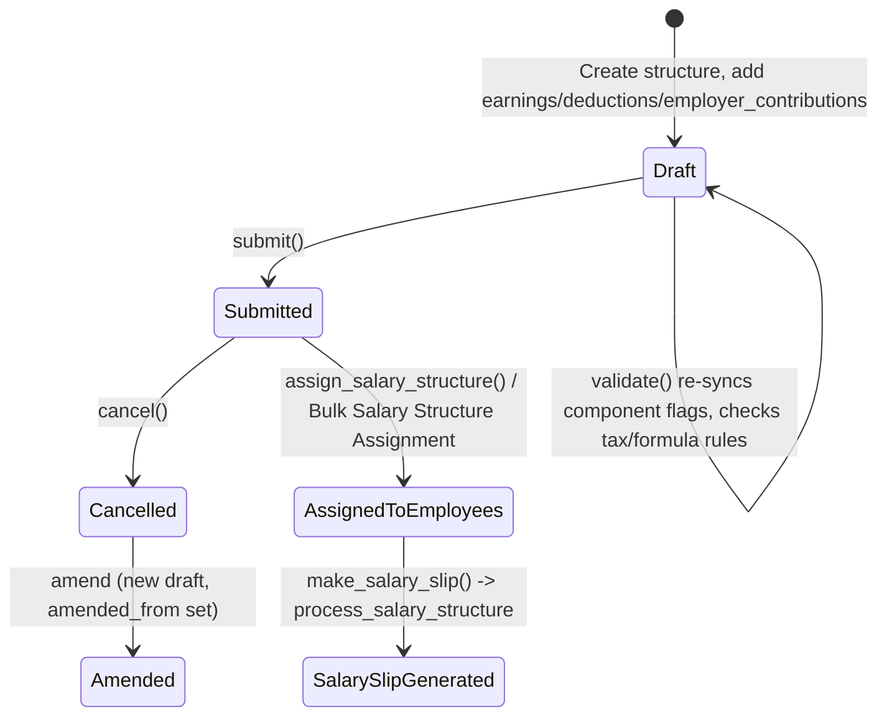

# Salary Structure

The submittable template that defines an employee's pay composition — its earnings, deductions, and employer contributions, each with a fixed amount or a Python formula/condition — for a given company and payroll frequency. It exists so payroll doesn't hard-code pay rules per employee: one structure is authored once (e.g. "Standard Grade A"), then attached to many employees via [[Salary Structure Assignment]], and every [[Salary Slip]] generated for those employees evaluates this same template against each employee's specific context.

## Key Fields

| Field | Type | Purpose |
|---|---|---|
| `company` | Link → Company | Company this structure belongs to; constrains which components, cost centers and assignments can use it. |
| `is_active` | Select (Yes/No) | Deactivates the structure from being newly assigned. |
| `currency` | Link → Currency | Currency all amounts in this structure are expressed in. |
| `payroll_frequency` | Select | Monthly/Fortnightly/Bimonthly/Weekly/Daily — required unless timesheet-based; drives `PERIODS_PER_YEAR` used in CTC/annual calculations. |
| `salary_slip_based_on_timesheet` | Check | If enabled, one earning component's amount is computed from Timesheet hours × `hour_rate` instead of the payroll_frequency-based cycle. |
| `salary_component` | Link → Salary Component | The specific earning component whose amount is overwritten by timesheet wage when `salary_slip_based_on_timesheet` is set. |
| `hour_rate` | Currency | Rate per timesheet hour. |
| `earnings` / `deductions` / `employer_contributions` (child tables) | Table → [[Salary Detail]] | The actual pay-component rows defining this structure's composition. |
| `employee_benefits` (child table) | Table → Employee Benefit Detail | Yearly flexible-benefit amounts offered under this structure. |
| `max_benefits` | Currency | Cap on total flexible benefits selectable across `employee_benefits`. |
| `leave_encashment_amount_per_day` | Currency | Per-day rate used for leave encashment calculations. |
| `total_earning` / `total_deduction` / `net_pay` | Currency (hidden, read-only) | Computed totals (client-side `calculate_totals`). |
| `mode_of_payment` / `payment_account` | Link | Default disbursement account for slips generated from this structure. |
| `amended_from` | Link → Salary Structure | Set when this document is an amendment of a cancelled submitted structure. |

## Relationships

- [[Salary Detail]] — parent/child: `earnings`, `deductions`, `employer_contributions` tables.
- [[Salary Component]] — linked from: every Salary Detail row's `salary_component`; also directly via the `salary_component` field for timesheet wage.
- [[Salary Structure Assignment]] — triggers: `assign_salary_structure()` / `create_salary_structure_assignment()` create assignment records for employees; conversely, an Assignment's `_evaluate_all_components()` reads this structure's tables to preview CTC/gross.
- [[Bulk Salary Structure Assignment]] — linked from: a single-instance tool that calls `create_salary_structure_assignment()` (imported from this module) to bulk-create assignments referencing this structure.
- [[Salary Slip]] — triggers: `make_salary_slip()` / `_make_salary_slip()` map this structure onto a new Salary Slip (`get_mapped_doc`), copying `total_earning → gross_pay`, `name → salary_structure`, `currency`; the slip then calls back into `process_salary_structure` to evaluate the component tables per payroll period.
- Employee — linked from: `get_employees()` finds active employees matching structure/company/branch/department/designation/grade filters for assignment.
- [[Income Tax Slab]] — linked from: assignment flow (`assign_salary_structure`) can pass through an income tax slab required by tax-variable deduction components.

## Logic — What Happens and Why

**Draft creation / edit (`validate`)**
- `set_missing_values()` — for every earnings/deductions/employer_contributions row, re-pulls `depends_on_payment_days`, `variable_based_on_taxable_salary`, `is_tax_applicable`, `is_flexible_benefit` from the current [[Salary Component]] master (always overwritten) and, only if the row has no `amount`/`formula` yet, also pulls `amount_based_on_formula`/`formula`/`amount`. This keeps structure rows synced to component-master changes while letting an already-configured row's specific amount/formula persist.
- `validate_amount()` — if the structure is timesheet-based, `net_pay` cannot be negative.
- `validate_component_based_on_tax_slab()` — a deduction with `variable_based_on_taxable_salary` (the auto tax-slab component) cannot also carry a fixed `amount` or `formula`, since its value is computed entirely from the employee's Income Tax Slab at slip time.
- `validate_payment_days_based_dependent_component()` — blocks a formula-based, payment-days-dependent row whose formula references another payment-days-dependent component's abbreviation, to prevent double-proration of the same underlying value (e.g. Basic already prorated, HRA computed off prorated Basic and also separately prorated).
- `validate_timesheet_component()` — warns (doesn't block) that a timesheet-computed wage will overwrite the matching earning component's manually-set amount.
- `validate_formula_setup()` — warns if a row has a `formula` but `amount_based_on_formula` is off (formula silently ignored).
- `validate_max_benefit_for_flexible_benefit()` (module-level, shared with Assignment) — no duplicate components in `employee_benefits`; each benefit amount must not exceed that component's `max_benefit_amount`; and the sum must not exceed `max_benefits`.
- `before_validate()` / `before_update_after_submit()` call `sanitize_condition_and_formula_fields()`, which strips and sanitizes each row's `condition`/`formula` via `sanitize_expression` (security: prevents arbitrary/unsafe Python in these fields) while preserving the original multi-line text in `_condition`/`_formula`.
- `on_update()` / `on_update_after_submit()` call `reset_condition_and_formula_fields()` to write the original (pre-sanitized) text back via `db_update_all()` so the form always displays human-authored formulas, not the sanitized evaluation form.

**Submit**
- No explicit `on_submit` override; submission just fixes the template (is_submittable), after which it can be referenced by Salary Structure Assignment (queries filter `docstatus: 1`).

**Assigning to employees**
- `assign_salary_structure()` (whitelisted) — resolves the target employee set via `get_employees()` (Active employees matching company + optional branch/grade/department/designation/single employee), then either processes them inline (≤20) or enqueues `assign_salary_structure_for_employees` as a background job (>20) to avoid blocking the request for large batches.
- `assign_salary_structure_for_employees()` — for each candidate employee, skips those with an existing submitted assignment for the same `from_date` (via `get_existing_assignments`, which also messages which employees were skipped), otherwise calls `create_salary_structure_assignment()` inside a savepoint so one employee's failure doesn't abort the whole batch (rolled back to savepoint, logged via `frappe.log_error`, others continue).
- `create_salary_structure_assignment()` — builds and submits a new [[Salary Structure Assignment]]: resolves `payroll_payable_account` from Company defaults if not passed (throws if neither is set), validates the payable account's currency matches either the structure currency or company currency (prevents a payable account denominated in an incompatible currency), then saves and submits with `ignore_permissions=True` (this is a system-driven bulk operation, not a direct user action, so it bypasses the normal permission check on the Assignment doctype itself while the caller's own permission to trigger the action was already checked).

**Generating a Salary Slip**
- `make_salary_slip()` (whitelisted) checks read permission on the target `employee` explicitly, then delegates to `_make_salary_slip()`, which uses `get_mapped_doc` to create/populate a Salary Slip from this structure (ignoring child tables — those are rebuilt fresh by the slip's own processing), and calls `process_salary_structure` on the target to evaluate components for the actual period. `for_preview`/`as_print` support previewing the slip as rendered print output without persisting it.

**Component search helper**
- `get_salary_component()` — backs the Salary Structure form's component-picker query, filtering [[Salary Component Account]] rows by component type and disabled flag, and by company match (or company-agnostic accounts).

**Regional/hook overrides**
- `hrms/hooks.py` doc_events: `"Salary Structure": {"after_insert": "hrms.telemetry.on_milestone_insert"}` — telemetry only, not business logic.
- `hrms/regional/india/setup.py` references "Salary Structure" only in a UI label string ("HRA as per Salary Structure") for setup fixtures — regional override exists (fixture/label only).
- `hrms/regional/india/utils.py` throws "Salary Structure must be submitted before submission of {doctype}" when validating a dependent regional doctype, and reads `payroll_frequency` off the linked Salary Structure and creates rows in `Salary Detail`/`Salary Structure` parenttype context — regional override exists, file: `hrms/regional/india/utils.py`.

## Roles & Permissions

| Role | Can Do | Notes |
|---|---|---|
| [[HR User]] | read/write/create/delete/submit/cancel/amend/print/report/share/email | Full lifecycle access. |
| [[HR Manager]] | read/write/create/delete/submit/cancel/amend/print/report/share/email/export/import | Same as HR User plus export/import. |

## Mermaid: State/Flow

