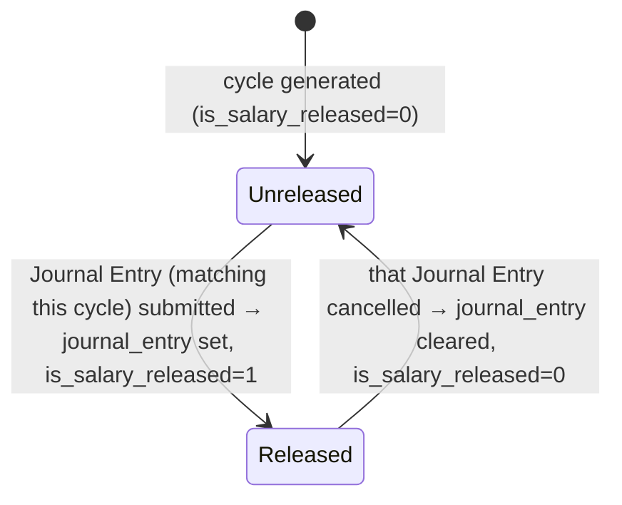

# Salary Withholding Cycle

A single payroll-cycle row within a [[Salary Withholding]] record, tracking whether that specific cycle's pay has been released and, if so, which Journal Entry authorized the release. It exists to give per-cycle granularity to a withholding order that may span several payroll periods — an employee's withheld salary can be released cycle-by-cycle (e.g. as an investigation concludes) rather than all-or-nothing.

## Key Fields

| Field | Type | Purpose |
|---|---|---|
| `from_date` / `to_date` | Date | The specific payroll cycle's date range. |
| `is_salary_released` | Check (read-only, no_copy) | Whether this cycle's withheld pay has been released; set programmatically, not by direct user edit. |
| `journal_entry` | Link (Journal Entry) | The Journal Entry that released (or, once cancelled, previously released) this cycle's pay. |

## Relationships

- [[Salary Withholding]] — parent, via the `cycles` Table field; regenerated wholesale by the parent's `set_withholding_cycles_and_to_date()` on every validate while in draft.
- [[Journal Entry]] — linked from `journal_entry`; hrms/hooks.py's Journal Entry `on_submit`/`on_cancel` doc_events (hrms/hooks.py:197-211) call `update_salary_withholding_payment_status`, which finds cycles by matching `journal_entry` and flips their `is_salary_released` via `_update_salary_withholdings`.
- [[Salary Slip]] — a slip's `salary_withholding_cycle` field ties it to one specific cycle row; `link_bank_entry_in_salary_withholdings` in salary_withholding.py bulk-updates cycles' `journal_entry` field based on a list of salary slips being paid together in one bank/journal entry.

## Logic — What Happens and Why

No controller overrides of its own (`salary_withholding_cycle.py` is stock Document). All logic lives in the parent [[Salary Withholding]] and in the module-level functions in `salary_withholding.py`:
- Rows are wholly regenerated (not incrementally edited) whenever the parent's `from_date`/`number_of_withholding_cycles`/`payroll_frequency` change, via `set_withholding_cycles_and_to_date`.
- `is_salary_released` and `journal_entry` are the only fields mutated after creation, and only via `db_set` from `_update_salary_withholdings` (never direct user save) — keeping the release/reversal audit trail tied strictly to Journal Entry submission/cancellation events.

## Roles & Permissions

| Role | Can Do | Notes |
|---|---|---|
| — | — | No `permissions` entries; access follows the parent [[Salary Withholding]] document. |

## Mermaid: State/Flow

