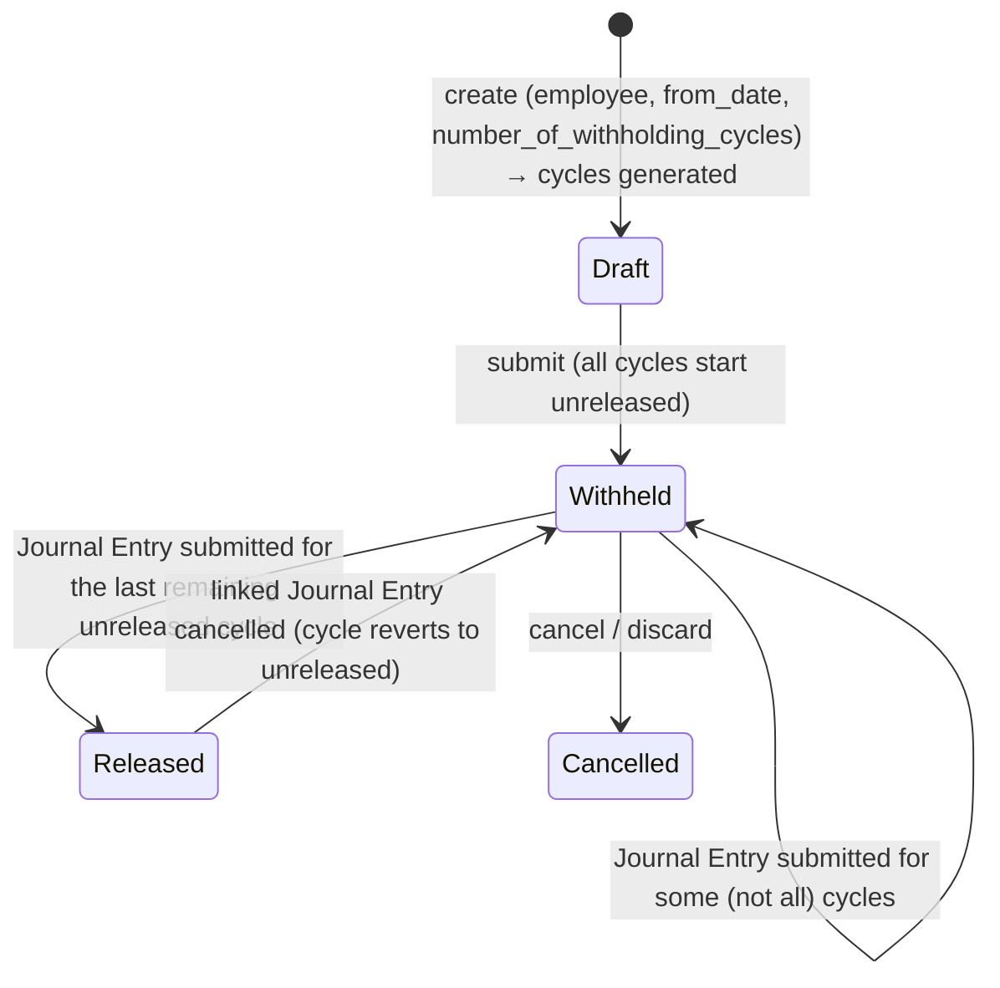

# Salary Withholding

Formally holds back an employee's salary for a defined number of payroll cycles — typically used when an employee is under investigation, has an unresolved exit/full-and-final process, or another compliance reason requires payment to be paused — by splitting the withholding period into per-cycle rows that are individually released once the reason is resolved and payment is authorized. It exists so "don't pay this person yet" is a tracked, auditable HR decision tied to specific payroll cycles and specific Salary Slips/Journal Entries, rather than an ad-hoc manual skip.

## Key Fields

| Field | Type | Purpose |
|---|---|---|
| `employee` | Link (Employee) | Whose salary is withheld. |
| `payroll_frequency` | Select | Monthly/Fortnightly/Bimonthly/Weekly/Daily; auto-derived from the employee's active Salary Structure if not set. |
| `number_of_withholding_cycles` | Int | How many payroll cycles to withhold; drives `to_date` and the generated `cycles` rows. |
| `from_date` / `to_date` | Date | Withholding window; `to_date` is computed, read-only. |
| `status` | Select | Draft / Withheld / Released / Cancelled — auto-derived. |
| `cycles` | Table (Salary Withholding Cycle) | One row per payroll cycle in the window, each independently tracked as released or not. |
| `date_of_joining` / `relieving_date` | Date (fetched) | Context for why withholding might apply (e.g. exit-related). |
| `reason_for_withholding_salary` | Small Text | Free-text justification. |

## Relationships

- [[Employee]] — linked from.
- [[Salary Structure Assignment]] — read in `get_payroll_frequency` to derive the payroll frequency from the employee's active structure as of `from_date`.
- [[Salary Withholding Cycle]] — parent/child via `cycles`; each cycle can carry a linked Journal Entry once its salary is released.
- [[Salary Slip]] — linked from (`salary_withholding` field on Salary Slip, declared via this doctype's `links`); Salary Slip's `status` is flipped between "Withheld"/"Submitted" as cycles are released/unreleased. Also, `salary_withholding_cycle` on Salary Slip ties a slip to a specific cycle row.
- [[Journal Entry]] — triggers/linked from: when a Journal Entry referencing a withheld cycle is submitted, hrms/hooks.py wires `update_salary_withholding_payment_status` to Journal Entry's `on_submit`/`on_cancel` (hrms/hooks.py:197-211) — this is the actual release mechanism, not a Payment Entry event, despite the function name suggesting a generic "payment."
- [[Payroll Employee Detail]] — updated (`is_salary_withheld` flag) whenever a cycle's release status flips, so [[Payroll Entry]] can exclude/include the employee accordingly.

## Logic — What Happens and Why

**Validate (`validate()`):**
- Resolves `payroll_frequency` from the employee's active Salary Structure if not explicitly set (`get_payroll_frequency`) — withholding cycles must align with how the employee is actually paid.
- `set_withholding_cycles_and_to_date` — computes `to_date` from `from_date + number_of_withholding_cycles` worth of frequency-based periods, then rebuilds the `cycles` child table from scratch: walks from `from_date` in frequency-sized increments (Monthly=1 month, Fortnightly=14 days, etc.) until reaching `to_date`, appending one `Salary Withholding Cycle` row per period with `is_salary_released = 0`.
- `validate_duplicate_record` — blocks any other non-cancelled Salary Withholding for the same employee whose date range overlaps this one (an employee can't have two overlapping withholding orders).
- `set_status()` — Draft (docstatus 0); Cancelled (docstatus 2); if submitted, "Released" only when *every* cycle's `is_salary_released` is true, otherwise "Withheld."

**Submit:** no explicit `on_submit` override — submission simply locks in the computed cycles; `set_status()` runs via `validate()` before submit completes, producing "Withheld" status (since cycles start unreleased).

**Release mechanism (module-level `update_salary_withholding_payment_status`, called from Journal Entry doc_events):**
- Finds all Salary Withholding Cycle rows whose `journal_entry` matches the submitted/cancelled Journal Entry and are themselves submitted.
- `_update_payment_status_in_payroll` — sets the corresponding Salary Slips' `status` to "Submitted" (release) or "Withheld" (cancel), and toggles `Payroll Employee Detail.is_salary_withheld` for the affected employees accordingly — this is what lets a future Payroll Entry treat the employee as payable again.
- `_update_salary_withholdings` — on the Salary Withholding doc itself, sets the matching cycle's `is_salary_released` (and clears `journal_entry` on cancel), then calls `set_status(update=True)` to recompute the parent's overall Withheld/Released status from the cycle-level state.
- `link_bank_entry_in_salary_withholdings` — a separate helper that stamps a bank/journal entry reference onto the withholding cycles tied to a batch of salary slips (called from the bank-payment/JV creation flow elsewhere in payroll processing), which is what populates `journal_entry` on a cycle in the first place.

**Discard (`on_discard`):** force-sets status to "Cancelled".

## Roles & Permissions

| Role | Can Do | Notes |
|---|---|---|
| [[System Manager]] | read/write/create/delete/submit/cancel/amend | Full control. |
| [[HR Manager]] | read/write/create/delete/submit/cancel | Full lifecycle. |
| [[Employee]] | read | View-only, presumably their own record. |

## Mermaid: State/Flow

