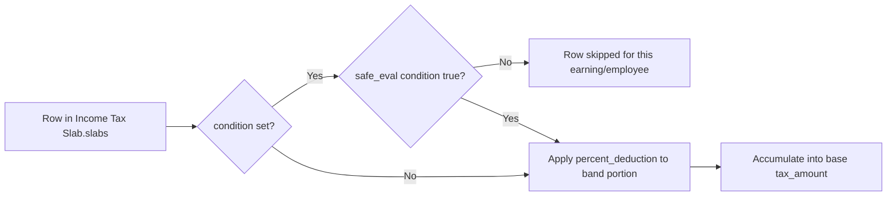

# Taxable Salary Slab

Child table row of [[Income Tax Slab]] representing one progressive tax band (e.g. "0–250,000: 0%", "250,001–500,000: 5%") plus an optional conditional formula that scopes the band to specific employees (by age, gender, or a salary component's value). This is the core rate table that `calculate_base_tax_from_tax_slabs` walks to compute base tax from annualized taxable earning.

## Key Fields

| Field | Type | Purpose |
|---|---|---|
| `from_amount` | Currency, default 0, required | Lower bound of the band. |
| `to_amount` | Currency | Upper bound; if empty, the band is open-ended (taxes everything above `from_amount`). |
| `percent_deduction` | Percent, default 0, required | Tax rate applied to the portion of income within this band. |
| `condition` | Code | Optional Python expression (via `frappe.safe_eval`) restricting when this row applies — e.g. by `date_of_birth`, `gender`, or a salary component value like `base`. |
| `html_6` | HTML | Static in-form help text showing example condition syntax; documentation only, no logic. |

## Relationships

- [[Income Tax Slab]] — parent/child (`slabs` table).

## Logic — What Happens and Why

No controller logic (`taxable_salary_slab.py` is `pass`) — pure data row. All computation happens in `hrms.payroll.doctype.income_tax_slab.income_tax_slab.calculate_base_tax_from_tax_slabs`:
1. For each slab row, if `condition` is non-empty, evaluate it via `eval_tax_slab_condition` (restricted `safe_eval` with `annual_taxable_earning` and any caller-supplied locals); rows whose condition evaluates false are skipped entirely for that employee.
2. If `to_amount` is empty and earning reaches `from_amount`, tax the excess above `from_amount` (inclusive, `+1`) at `percent_deduction`.
3. If earning falls between `from_amount` and `to_amount`, tax only the excess above `from_amount`.
4. If earning exceeds `to_amount` entirely, tax the full band width (`to_amount - from_amount + 1`) at `percent_deduction`.
5. Sums across all applicable rows to produce the base tax amount (before marginal relief, surcharge, and other charges).

Why conditions exist per-row: some jurisdictions define different tax-free/slab thresholds for different demographics within the same tax year (e.g. India's higher exemption threshold for senior citizens) — encoding that as a per-row Python condition avoids needing a separate `Income Tax Slab` document per demographic segment.

## Roles & Permissions

Child table — no standalone `permissions` array (`"permissions": []`). Access follows the parent [[Income Tax Slab]] (System Manager, HR Manager, HR User — full submit/cancel/amend rights).

## Mermaid: State/Flow

