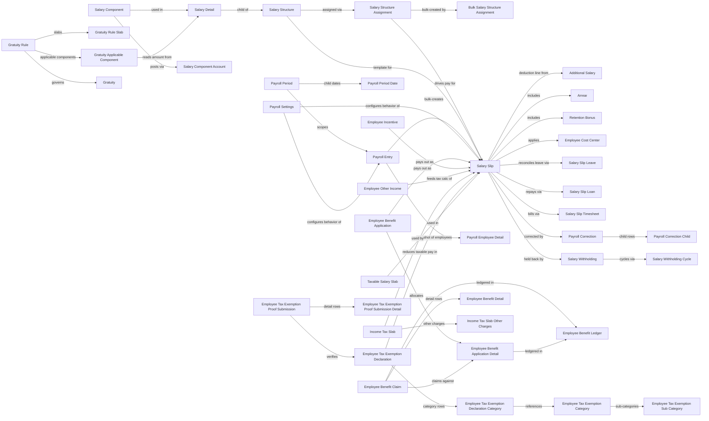

# Payroll

Payroll is the compensation-execution engine of HRMS: it turns an employee's contracted pay
structure into a periodic, auditable salary payment, handles the statutory and voluntary
deductions layered on top of base pay (income tax, benefits, loans, tax exemptions), and
produces the accounting and compliance trail (journal entries, tax declarations, gratuity
liability) a company needs to run payroll legally and repeatably. It covers everything from
defining what a "salary component" is, to assigning a pay structure to an employee, to running
a bulk payroll cycle, to settling end-of-service dues like gratuity.

## Doctype Map

## Why This Module Exists

Payroll cannot run on ad-hoc numbers — it needs a defined, versioned pay template before it can
compute anything for an individual. That is the reason [[Salary Structure]] (the template of
[[Salary Component]] earnings/deductions, as [[Salary Detail]] rows) must exist and be assigned
to an employee via [[Salary Structure Assignment]] *before* a [[Salary Slip]] can be generated —
the assignment fixes the base/CTC and effective date so the same structure can be reused across
employees and revised over time without rewriting history. [[Payroll Period]] exists because
statutory tax calculation (income tax slabs, exemptions) is computed over a fixed period, not
per slip, so per-employee tax deducted at source has to be reconciled against annual liability —
this is why [[Income Tax Slab]], [[Employee Tax Exemption Declaration]], and
[[Employee Tax Exemption Proof Submission]] all key off a Payroll Period rather than a slip.

[[Payroll Entry]] exists to make payroll a controlled, auditable batch operation instead of
one-by-one slip creation: it snapshots the eligible employee set as [[Payroll Employee Detail]],
runs every slip through the same validation and accounting logic in one submit/cancel unit, and
is the point where the accounting entries (bank/net-pay journal entries) get created and can be
rolled back consistently on cancel. Adjustments that must not touch the structure or a
committed slip — [[Additional Salary]] (one-off pay), [[Arrear]] (back-pay), [[Retention Bonus]],
[[Employee Incentive]] — exist as separate doctypes so they can be approved, dated, and audited
independently of the recurring structure, then picked up automatically by the next slip generation
for their target period.

Benefits ([[Employee Benefit Application]], [[Employee Benefit Claim]]) exist because some pay
components are legally capped, tax-exempt allowances that an employee must actively claim against
(fuel, LTA, meal cards, etc.) rather than receive automatically — the application/claim/ledger
split ([[Employee Benefit Ledger]]) exists so the system can track how much of a component's
annual entitlement has already been paid out, preventing over-claiming. Tax exemption doctypes
exist for the same reason on the deduction side: an employee's declared investments
([[Employee Tax Exemption Declaration]]) reduce taxable income for TDS calculation, but only
after proof is verified ([[Employee Tax Exemption Proof Submission]]), so the system doesn't
under-collect tax on an unproven declaration and expose the employer to compliance risk.

[[Gratuity]] and [[Gratuity Rule]] exist separately from the recurring slip because gratuity is
an end-of-service, jurisdiction-defined lump-sum liability (slab-based in India, service-year
based in the UAE — see regional overrides noted in the individual doctype files) computed once
against tenure and last-drawn pay, not something that accrues per pay run the way a salary
component does. [[Salary Withholding]] exists to let a company legally hold back part of an
employee's pay (e.g. during a probation review or dispute) without altering the underlying
salary structure, releasing it automatically over a [[Salary Withholding Cycle]] once the
withholding condition clears.

## Doctypes in This Module

### Structure & Assignment
- [[Salary Component]] — defines one earning/deduction type (formula, tax treatment, GL account mapping).
- [[Salary Component Account]] — per-company GL account override for a Salary Component.
- [[Salary Detail]] — child row binding a Salary Component to an amount/formula inside a Salary Structure or Salary Slip.
- [[Salary Structure]] — the reusable pay template (list of earnings/deductions) assigned to employees.
- [[Salary Structure Assignment]] — links an employee to a Salary Structure with an effective date and base/CTC.
- [[Bulk Salary Structure Assignment]] — tool doctype to assign one structure to many employees at once.

### Payroll Run
- [[Salary Slip]] — the generated, per-employee, per-period payslip; the module's central document.
- [[Salary Slip Leave]] — child table snapshotting leave taken/encashed on a slip.
- [[Salary Slip Loan]] — child table snapshotting loan repayment/interest deducted on a slip.
- [[Salary Slip Timesheet]] — child table linking billable timesheet hours used for hourly pay.
- [[Payroll Entry]] — batch controller that generates, submits, and accounts for a set of Salary Slips.
- [[Payroll Employee Detail]] — child table snapshotting the employee set picked up by a Payroll Entry.
- [[Payroll Period]] — a named date range (usually a fiscal year) used to scope tax and exemption calculations.
- [[Payroll Period Date]] — child table of period-relevant dates (unused/rare; check source before relying on it).
- [[Payroll Settings]] — singleton of global payroll behavior toggles (rounding, email settings, etc).
- [[Payroll Correction]] — records post-submission correction requests against a submitted Salary Slip.
- [[Payroll Correction Child]] — child row of field-level corrections inside a Payroll Correction.
- [[Salary Withholding]] — holds back part of an employee's pay across a date range pending resolution.
- [[Salary Withholding Cycle]] — child table of scheduled release cycles for a Salary Withholding.

### Adjustments & Incentives
- [[Additional Salary]] — one-off recurring/non-recurring earning or deduction injected into a slip.
- [[Arrear]] — back-pay adjustment for a prior period.
- [[Retention Bonus]] — scheduled retention payout tied to a future date/condition.
- [[Employee Incentive]] — one-off incentive/bonus payout.
- [[Employee Other Income]] — employee-declared non-salary income used in tax computation.
- [[Employee Cost Center]] — child table splitting an employee's pay across cost centers.

### Benefits
- [[Employee Benefit Application]] — employee's declared allocation of flexible benefit components for a period.
- [[Employee Benefit Application Detail]] — child row of one component's claimed amount in an application.
- [[Employee Benefit Claim]] — actual claim submitted against an allocated benefit.
- [[Employee Benefit Detail]] — child row of claimed items inside a Benefit Claim.
- [[Employee Benefit Ledger]] — running ledger of benefit amounts paid/claimed per employee/component.

### Tax & Exemptions
- [[Income Tax Slab]] — statutory tax slab/rate table used to compute TDS on a slip.
- [[Income Tax Slab Other Charges]] — child table of additional charges/cess on a slab.
- [[Taxable Salary Slab]] — child table of marginal tax bands inside a slab (or related tax structure).
- [[Employee Tax Exemption Category]] — top-level exemption category (e.g. Section 80C).
- [[Employee Tax Exemption Sub Category]] — sub-category under a category with its own max exemption limit.
- [[Employee Tax Exemption Declaration]] — employee's declared investment/exemption amounts for a period.
- [[Employee Tax Exemption Declaration Category]] — child row of declared sub-category amounts.
- [[Employee Tax Exemption Proof Submission]] — proof submitted against a declaration, verified by HR.
- [[Employee Tax Exemption Proof Submission Detail]] — child row of proof amounts per sub-category.

### Gratuity
- [[Gratuity]] — end-of-service gratuity payout record for a leaving/eligible employee.
- [[Gratuity Rule]] — jurisdiction-specific gratuity calculation rule (slab or service-year based).
- [[Gratuity Rule Slab]] — child table of tenure-based slab rates inside a Gratuity Rule.
- [[Gratuity Applicable Component]] — child table of which Salary Components count toward gratuity-relevant pay.

## Related Flow

See [[Payroll Run Lifecycle]] for the end-to-end sequence from Salary Structure Assignment through Payroll Entry to Salary Slip submission.
