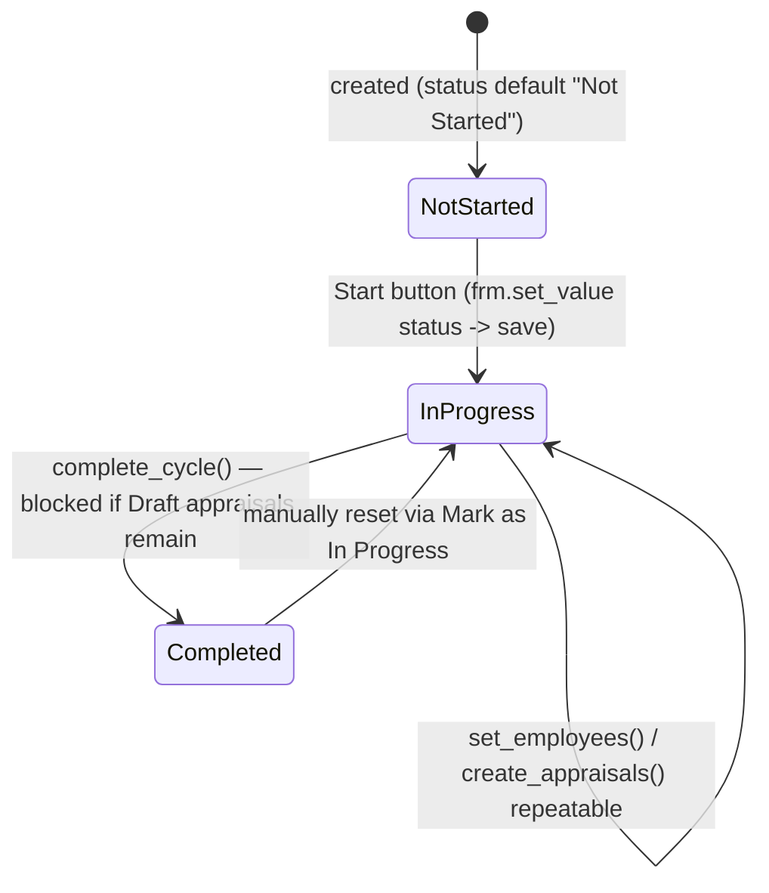

# Appraisal Cycle

The container process that defines a company's performance-review round: its date window, evaluation method (automated goal-progress vs manual rating), which employees are in scope, and the formula used to compute each employee's final score. It is the parent object that [[Appraisal]], [[Goal]], and [[Employee Performance Feedback]] all key off of.

## Key Fields

| Field | Type | Purpose |
|---|---|---|
| `cycle_name` | Data | Unique name; also the document's autoname source. |
| `company` | Link (Company) | Scopes which employees can be pulled in. |
| `start_date` / `end_date` | Date | The review period window; validated start < end. |
| `status` | Select | Not Started / In Progress / Completed — drives what actions are allowed. |
| `kra_evaluation_method` | Select | "Automated Based on Goal Progress" or "Manual Rating"; locked once appraisals exist. |
| `calculate_final_score_based_on_formula` | Check | Enables a custom Python-expression formula instead of the default equal-weighted average. |
| `final_score_formula` | Code (PythonExpression) | Custom formula evaluated per-Appraisal via `frappe.safe_eval`. |
| `branch` / `department` / `designation` | Link | Optional filters used only to pull the initial employee list into `appraisees`. |
| `appraisees` | Table (Appraisee) | The employee list this cycle applies to, each row optionally carrying its own `appraisal_template`. |

## Relationships

- [[Company]] — required scoping link.
- [[Branch]], [[Department]], [[Designation]] — optional filter links used by `get_employees_for_appraisal`.
- Appraisee (child table, not a standalone module doctype covered here) — one row per employee pulled in, holding `appraisal_template` per employee/designation.
- [[Appraisal]] — triggers: `create_appraisals_for_cycle` creates one Appraisal per appraisee; linked back via `Appraisal.appraisal_cycle`.
- [[Employee Performance Feedback]] — linked from, via `appraisal_cycle` (fetched through their linked Appraisal).
- [[Goal]] — linked from, via `appraisal_cycle`; used to compute missing-goals summary.
- [[Employee]] — queried in `get_employees_for_appraisal` (status Active + company/department/branch/designation filters).
- [[Designation]] — `get_appraisal_template_map` reads each Designation's default `appraisal_template` to prefill appraisees lacking one.

## Logic — What Happens and Why

**Validate.** `validate_from_to_dates` enforces `start_date <= end_date`. `validate_evaluation_method_change` blocks changing `kra_evaluation_method` once any non-cancelled Appraisal already exists for this cycle (`check_if_appraisals_exist`) — because switching from automated-goal-progress to manual (or back) mid-cycle would make already-scored appraisals inconsistent with newly created ones.

**Employee selection.** `set_employees` (whitelisted, `check_permission("write")`) queries active Employees in the cycle's company filtered by optional department/branch/designation, then replaces the `appraisees` table, attaching each employee's Designation's default Appraisal Template via `get_appraisal_template_map`. If any appraisee ends up without a template, `show_missing_template_message` warns (and can raise) telling the user to set a Designation-level template or fill it in manually per row — this exists because `create_appraisals` requires every appraisee to have a template before Appraisal docs can be built with KRAs.

**Appraisal creation.** `create_appraisals` (whitelisted, `check_permission("write")`) requires a non-empty `appraisees` list and that every row has a template (else throws via `show_missing_template_message(raise_exception=True)`). For >30 appraisees it is enqueued as a background job (`frappe.enqueue(..., queue="long", timeout=600)`) with progress published; for ≤30 it runs synchronously with `publish_progress` so the UI shows a progress bar. The module-level `create_appraisals_for_cycle` function builds one `Appraisal` per appraisee (setting `rate_goals_manually` from `kra_evaluation_method`, calling `set_kras_and_rating_criteria()`, then `insert()`), silently skipping any that already exist (`frappe.DuplicateEntryError` caught and ignored) so re-running the action is idempotent.

**Completing the cycle.** `complete_cycle` (whitelisted, `check_permission("write")`) counts Draft (`docstatus=0`) Appraisals for the cycle and throws with a link to them if any remain unsubmitted — a cycle cannot be marked Completed while appraisals are still in progress, because `validate_active_appraisal_cycle` (used by Appraisal, Goal validators) then blocks any further create/edit against a Completed cycle, effectively freezing all linked records.

**Cross-doctype guard.** `validate_active_appraisal_cycle` (module-level helper, imported by `appraisal.py` and `goal.py`) throws if the target cycle's status is "Completed" — this is the mechanism that "freezes" goals and appraisals once a cycle is closed out.

**Reporting helpers.** `get_appraisal_cycle_summary` (whitelisted) returns counts: total non-cancelled appraisees, appraisals with `self_score == 0` (self-appraisal pending), employees without any non-archived Goal in the cycle (`get_employees_without_goals`), and employees without submitted feedback (`get_employees_without_feedback`) — all via query-builder anti-joins against Appraisal. Used to populate dashboard indicators, not to gate any workflow transition.

## Roles & Permissions

| Role | Can Do | Notes |
|---|---|---|
| [[System Manager]] | read, write, create, delete, export | No submit/cancel — doctype is not submittable. |
| [[HR Manager]] | read, write, create, delete, export | Same rights as System Manager. |
| [[HR User]] | read, write, create, export | No delete. |
| [[Employee]] | read, select, export | Read-only visibility (e.g. to see their own cycle); cannot create/edit. |

## Mermaid: State/Flow

