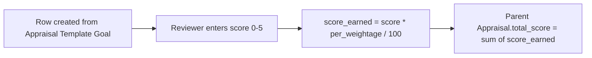

# Appraisal Goal

A child-table row on [[Appraisal]] (used only when `rate_goals_manually` is checked) representing one manually-scored goal line: a description, its weightage, and the star rating a reviewer assigns it. It exists to support companies whose Appraisal Cycle uses "Manual Rating" instead of automated goal-progress scoring.

## Key Fields

| Field | Type | Purpose |
|---|---|---|
| `kra` | Small Text | Free-text goal/KRA description (labeled "Goal" on the form; not a Link, unlike Appraisal KRA). |
| `per_weightage` | Float | Weightage percentage of this goal within the appraisal; all rows must sum to 100 (`validate_total_weightage` on the parent). |
| `score` | Float | Manually entered rating (capped at the "score" field's rating-scale, enforced in `Appraisal.calculate_total_score`, default cap effectively via number_of_stars from the DocField options, typically 5). |
| `score_earned` | Float | `score * per_weightage / 100`, computed client-side (`appraisal.js` `set_score_earned`) and server-side in `Appraisal.calculate_total_score`. |

## Relationships

- [[Appraisal]] — parent; stored in the `goals` table field, only populated/visible when `rate_goals_manually` is set.
- [[Appraisal Template]] — indirectly: rows are seeded from the template's `goals` (Appraisal Template Goal) via `Appraisal.set_kras_and_rating_criteria` when `rate_goals_manually`.

## Logic — What Happens and Why

No dedicated Python controller logic (`AppraisalGoal(Document): pass`). All behavior lives in the parent [[Appraisal]] controller and its client script:
- Client-side (`appraisal.js`): entering a `score` > 5 shows a message and resets it to 0; both `score` and `per_weightage` changes recompute `score_earned` and roll up `total_score` on the parent grid live.
- Server-side (`Appraisal.calculate_total_score`): throws if any row's `score` exceeds the doctype's configured max rating (`number_of_stars`), computes `score_earned` for each row, and sums into the parent's `total_score`, after checking total weightage equals 100.

## Roles & Permissions

Not enforced in code — this is a pure child table (`istable: 1`) with an empty `permissions` array in its JSON; access is governed entirely by permissions on the parent [[Appraisal]] document.

## Mermaid: State/Flow

