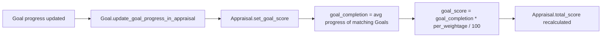

# Appraisal KRA

A child-table row on [[Appraisal]] (used when scoring is automated, i.e. `rate_goals_manually` is unchecked) linking a KRA to its weightage and its computed completion/score, derived from the average progress of the employee's [[Goal]] records tagged with that KRA in the same cycle. It exists so goal-progress tracking translates automatically into an appraisal score without manual rating.

## Key Fields

| Field | Type | Purpose |
|---|---|---|
| `kra` | Link (KRA) | The Key Result Area being scored (a real Link, unlike Appraisal Goal's free-text field). |
| `per_weightage` | Percent | Weightage of this KRA in the appraisal; rows must total 100 (`validate_total_weightage`). |
| `goal_completion` | Percent | Read-only; average `progress` of matching top-level, non-archived Goals for this employee/KRA/cycle, set by `Appraisal.set_goal_score`. |
| `goal_score` | Float | Read-only; `goal_completion * per_weightage / 100`, i.e. weighted contribution to the appraisal's goal score. |

## Relationships

- [[Appraisal]] — parent; stored in `appraisal_kra`, visible only when `!rate_goals_manually`.
- KRA (Key Result Area, not separately documented here) — linked via `kra`.
- [[Goal]] — not a stored link, but queried live: `Appraisal.set_goal_score` averages `Goal.progress` where `Goal.kra == this row's kra`, `Goal.employee == appraisal.employee`, `Goal.status != "Archived"`, `Goal.parent_goal` is empty, and `Goal.appraisal_cycle == appraisal.appraisal_cycle`.

## Logic — What Happens and Why

No dedicated controller logic (`AppraisalKRA(Document): pass`). All computation happens in `Appraisal.set_goal_score`, run on every Appraisal `validate()` and whenever a linked Goal changes (`Goal.update_goal_progress_in_appraisal` calls `Appraisal.set_goal_score(update=True)`):
- For each KRA row, averages the progress of only root-level (non-child) Goals to avoid double-counting nested sub-goals whose progress already rolls up into their parent Goal's own progress.
- Archived goals are excluded from the average so goals a manager abandoned don't drag down (or artificially inflate, if excluded entirely) the KRA completion.
- The resulting `goal_completion` feeds `goal_score`, and all rows' `goal_score_percentage` sum feeds `Appraisal.calculate_total_score` (converted to a /5 scale via `/20`).

## Roles & Permissions

Not enforced in code — pure child table (`istable: 1`, empty `permissions` array); governed by the parent [[Appraisal]]'s permissions.

## Mermaid: State/Flow

