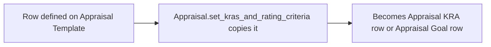

# Appraisal Template Goal

A child-table row on [[Appraisal Template]] pairing a KRA with its prescribed weightage for that template. It is the master-data source that later gets copied into each individual [[Appraisal]]'s `appraisal_kra` or `goals` table.

## Key Fields

| Field | Type | Purpose |
|---|---|---|
| `key_result_area` | Link (KRA) | The KRA this template line prescribes. |
| `per_weightage` | Percent | Weightage of this KRA within the template; all rows on the template must sum to 100. |

## Relationships

- [[Appraisal Template]] — parent; stored in the `goals` table field.
- KRA (Key Result Area, not separately documented in this module) — linked via `key_result_area`.
- [[Appraisal]] — indirectly: `Appraisal.set_kras_and_rating_criteria` reads each Appraisal Template Goal row (`entry.key_result_area`, `entry.per_weightage`) and appends corresponding rows into the Appraisal's `appraisal_kra` (automated) or `goals` (manual) table.

## Logic — What Happens and Why

No dedicated controller logic (`AppraisalTemplateGoal(Document): pass`). Validation of the 100%-total rule happens on the parent [[Appraisal Template]] via `validate_total_weightage`.

## Roles & Permissions

Not enforced in code — pure child table (`istable: 1`, empty `permissions` array); governed by the parent [[Appraisal Template]]'s permissions.

## Mermaid: State/Flow

