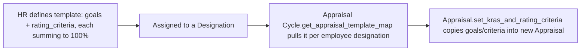

# Appraisal Template

A reusable master template — normally set per [[Designation]] — that defines the standard set of KRAs (goals) and self/peer rating criteria a role should be evaluated against. It lets HR define scoring structure once and reuse it across every appraisal for that role instead of configuring KRAs and criteria per employee each cycle.

## Key Fields

| Field | Type | Purpose |
|---|---|---|
| `template_title` | Data | Unique name; autoname source. |
| `description` | Small Text | Free-text description of the template's intent. |
| `goals` | Table (Appraisal Template Goal) | The KRA list and weightages this template prescribes; required. |
| `rating_criteria` | Table (Employee Feedback Rating) | The feedback/self-appraisal criteria and weightages this template prescribes. |

## Relationships

- [[Appraisal Template Goal]] — child table `goals`; defines KRA + weightage pairs copied into new appraisals.
- [[Employee Feedback Rating]] — child table `rating_criteria`; defines criteria + weightage pairs copied into appraisals' `self_ratings` and into [[Employee Performance Feedback]]'s `feedback_ratings`.
- [[Designation]] — linked from: `Designation.appraisal_template` points here, and `Appraisal Cycle.get_appraisal_template_map` reads it to prefill appraisees.
- [[Appraisal]] — linked from, via `appraisal_template`; `Appraisal.set_kras_and_rating_criteria` copies this template's `goals`/`rating_criteria` into the Appraisal's `appraisal_kra`/`goals` and `self_ratings`.

## Logic — What Happens and Why

`validate()` (via `AppraisalMixin.validate_total_weightage`) enforces that both the `goals` table and the `rating_criteria` table each sum to exactly 100% weightage. This guarantees that any Appraisal built from this template starts from a scoring structure that can legitimately be normalized to a percentage/5-star scale — if a template's weights didn't sum to 100, every appraisal derived from it would inherit an already-invalid `validate_total_weightage` failure at save time (the same check re-runs on the Appraisal itself).

There is no submit/cancel lifecycle — this is a plain (non-submittable) setup/master doctype maintained by HR.

## Roles & Permissions

| Role | Can Do | Notes |
|---|---|---|
| [[HR User]] | read, write, create | No delete. |
| [[HR Manager]] | read, write, create, delete, export | Full control. |
| [[Employee]] | read | View-only, e.g. to see what they're evaluated against. |

## Mermaid: State/Flow

