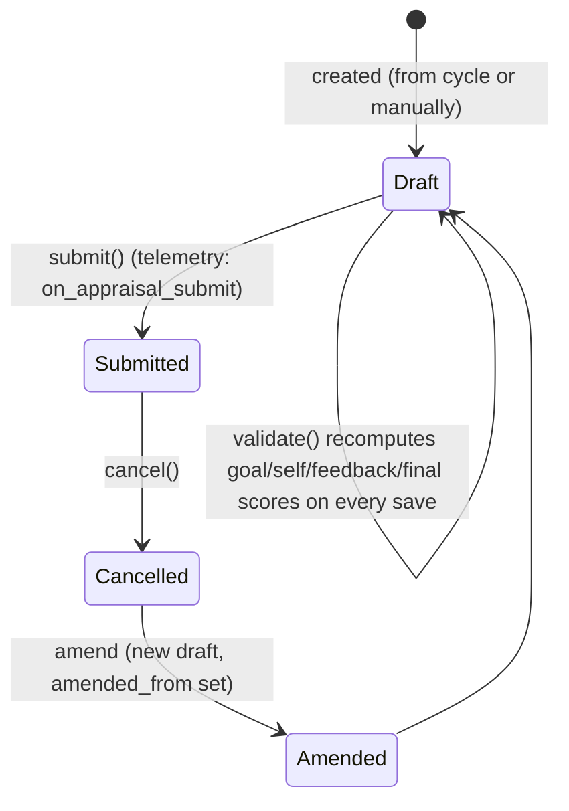

# Appraisal

The formal, submittable performance-review record for one employee for one [[Appraisal Cycle]]. It aggregates three independent inputs — automated/manual goal scoring against KRAs, peer/manager feedback, and self-appraisal ratings — into a single Final Score that becomes the employee's official appraisal outcome for that cycle.

## Key Fields

| Field | Type | Purpose |
|---|---|---|
| `employee` | Link (Employee) | Whose appraisal this is; set only once. |
| `appraisal_cycle` | Link (Appraisal Cycle) | The cycle this appraisal belongs to; drives dates, KRA evaluation method, and final-score formula. |
| `appraisal_template` | Link (Appraisal Template) | Source of KRAs and rating criteria; mandatory once the doc is saved once. |
| `rate_goals_manually` | Check | Read-only flag copied from the cycle's `kra_evaluation_method`; switches whether `goals` (manual) or `appraisal_kra` (automated) table is used. |
| `appraisal_kra` | Table (Appraisal KRA) | KRA vs Goals — used when scoring is automated from Goal progress. |
| `goals` | Table (Appraisal Goal) | Manually-rated goals — used when `rate_goals_manually` is set. |
| `goal_score_percentage` | Float | Sum of weighted KRA goal completion, computed in `calculate_total_score`. |
| `total_score` | Float | Goal score out of 5 (from KRAs or manual goals). |
| `self_ratings` | Table (Employee Feedback Rating) | Self-appraisal criteria and star ratings. |
| `self_score` | Float | Computed self-appraisal score. |
| `avg_feedback_score` | Float | Average `total_score` across all submitted [[Employee Performance Feedback]] for this appraisal. |
| `final_score` | Float | Average of goal score, feedback score and self score, or a custom formula from the cycle. |
| `reflections` | Text Editor | Free-text self-reflection. |
| `remarks` | Text | Manual notes, shown only when `rate_goals_manually`. |

## Relationships

- [[Employee]] — linked from `employee`; the subject of the appraisal.
- [[Appraisal Cycle]] — linked from `appraisal_cycle`; parent process this appraisal is part of.
- [[Appraisal Template]] — linked from `appraisal_template`; supplies KRAs and rating criteria via `set_kras_and_rating_criteria`.
- [[Appraisal KRA]] — child table `appraisal_kra`, one row per KRA with computed `goal_completion`/`goal_score`.
- [[Appraisal Goal]] — child table `goals`, used for manually-rated goals.
- [[Employee Feedback Rating]] — child table `self_ratings`, self-appraisal criteria/ratings.
- [[Goal]] — linked from (queried, not stored): `set_goal_score` averages `Goal.progress` per KRA/employee/cycle to compute `goal_completion`.
- [[Employee Performance Feedback]] — linked from: feedback docs reference this Appraisal via their `appraisal` field; `calculate_avg_feedback_score` reads their `total_score`.
- [[Department]], [[Designation]], [[Company]] — fetched read-only context fields from Employee.

## Logic — What Happens and Why

**Create (draft).** `set_kra_evaluation_method` (called in `validate`, only `if self.is_new()`) reads the linked Appraisal Cycle's `kra_evaluation_method`; if it is "Manual Rating", `rate_goals_manually` is set to 1. This locks in the scoring mode per-appraisal so a later change to the cycle's method doesn't retroactively change how existing appraisals are scored (enforced separately in `Appraisal Cycle.validate_evaluation_method_change`).

The whitelisted `set_appraisal_template` looks up the `Appraisee` child row on the Appraisal Cycle for this employee to pull the template, then calls `set_kras_and_rating_criteria`, which clears `appraisal_kra`/`self_ratings`/`goals` and repopulates them from the `Appraisal Template`'s `goals` and `rating_criteria`, routing KRAs to `goals` or `appraisal_kra` depending on `rate_goals_manually`.

**Validate (every save).** In order: `validate_active_employee` blocks appraisals for inactive employees; `validate_active_appraisal_cycle` blocks any create/change once the cycle status is "Completed"; `validate_duplicate` runs a query-builder check that throws `DuplicateEntryError` if another non-cancelled Appraisal exists for the same employee with the same cycle OR an overlapping start/end date range — this prevents two concurrent appraisal records double-counting the same period. `validate_total_weightage` (from `AppraisalMixin`) is called twice — once for `appraisal_kra`, once for `self_ratings` — throwing unless weightages sum to exactly 100%, so score computation is always a true percentage split.

**Scoring pipeline (also re-run on every save).**
- `set_goal_score` iterates `appraisal_kra` rows; for each KRA it averages `Goal.progress` across all non-archived, non-child (`parent_goal` empty) Goals for this employee/KRA/cycle, stores it as `goal_completion`, and computes `goal_score = goal_completion * per_weightage / 100`. It then calls `calculate_total_score`.
- `calculate_total_score` either sums manually-entered `goals` scores (validating each ≤ the "score" field's rating-scale max, throwing otherwise) into `total_score`, or (automated mode) sums `goal_score_percentage` across `appraisal_kra` and converts it to a 0–5 scale (`/20`). Either way it throws if the relevant table's weightage doesn't sum to 100.
- `calculate_self_appraisal_score` computes `self_score` from `self_ratings`: `rating * max_stars * weightage/100`, summed.
- `calculate_avg_feedback_score` runs a Frappe query-builder AVG over `Employee Performance Feedback.total_score` for this employee+appraisal where `docstatus=1` (submitted only) — draft/cancelled feedback never affects the score. Called with `update=True` from Goal and Feedback controllers to push a live recompute + `db_update()` without going through full `save()`.
- `calculate_final_score` reads the Appraisal Cycle's `calculate_final_score_based_on_formula`/`final_score_formula`. If set, it builds a data dict merging goal/feedback/self scores with the cycle, employee and appraisal field values, sanitizes the formula (`sanitize_expression`, guarding against unsafe eval) and evaluates it via `frappe.safe_eval`. Otherwise it defaults to the straight average of the three scores. This lets a company weight the three inputs differently instead of assuming equal thirds.

**Feedback loop.** `add_feedback` (whitelisted) is the API a reviewer's feedback UI calls: it builds and immediately `submit()`s a new [[Employee Performance Feedback]] document tied to this appraisal, using the current session's Employee as `reviewer`. `get_feedback_history` (module-level, permission-checked via `frappe.has_permission`) returns the submitted feedback list plus a histogram of `total_score` ratings (buckets 1–5) for the dashboard chart.

**Submit / Cancel.** No `on_submit`/`on_cancel` are defined on Appraisal itself — submission just locks the document per Frappe's standard `is_submittable` behavior. The only doc_event hook is `hrms.hooks.py`: `"Appraisal": {"on_submit": "hrms.telemetry.on_appraisal_submit"}` — this is telemetry only, not business logic.

**Duplicate prevention rationale.** The overlapping-period check exists because an employee having two live appraisals for overlapping/duplicate windows would corrupt the "current appraisal" lookups used by Goal (`update_goal_progress_in_appraisal`) and Employee Performance Feedback (`validate_appraisal`), which assume a single appraisal per employee/cycle.

## Roles & Permissions

| Role | Can Do | Notes |
|---|---|---|
| [[Employee]] | read, write, create | No submit/cancel/delete — an employee can prepare their own appraisal draft (e.g. self-ratings/reflections) but cannot finalize it. |
| [[System Manager]] | read, write, create, submit, cancel, delete, amend | Full control. |
| [[HR User]] | read, write, create, submit, cancel, delete, amend | Same as System Manager. |
| [[HR Manager]] | read, write, create, submit, delete, amend, export | Has submit but this permission row omits explicit `cancel: 1` — not enforced in code beyond the JSON (cancel not listed for HR Manager). |

## Mermaid: State/Flow

