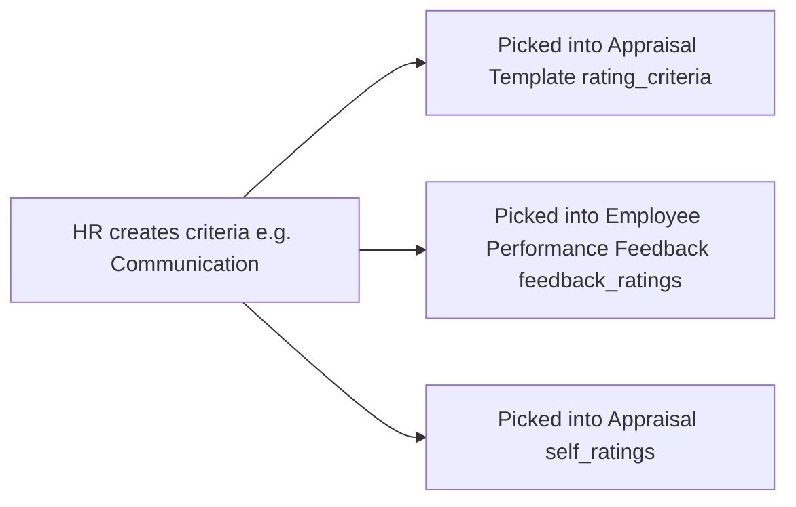

# Employee Feedback Criteria

A simple master list of named criteria (e.g. "Communication", "Teamwork") that can be picked when building rating tables on [[Appraisal Template]], [[Employee Performance Feedback]], or an [[Appraisal]]'s self-ratings. It exists so criteria names are standardized and reusable across templates and feedback rather than free-typed each time.

## Key Fields

| Field | Type | Purpose |
|---|---|---|
| `criteria` | Data | The unique criteria name; also the autoname source. |

## Relationships

- [[Employee Feedback Rating]] — linked from: every Employee Feedback Rating row's `criteria` field is a Link to this doctype.
- [[Appraisal Template]], [[Appraisal]], [[Employee Performance Feedback]] — indirectly, via their `rating_criteria`/`self_ratings`/`feedback_ratings` child tables all using Employee Feedback Rating rows that reference this master list.

## Logic — What Happens and Why

No controller logic (`EmployeeFeedbackCriteria(Document): pass`). It is a pure lookup/master list; `quick_entry: 1` in the JSON allows fast inline creation from within a rating table when a new criteria name is needed.

## Roles & Permissions

| Role | Can Do | Notes |
|---|---|---|
| [[System Manager]] | read, write, create, delete, export | Full control. |
| [[HR Manager]] | read, write, create, delete, export | Full control. |
| [[HR User]] | read, write, create, delete, export | Full control. |

## Mermaid: State/Flow

