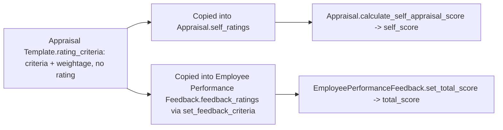

# Employee Feedback Rating

A generic child-table row pairing a criteria, its weightage, and (where applicable) a star rating. It is reused across three different parent contexts — [[Appraisal Template]]'s `rating_criteria` (definition only, no rating), [[Appraisal]]'s `self_ratings` (self-appraisal), and [[Employee Performance Feedback]]'s `feedback_ratings` (reviewer feedback) — so the same weighted-criteria structure and scoring math don't need three separate child doctypes.

## Key Fields

| Field | Type | Purpose |
|---|---|---|
| `criteria` | Link (Employee Feedback Criteria) | Which named criteria this row rates. |
| `per_weightage` | Percent | Weightage of this criteria within the parent's total (must sum to 100 across the table via `validate_total_weightage`). |
| `rating` | Rating | Star rating (1–5 scale); the JSON hides it (`depends_on: eval: doc.parenttype != "Appraisal Template"`) when the parent is an Appraisal Template, since a template only defines criteria/weightage, not an actual rating. |

## Relationships

- [[Employee Feedback Criteria]] — linked via `criteria`.
- [[Appraisal Template]] — parent when used as `rating_criteria` (definition template, no rating entered).
- [[Appraisal]] — parent when used as `self_ratings`; feeds `Appraisal.calculate_self_appraisal_score`.
- [[Employee Performance Feedback]] — parent when used as `feedback_ratings`; feeds `EmployeePerformanceFeedback.set_total_score`.

## Logic — What Happens and Why

No dedicated controller logic (`EmployeeFeedbackRating(Document): pass`). Scoring math lives entirely in the parent controllers:
- On [[Appraisal]]: `calculate_self_appraisal_score` sums `rating * number_of_stars * (per_weightage/100)` across `self_ratings` into `self_score`.
- On [[Employee Performance Feedback]]: `set_total_score` sums `rating * 5 * (per_weightage/100)` across `feedback_ratings` into `total_score`.
- On [[Appraisal Template]]: rows only carry `criteria`/`per_weightage` (rating hidden/unused); `validate_total_weightage` still enforces the weightage sum to 100 so any appraisal or feedback seeded from the template starts from a valid split.

## Roles & Permissions

Not enforced in code — pure child table (`istable: 1`, empty `permissions` array); governed by whichever parent doctype ([[Appraisal Template]], [[Appraisal]], or [[Employee Performance Feedback]]) it is attached to.

## Mermaid: State/Flow

