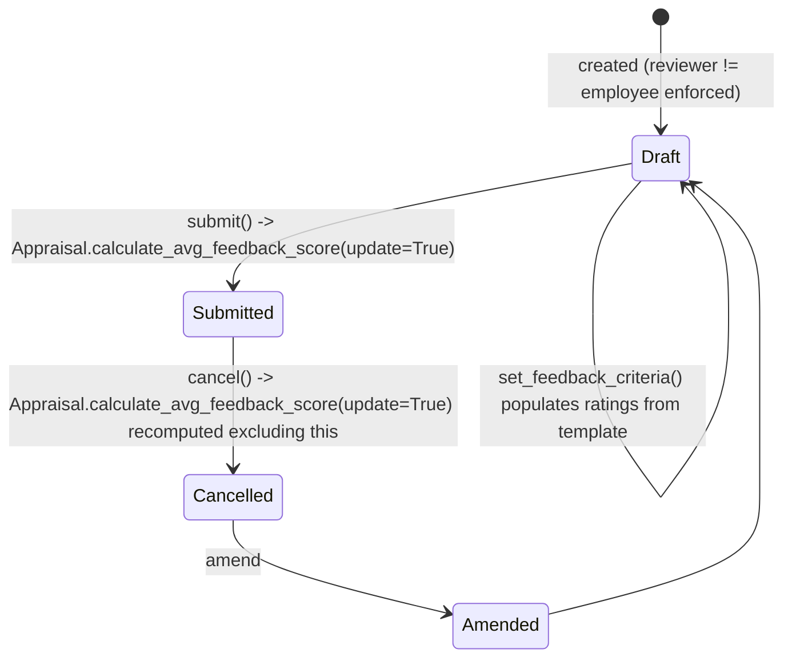

# Employee Performance Feedback

A submittable record of one reviewer's feedback (ratings across criteria plus free text) on one employee, tied to a specific [[Appraisal]]. It exists to let multiple peers/managers contribute structured, weighted feedback that is then averaged into the employee's overall appraisal score.

## Key Fields

| Field | Type | Purpose |
|---|---|---|
| `employee` | Link (Employee) | The employee being reviewed ("For Employee"). |
| `appraisal` | Link (Appraisal) | The specific appraisal this feedback counts toward; must belong to `employee`. |
| `appraisal_cycle` | Link (Appraisal Cycle) | Read-only, fetched from the linked appraisal. |
| `reviewer` | Link (Employee) | Who is giving the feedback; must differ from `employee`. |
| `feedback_ratings` | Table (Employee Feedback Rating) | Criteria + weightage + rating rows; must total 100% weightage. |
| `total_score` | Float | Computed weighted score from `feedback_ratings`. |
| `feedback` | Text Editor | Free-text feedback, required. |
| `added_on` | Datetime | Defaults to now. |

## Relationships

- [[Employee]] — twice: as the reviewed `employee` and (also an Employee record) as `reviewer`.
- [[Appraisal]] — parent process; `validate_appraisal` enforces the appraisal's `employee` matches this feedback's `employee`; `on_submit`/`on_cancel` push `calculate_avg_feedback_score(update=True)` back onto it.
- [[Appraisal Cycle]] — fetched read-only from the appraisal; validated active via `validate_active_appraisal_cycle`.
- [[Employee Feedback Rating]] — child table `feedback_ratings`.
- [[Appraisal Template]] — indirectly: `set_feedback_criteria` reads the appraisal's template's `rating_criteria` to seed `feedback_ratings`.

## Logic — What Happens and Why

**Validate.** `validate_active_appraisal_cycle` blocks feedback against a Completed cycle. `validate_employee` throws if `employee == reviewer` ("Employees cannot give feedback to themselves... Use Self Appraisal instead"), pointing the user at the Appraisal's own self-appraisal fields instead — self-feedback is a structurally different flow (self_ratings on the Appraisal) so it's explicitly rejected here to avoid double-counting. It also calls `validate_active_employee` for both employee and reviewer. `validate_appraisal` confirms the linked Appraisal's `employee` matches this feedback's `employee`, preventing feedback from being filed against someone else's appraisal by mistake. `validate_total_weightage("feedback_ratings", ...)` (from `AppraisalMixin`) enforces the ratings sum to 100%. `set_total_score` computes `total_score` as the sum over rows of `rating * 5 * (per_weightage/100)` — multiplying by 5 normalizes a 1–5 star rating field back to a 0–5 scale scaled by weight.

**Submit.** `on_submit` calls `update_avg_feedback_score_in_appraisal`, which loads the linked Appraisal and calls its `calculate_avg_feedback_score(update=True)` — this recomputes the Appraisal's `avg_feedback_score` as the average `total_score` of all *submitted* feedback (Appraisal's query filters `docstatus=1`), then recalculates the Appraisal's `final_score` and persists via `db_update()`. Only submission makes feedback count — drafts are invisible to the average.

**Cancel.** `on_cancel` runs the same `update_avg_feedback_score_in_appraisal`, so cancelling a feedback removes it from the average immediately (the Appraisal's query excludes non-submitted/cancelled docs by `docstatus=1`).

**Whitelisted helper.** `set_feedback_criteria` looks up the linked Appraisal's `appraisal_template` and repopulates `feedback_ratings` from the template's `rating_criteria`, so a reviewer doesn't have to hand-enter the criteria list — it mirrors `Appraisal.set_kras_and_rating_criteria`'s pattern for self_ratings.

**Origin via Appraisal.add_feedback.** `Appraisal.add_feedback` (whitelisted on the Appraisal side) is an alternate entry point: it builds a Performance Feedback doc directly (reviewer = current session's Employee) and immediately submits it, used by an in-app feedback widget rather than the standalone form.

## Roles & Permissions

| Role | Can Do | Notes |
|---|---|---|
| [[System Manager]] | read, write, create, submit, cancel, delete, amend, export | Full control. |
| [[Employee]] | read, write, create, submit, cancel | Can create and submit feedback (as a reviewer) but not delete or amend. |
| [[HR Manager]] | read, write, create, submit, cancel, export | Same operational rights as Employee plus export; no delete/amend listed. |
| [[HR User]] | read, export | Read-only visibility. |

## Mermaid: State/Flow

