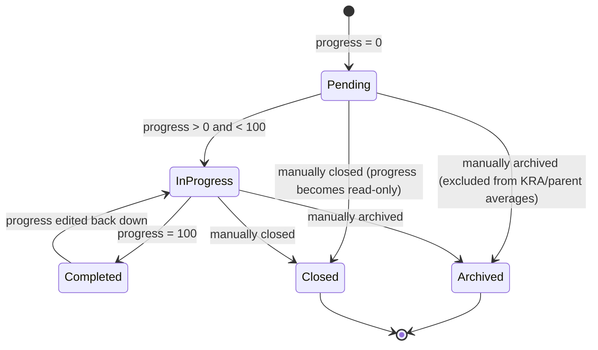

# Goal

A tracked objective an employee is working toward, organized as a tree (goals can have sub-goals) and optionally tagged to a KRA and an [[Appraisal Cycle]]. Its `progress` percentage is the raw input that automated appraisal scoring (`Appraisal KRA.goal_completion`) is built from — it exists so day-to-day objective tracking feeds directly into formal performance review without manual re-entry.

## Key Fields

| Field | Type | Purpose |
|---|---|---|
| `employee` | Link (Employee) | Owner of the goal; set only once. |
| `goal_name` | Data | Title of the goal. |
| `is_group` | Check | Marks this as a parent/group node in the tree (set only once); its own `progress` is derived, not entered. |
| `parent_goal` | Link (Goal) | Nested-set parent; must share the same employee, KRA and appraisal cycle as the child. |
| `progress` | Percent | 0–100; read-only once `is_group` or `status == "Closed"`; drives `status` and rolls up to parent goal and to the linked Appraisal. |
| `status` | Select | Pending / In Progress / Completed / Archived / Closed — mostly derived automatically from `progress`, except Archived/Closed which are sticky. |
| `kra` | Link (KRA) | Ties the goal to a KRA; mandatory when there's no parent goal and an appraisal cycle is set; fetched from parent goal if one exists. |
| `appraisal_cycle` | Link (Appraisal Cycle) | Cycle this goal counts toward; set only once; fetched from parent goal if nested. |
| `start_date` / `end_date` | Date | Fetched from the Appraisal Cycle's dates if not set explicitly. |

## Relationships

- [[Employee]] — owner; all validations key off this field matching parent/child consistently.
- [[Appraisal Cycle]] — linked via `appraisal_cycle`; blocked from being set/changed once that cycle is Completed (`validate_active_appraisal_cycle`).
- KRA (Key Result Area) — linked via `kra`.
- Goal (self-referential) — `parent_goal` builds a tree (`NestedSet`/`is_tree: 1`); child goals must match the parent's employee, KRA, and appraisal cycle.
- [[Appraisal]] — triggers: `update_goal_progress_in_appraisal` finds the Appraisal for this employee+cycle and calls its `set_goal_score(update=True)` whenever this Goal is saved or deleted, keeping the appraisal's automated KRA scoring in sync.

## Logic — What Happens and Why

**Before insert.** If `is_group` is set, `progress` is forced to 0 — a group node's progress is meant to be a rollup of its children, not a manually entered value.

**Validate.** `validate_active_appraisal_cycle` blocks changes once the linked cycle is Completed. `validate_active_employee` blocks goals for inactive employees. `validate_parent_fields` enforces that a child goal shares its parent's `employee`, `kra`, and `appraisal_cycle` exactly — this keeps the tree internally consistent so that averaging child progress into a parent, and rolling KRA-tagged goals into an Appraisal, is always operating over one coherent employee/KRA/cycle group. `validate_progress` throws if `progress` > 100. `set_status` auto-derives `status` from `progress` (0 → Pending, 100 → Completed, in-between → In Progress) unless the goal is already Archived or Closed, which are treated as terminal/manual states that progress changes should not override.

**On update.** `NestedSet.on_update` maintains the tree's `lft`/`rgt` values. If this isn't a new doc, `update_kra_in_child_goals` checks whether `kra` changed on a group node and, if so, bulk-updates all direct children's `kra` to match via a query-builder `UPDATE` (bypassing per-doc validation) plus a UI message — this exists so re-tagging a parent goal's KRA doesn't leave children silently pointing at a stale KRA. If `parent_goal` itself changed, `update_parent_progress` is also called for the *old* parent so its rollup average recalculates without this goal. `update_parent_progress` is then called for the current parent: it averages `progress` across all non-archived children of that parent (same employee) and saves the parent's `progress` with `ignore_permissions`/`ignore_mandatory` (a system-driven recalculation, not a user edit). Finally `update_goal_progress_in_appraisal` finds the matching Appraisal (same employee + appraisal_cycle) and calls `set_goal_score(update=True)` so the appraisal's automated score reflects the latest goal progress immediately, not just at next Appraisal save.

**On trash / after delete.** `on_trash` allows deleting even root nodes of the tree (`allow_root_deletion=True`). `after_delete` re-runs `update_parent_progress` and `update_goal_progress_in_appraisal` so removing a goal doesn't leave stale progress/score behind on its parent or appraisal.

**Whitelisted helpers.** `update_progress` and `update_status` are simple whitelisted setters used by the Goal tree/kanban UI (`goal_tree.js`, `goal_list.js`) to update progress or bulk-set status (setting `progress = 100` automatically when status is set to Completed) with `ignore_mandatory` so partial UI updates don't fail validation. `get_children` powers the tree view, filtering out Archived goals and supporting employee/cycle/date-range/parent filters; `_update_goal_completion_status` annotates group nodes with an "X of Y Completed" label for the tree UI. `add_tree_node` is the generic Frappe tree "add node" handler, treating the synthetic root ("All Goals") as no parent.

## Roles & Permissions

| Role | Can Do | Notes |
|---|---|---|
| [[System Manager]] | read, write, create, delete, export | Full control. |
| [[HR User]] | read, write, create, delete, export | Full control. |
| [[HR Manager]] | read, write, create, delete, export | Full control. |
| [[Employee]] | read, write, create, delete, export | Employees manage their own goals directly; no field-level restriction to "own record only" is enforced in this JSON — not enforced in code beyond standard user-permission/employee-linking conventions. |

## Mermaid: State/Flow

