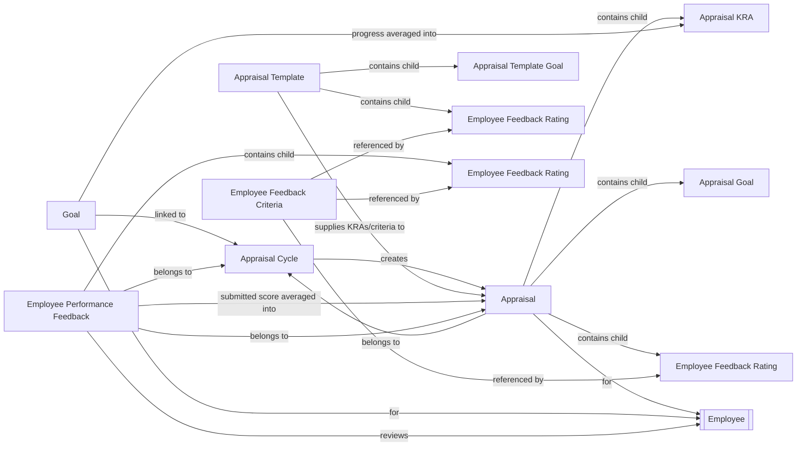

# Performance

The Performance module covers the full employee performance-review cycle: defining review periods and scoring rules ([[Appraisal Cycle]]), what employees are evaluated on ([[Appraisal Template]], [[Appraisal Template Goal]], [[Employee Feedback Criteria]]), day-to-day objective tracking ([[Goal]]), the formal per-employee review record ([[Appraisal]] with its [[Appraisal KRA]]/[[Appraisal Goal]] scoring lines), and structured multi-rater feedback ([[Employee Performance Feedback]], [[Employee Feedback Rating]]).

## Doctype Map

## Why This Module Exists

Performance management needs a process that is both structured (so scores are comparable across employees) and configurable (so different companies weight goal completion, peer feedback, and self-assessment differently). The module is built around a strict dependency chain:

1. An **Appraisal Cycle** must exist first — it fixes the review period, chooses whether KRA scoring is automated from goal progress or manually rated, and can define a custom final-score formula. Its status gates everything else: `validate_active_appraisal_cycle` blocks any Appraisal, Goal, or Feedback change once a cycle is marked Completed, so historical review data can't be altered after the fact.
2. An **Appraisal Template** (usually tied to a Designation) must define KRAs and rating criteria before appraisals can be generated, so every employee in a given role is judged against the same weighted structure (each table enforced to sum to 100% weightage).
3. Within the cycle, employees pursue **Goals** tagged to a KRA. Goal progress is the raw signal for automated scoring — a group/child tree lets big objectives break into sub-goals whose progress rolls up automatically, so the appraisal score reflects real, granular work rather than a single self-reported number.
4. The **Appraisal** itself is the aggregation point: it pulls together the automated/manual goal score, the average of all *submitted* **Employee Performance Feedback**, and a self-appraisal score, combining them (equal-weighted average by default, or a custom formula) into one Final Score. Using only submitted feedback (not drafts) ensures the score isn't skewed by incomplete reviews, and recomputing on every relevant save (goal update, feedback submit/cancel) keeps the number live rather than stale until the next manual save.
5. Feedback deliberately excludes self-review (`Employee Performance Feedback` throws if reviewer == employee, directing self-assessment to the Appraisal's own self-ratings) to keep the three scoring inputs — goals, peer/manager feedback, self-appraisal — structurally distinct and independently auditable.

## Doctypes in This Module

- [[Appraisal]] — the submittable per-employee, per-cycle performance review record and final-score aggregator.
- [[Appraisal Cycle]] — the review-period container that defines scoring method, formula, and the employee list.
- [[Appraisal Goal]] — child table for manually-rated goal lines on an Appraisal.
- [[Appraisal KRA]] — child table linking a KRA to automated goal-progress-derived scoring on an Appraisal.
- [[Appraisal Template]] — reusable KRA + rating-criteria structure, typically assigned per Designation.
- [[Appraisal Template Goal]] — child table defining a KRA + weightage on an Appraisal Template.
- [[Goal]] — tree-structured employee objective whose progress feeds automated appraisal scoring.
- [[Employee Performance Feedback]] — submittable multi-rater feedback record scored and averaged into an Appraisal.
- [[Employee Feedback Criteria]] — master list of named rating criteria reused across templates, appraisals, and feedback.
- [[Employee Feedback Rating]] — generic child table pairing criteria, weightage, and rating, reused across three parent doctypes.

## See Also

- [[Performance Appraisal Cycle]] — end-to-end flow from cycle setup through goal tracking, feedback, and final-score aggregation.
