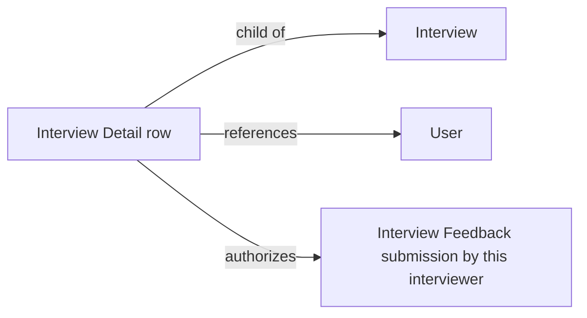

# Interview Detail

A child-table row holding one interviewer (User) assigned to a specific Interview. It
exists so a single Interview can have multiple interviewers on the panel, independent of
the default interviewer pool defined on the Interview Type.

## Key Fields
| Field | Type | Purpose |
|---|---|---|
| `interviewer` | Link (User) | One person assigned to this Interview's panel. |

## Relationships
- [[Interview]] — parent doctype; `interview_details` table (labeled "Interviewers" on the form), `allow_on_submit: 1` so interviewers can still be added/removed after submission.
- [[Interview Feedback]] — `validate_interviewer()` on Interview Feedback checks the submitting interviewer appears in this table (via `get_applicable_interviewers`) before allowing feedback to be recorded.
- `User` (Frappe core) — the actual person.

## Logic — What Happens and Why
No controller logic (`pass`) — a pure link-holder child table. Its rows are the
authoritative list of who is allowed to submit feedback for a given Interview:
`Interview Feedback.validate_interviewer()` and the whitelisted
`get_applicable_interviewers(interview)` both query this table by `parent = interview`.
Also used by `Interview.get_recipients()` to build the notification/reminder audience.

## Roles & Permissions
No independent permissions (`"permissions": []`) — access is entirely inherited from the
parent [[Interview]] document, though `allow_on_submit` lets it be edited even on a
submitted Interview by anyone with write access to that Interview.

## Mermaid: State/Flow

No status lifecycle — child table, not submittable.
