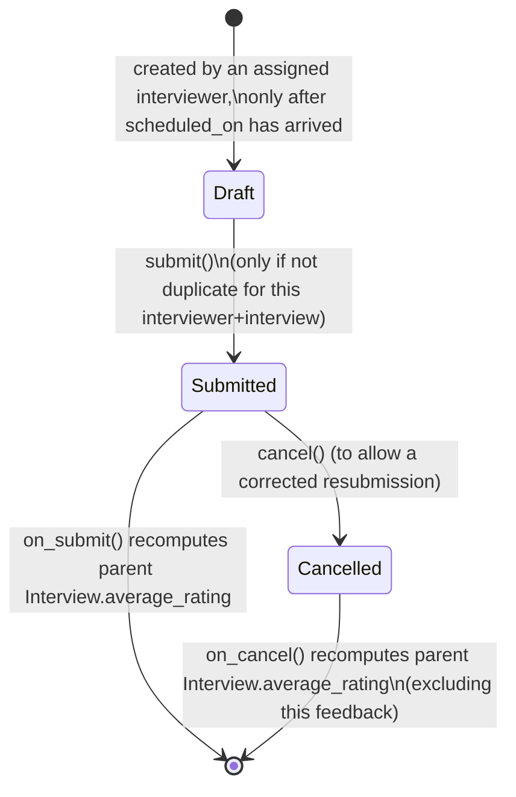

# Interview Feedback

One interviewer's submittable scorecard for one Interview — a skill-by-skill rating, an
overall Cleared/Rejected result, and free-text comments. It exists to capture structured,
individually-attributable, tamper-resistant (submittable) feedback per interviewer, which
is then averaged to produce the parent Interview's overall rating.

## Key Fields
| Field | Type | Purpose |
|---|---|---|
| `interview` | Link (Interview, required) | Which interview this feedback is for. |
| `interviewer` | Link (User, required) | Who is giving the feedback; must be on the interview's panel. |
| `job_applicant` / `interview_type` | Link (fetched, read-only) | Context copied from the parent Interview. |
| `skill_assessment` | Table (Skill Assessment, required) | Per-skill ratings. |
| `average_rating` | Rating (read-only) | Computed mean of `skill_assessment` ratings. |
| `result` | Select (required) | `Cleared` / `Rejected`. |
| `feedback` | Text | Free-text comments. |

## Relationships
- [[Interview]] — required parent link; this feedback's submit/cancel recomputes the Interview's `average_rating`.
- [[Interview Detail]] — `validate_interviewer()` checks `interviewer` is present in the parent Interview's `interview_details` child table.
- `Skill Assessment` (child table, not in this module) — per-skill scores that `average_rating` is derived from.

## Logic — What Happens and Why
**`validate()`** runs, in order:
1. **`validate_interviewer()`**: looks up `get_applicable_interviewers(interview)` (the
   Interview's `Interview Detail` rows) and throws if the current `interviewer` isn't in
   that list — only assigned panelists may leave feedback for that interview, preventing
   uninvolved users from injecting scores.
2. **`validate_interview_date()`**: if today is before the Interview's `scheduled_on` date
   **and** this feedback is being submitted (`docstatus == 1`), throws — feedback cannot be
   submitted ahead of the scheduled interview date, preventing pre-judged/rubber-stamp
   results.
3. **`validate_duplicate()`**: throws if a submitted Interview Feedback already exists for
   the same `interviewer` + `interview` combination, pointing at the existing one and
   requiring it be cancelled first — enforces exactly one live feedback per interviewer per
   interview.
4. **`calculate_average_rating()`**: averages the `rating` values across all
   `skill_assessment` rows (treats missing ratings as excluded from the sum but still
   divides by total row count) into `average_rating`.

**`on_submit()` / `on_cancel()`** both call **`update_interview_average_rating()`**: recomputes
the mean of `average_rating` across all `docstatus=1` Interview Feedback rows tied to the
same Interview (via a query-builder `AVG`), and force-writes that mean onto the parent
Interview's `average_rating` field with `db_set` + `notify_update()` — this is the
mechanism by which several interviewers' independent scores roll up into the Interview's
single `average_rating`. Running the same recompute on cancel too means a cancelled/retracted
feedback correctly drops out of the average rather than leaving a stale contribution.

**`get_applicable_interviewers(interview)` (whitelisted)**: exposes the permitted-
interviewer list to the client (e.g. to populate a dropdown before someone attempts to
submit feedback), reusing the same source of truth as the validation.

## Roles & Permissions
| Role | Can Do | Notes |
|---|---|---|
| [[HR Manager]] | Read/Export/Print/Report/Share/Email | Read-only — cannot create, edit, or submit feedback themselves; oversight only. |
| [[Interviewer (Role)]] | Full CRUD + submit/cancel/export/print/report/share/email | The role expected to actually author feedback. |
| [[HR User]] | Read/Export/Print/Report/Share/Email | Read-only, same as HR Manager. |

Enforced additionally in code (beyond the permission table): even an Interviewer with
broad doctype-level rights can only submit feedback for interviews they are explicitly
listed on (`validate_interviewer`), and only one feedback document per interviewer per
interview may be live at a time.

## Mermaid: State/Flow

