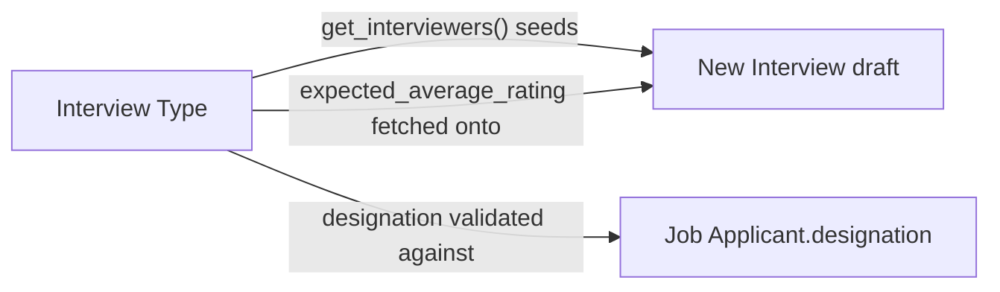

# Interview Type

A reusable definition of one kind of interview round (e.g. "Technical Round 1", "HR
Round") — what designation it applies to, the skills it should assess, the expected
average rating to pass, and who the default interviewers are. It exists so that every
interview of the same kind is evaluated against the same rubric instead of being invented
ad hoc each time a round is scheduled.

## Key Fields
| Field | Type | Purpose |
|---|---|---|
| `interview_type_name` | Data (unique, autoname) | Name of the round type. |
| `designation` | Link (Designation) | If set, restricts this round to applicants applying for that designation. |
| `expected_skill_set` | Table (Expected Skill Set, required) | Skills to be scored during this round. |
| `expected_average_rating` | Rating | Passing-bar rating, fetched onto each Interview created from this type. |
| `interviewers` | Table MultiSelect (Interviewer) | Default pool of interviewer Users for this round. |
| `description` | Text | Free-text notes on the round. |

## Relationships
- [[Interview]] — `interview_type` link; `designation` and `expected_average_rating` are fetched onto the Interview; `create_interview()` (on this doctype) and `Job Applicant.create_interview/schedule_interview` both seed a new Interview from this type's interviewers.
- [[Interviewer]] — child table (Table MultiSelect) of default interviewer Users.
- [[Designation]] — optional scoping link, enforced when scheduling an Interview against a Job Applicant of a different designation.
- Expected Skill Set (child table, not in this module) — the rubric skills.

## Logic — What Happens and Why
No `validate`/lifecycle logic in the controller (`pass`) — this is a configuration
doctype. Its logic lives in how other doctypes consume it:

- `Job Applicant.create_interview()` / `schedule_interview()` read this type's
  `designation` and throw if it conflicts with the applicant's own designation — the
  business rule that a "Backend Engineer Technical Round" cannot be used for a Sales
  Executive applicant.
- `Interview.get_interviewers(interview_type)` (whitelisted, used by the client) reads the
  `Interviewer` child table (via the `Interviewer.parent` link, which is this doctype) to
  populate default interviewers when creating an Interview.
- `create_interview(docname)` (whitelisted, on this doctype) is an alternate entry point
  (e.g. from the Interview Type form's own "Create Interview" button) that builds a new
  unsaved Interview pre-filled with this type's `designation` and interviewer list.
- `get_expected_skill_set(interview_type)` (defined in `interview.py`, whitelisted) reads
  this type's `Expected Skill Set` child table so the client can render the skill list an
  interviewer needs to score during feedback entry.

## Roles & Permissions
| Role | Can Do | Notes |
|---|---|---|
| [[HR User]] | Full CRUD + email/export/print/report/share | — |
| [[HR Manager]] | Full CRUD + email/export/print/report/share | — |
| [[Interviewer (Role)]] | Full CRUD (create/delete/write) + `select` | Interviewers can define/maintain interview round rubrics themselves, not just execute them. |

## Mermaid: State/Flow

No status lifecycle — configuration doctype, no `states`, not submittable.
