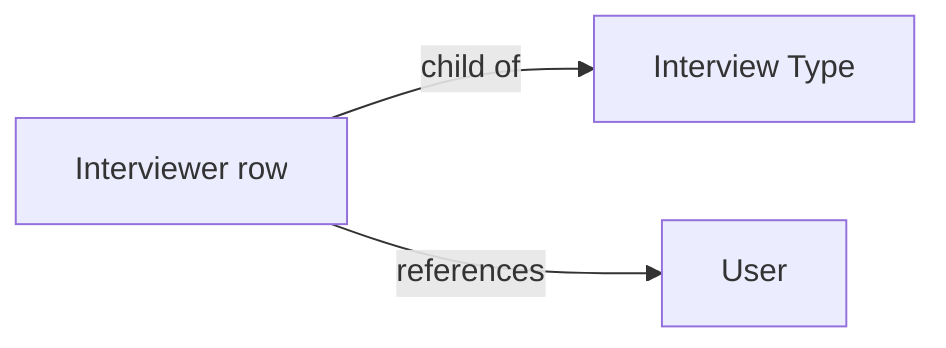

# Interviewer

A child-table row holding a single User, used inside Interview Type to list the default
pool of interviewers for a round type. It exists purely to let an Interview Type reference
multiple Users (Table MultiSelect requires a link-table doctype).

## Key Fields
| Field | Type | Purpose |
|---|---|---|
| `user` | Link (User) | One interviewer for the parent Interview Type. |

## Relationships
- [[Interview Type]] — parent doctype; `interviewers` field is a Table MultiSelect using this doctype.
- `User` (Frappe core, not a recruitment doctype) — the actual person referenced.

## Logic — What Happens and Why
No controller logic (`pass`) — a pure link-holder child table. Its rows are read by
`Interview.get_interviewers(interview_type)` (filtering `Interviewer` by
`parent = interview_type`) to default the interviewer list when a new Interview is created
from that type.

## Roles & Permissions
No independent permissions (`"permissions": []`) — access is entirely inherited from the
parent [[Interview Type]] document.

## Mermaid: State/Flow

No status lifecycle — child table, not submittable.
