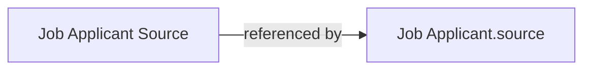

# Job Applicant Source

A simple lookup list of channels candidates come from (e.g. job boards, referrals, website
listing), used for source-of-hire reporting. It exists so recruiting teams can measure
which channels actually produce hires rather than tracking source as free text.

## Key Fields
| Field | Type | Purpose |
|---|---|---|
| `source_name` | Data (unique, autoname) | The channel's display name; also the document name. |
| `details` | Text Editor | Free-text notes about the source. |

## Relationships
- [[Job Applicant]] — `source` links here; `source_name` on Job Applicant additionally links an Employee when this source is literally named "Employee Referral" (string comparison in the `depends_on` expression, not a doctype relationship).

## Logic — What Happens and Why
No controller logic (`pass`) — purely a reference/lookup list. Its only behavioral effect
elsewhere is indirect: `Job Applicant.before_insert()` defaults `source = "Website Listing"`
when an applicant is submitted through a public web form, which implies a Job Applicant
Source record named exactly "Website Listing" is expected to exist (not enforced/created in
code — must be seeded as fixture/setup data).

## Roles & Permissions
| Role | Can Do | Notes |
|---|---|---|
| [[System Manager]] | Read/Write/Create/Delete/Share/Report | No email/export/print. |
| [[HR User]] | Read/Write/Create | No delete. |
| [[HR Manager]] | Full CRUD + email/export/print/report/share | — |

## Mermaid: State/Flow

No status lifecycle — this doctype has no `states` and no submit workflow.
