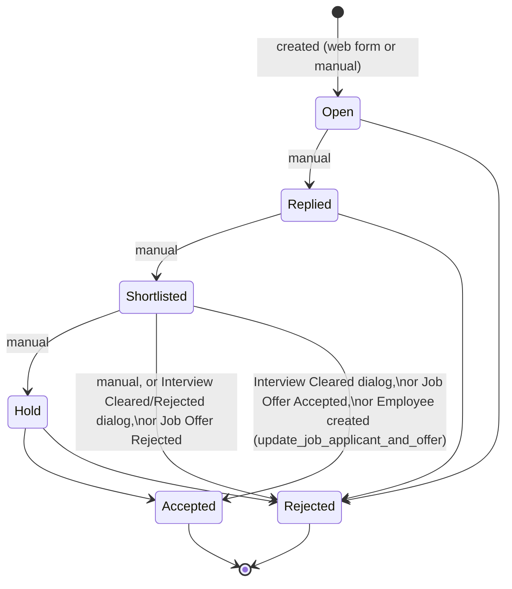

# Job Applicant

A candidate who applied — either through the public job board web form or entered
manually by a recruiter — for a specific Job Opening (or unattached, if no opening is
specified). It is the central pipeline record recruiters move through Open → Replied →
Shortlisted → Accepted/Rejected/Hold, and the anchor that interviews, feedback, and
eventually a Job Offer and Employee record all hang off.

## Key Fields
| Field | Type | Purpose |
|---|---|---|
| `applicant_name` | Data | Candidate's name; auto-guessed from email local-part if blank. |
| `email_id` | Data (Email) | Validated; also the document's `name` (autoname). |
| `status` | Select | `Open / Replied / Shortlisted / Rejected / Hold / Accepted` — the pipeline stage. |
| `job_title` | Link (Job Opening) | The vacancy applied for; drives duplicate/closed-opening checks. |
| `designation` | Link (fetched from `job_title.designation`) | Role context, also used for interview-type designation matching. |
| `source` / `source_name` | Link | Where the applicant came from (Job Applicant Source); `source_name` links an Employee when source is "Employee Referral". |
| `employee_referral` | Link (Employee Referral, read-only) | Set when created via a referral flow; drives referral status sync. |
| `resume_attachment`, `resume_link`, `cover_letter` | — | Application materials. |
| `lower_range`/`upper_range`/`currency` | Currency/Link | Candidate's salary expectation. |
| `applicant_rating` | Rating | Manual recruiter rating. |

## Relationships
- [[Job Opening]] — `job_title` link; `before_insert` blocks applying to a Closed opening and can enforce one-application-per-email via `prevent_duplicate_applicant`.
- [[Job Applicant Source]] — `source`; auto-set to "Website Listing" when submitted via a web form (`frappe.flags.in_web_form`).
- [[Employee Referral]] — `employee_referral`; this applicant's status changes push a status back onto the referral (`set_status_for_employee_referral`).
- [[Interview]] — `create_interview()` / `schedule_interview()` (whitelisted) generate Interview documents seeded from this applicant plus an Interview Type's default interviewers.
- [[Interview Type]] — used by `create_interview`/`schedule_interview` to validate the interview round matches the applicant's designation and to source default interviewers (`get_interviewers`).
- [[Job Offer]] — `onload()` surfaces any non-cancelled Job Offer for this applicant to the form; a Job Offer's status changes write back onto this applicant's `status`.
- [[Employee]] — `make_employee()` (mapped-doc) creates an Employee pre-filled from this applicant (and, if present, the linked Job Opening's company/department/employment_type); `onload()` also surfaces an existing linked Employee.
- [[Kanban Board]] — `create_kanban_board()` builds a status-based Kanban view (not a recruitment doctype, generic Frappe feature).

## Logic — What Happens and Why
**`autoname()`**: uses the email address as the document name (`self.name = self.email_id`),
appending a numeric suffix via `append_number_if_name_exists` if that email already exists
— this is what allows the same person to apply more than once (for a different role, or a
reapplication) without a naming collision, while still keeping email as the natural key for
most lookups.

**`before_insert()`**: if a `job_title` (Job Opening) is set, throws if that opening's
`status == "Closed"` ("Cannot create a Job Applicant against a closed Job Opening") — the
business rule that closed vacancies can no longer receive candidates. If the opening has
`prevent_duplicate_applicant` enabled, throws a `DuplicationError` if a Job Applicant with
the same email already exists for that same opening — stops one person spamming multiple
applications for one role (but does not stop applying to *different* roles with the same
email, which is intentional). If created from a web form (`frappe.flags.in_web_form`) and no
`source` is set, defaults `source = "Website Listing"`.

**`validate()`**: validates `email_id` format; if `applicant_name` is blank, derives a
best-effort display name by capitalizing the dot-separated parts of the email's local part
(e.g. `jane.doe@x.com` → "Jane Doe") — a fallback for minimal web-form submissions. If
`employee_referral` is set, calls `set_status_for_employee_referral()`.

**`set_status_for_employee_referral()`**: keeps the linked Employee Referral's status in
sync with this applicant's pipeline stage — Job Applicant `Open/Replied/Hold` maps the
referral to `"In Process"`; `Accepted`/`Rejected` maps the referral to the same value. This
is the only two-way link between the Recruitment and Employee Referral (Compensation/HR)
domains at the applicant level.

**Status changes driven from elsewhere** (not in this controller, but affecting it):
- `create_interview`/`schedule_interview` do not themselves change `status`; but
  `Interview.show_job_applicant_update_dialog()` on interview submit offers to set this
  applicant's status to `Accepted` (if interview `Cleared`) or `Rejected` (if interview
  `Rejected`) via `update_job_applicant_status`.
- `Job Offer.on_change()` → `update_job_applicant()` sets this applicant's `status` to
  `Accepted` or `Rejected` whenever the linked Job Offer's status becomes one of those.
- `Employee.after_insert` → `hrms.overrides.employee_master.update_job_applicant_and_offer`
  forces this applicant's status to `Accepted` (and the linked Job Offer's status to
  `Accepted` + saved) once an Employee record referencing this applicant is inserted — the
  final, authoritative confirmation that hiring completed.

**`make_employee(source_name)` (whitelisted, mapped-doc)**: maps `applicant_name →
first_name`, `email_id → personal_email`, `phone_number → cell_number`, `currency →
salary_currency`, explicitly excludes `status` from being copied (`field_no_map`), and if
the applicant has a `job_title` (Job Opening), also seeds the new Employee's `company`,
`department`, and `employment_type` from that opening. This is the "convert candidate to
employee" action a recruiter triggers manually.

**`create_interview` / `schedule_interview` (whitelisted)**: both validate that the chosen
Interview Type's `designation` (if set) matches the applicant's own `designation`, throwing
otherwise — a Backend Engineer interview type cannot be scheduled against a Sales Executive
applicant. `create_interview` returns an unsaved Interview doc for the user to complete;
`schedule_interview` additionally takes date/time/interviewer args and directly inserts the
Interview with `ignore_permissions=True` (though it explicitly checks `has_permission`
on `Interview` create and `Job Applicant` read first) — used by calendar/quick-schedule UI.

**`get_interview_details(job_applicant)` / `get_applicant_to_hire_percentage()`
(whitelisted)**: read-only reporting helpers for the applicant's interview summary panel
and a sitewide hire-rate metric (`Accepted` count / total applicants).

## Roles & Permissions
| Role | Can Do | Notes |
|---|---|---|
| [[System Manager]] | Full CRUD + email/export/print/report/share | — |
| [[HR User]] | Read/Write/Create/Print/Report/Share/Email | No delete. |
| [[HR Manager]] | Full CRUD + email/export/print/report/share | — |

Not enforced in code: no role is restricted to only creating/editing applicants for
themselves — all three roles above have blanket read/write across all applicants (no
"self" scoping like Employee-facing doctypes elsewhere in HRMS).

## Mermaid: State/Flow

