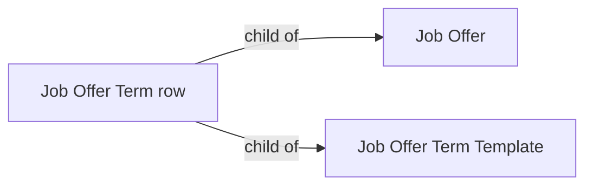

# Job Offer Term

A single named term and its value/description (e.g. "Base Salary" → "$95,000/year"),
attached either to a Job Offer directly or to a reusable Job Offer Term Template. It
exists to let an offer's terms be structured line items instead of one undifferentiated
text block.

## Key Fields
| Field | Type | Purpose |
|---|---|---|
| `offer_term` | Link (Offer Term, required) | The term being specified (e.g. Base Salary, Joining Bonus). |
| `value` | Small Text (required) | The value/description for that term on this offer. |

## Relationships
- [[Job Offer]] — child table (`offer_terms`).
- [[Job Offer Term Template]] — child table (`offer_terms`); templates hold a reusable set of these rows.
- `Offer Term` (master list doctype, not in this module) — the term catalog `offer_term` links to.

## Logic — What Happens and Why
No controller logic — pure data row, no `.py` beyond the auto-generated Document base (this
doctype has no dedicated `.py` file at all in this folder set beyond the standard
generated stub referenced by its parents' type hints). Values are populated either manually
on a Job Offer, or copied wholesale from a Job Offer Term Template's own `offer_terms` when
a user selects `job_offer_term_template` on a Job Offer (client-side copy, not enforced by
server validation in the doctypes read here).

## Roles & Permissions
No independent permissions (`"permissions": []`) — access inherited from whichever parent
([[Job Offer]] or [[Job Offer Term Template]]) holds the row.

## Mermaid: State/Flow

No status lifecycle — child table, not submittable.
