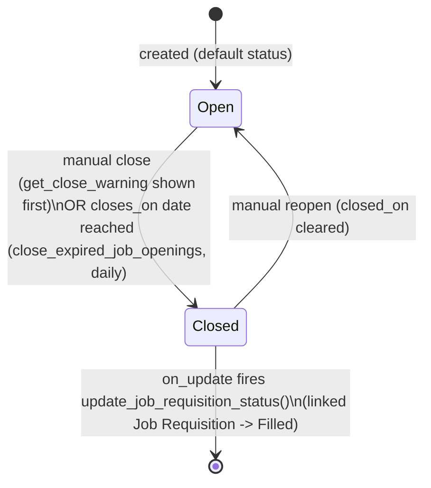

# Job Opening

A vacancy for a designation at a company — the thing candidates apply against, and
optionally the public-facing job posting shown on the careers website (`hrms/www/jobs`).
It exists to advertise a hiring need and to gate how many applicants/openings can exist
relative to what a Staffing Plan or Job Requisition actually authorized.

## Key Fields
| Field | Type | Purpose |
|---|---|---|
| `job_title` | Data | Free-text title shown to candidates; title field. |
| `designation` | Link (Designation) | Role, used for staffing-plan vacancy checks. |
| `company` / `department` | Link | Organizational context; used in the `route` slug. |
| `status` | Select (hidden) | `Open` / `Closed`. |
| `posted_on` / `closes_on` / `closed_on` | Datetime/Date | Lifecycle dates; `closes_on` auto-closes the opening. |
| `staffing_plan` / `planned_vacancies` | Link/Int (read-only) | Auto-derived from the active Staffing Plan for company+designation. |
| `job_requisition` / `vacancies` | Link/Int (read-only, fetched) | Back-reference to the requisition that spawned this opening, and its position count. |
| `publish` | Check | Whether this opening is shown on the public job board. |
| `route` | Data (unique) | Website slug; auto-generated as `jobs/<company>/<job-title>` if blank. |
| `prevent_duplicate_applicant` | Check | Blocks a second application from the same email for this opening. |
| `publish_applications_received` | Check | Shows applicant count publicly. |
| `job_application_route` | Data | Route to a custom Job Application web form. |
| `job_opening_template` | Link (Job Opening Template) | Optional template this was created from. |
| `currency`, `lower_range`, `upper_range`, `salary_per`, `publish_salary_range` | — | Optional public salary-range disclosure. |

## Relationships
- [[Job Requisition]] — optional origin; closing this opening marks the requisition `Filled`.
- [[Job Opening Template]] — optional source of default field values (`create_job_opening_from_template`).
- [[Job Applicant]] — applicants link to this opening via `job_title`; `get_context()` counts them for the public page.
- [[Designation]], [[Company]], [[Department]], [[Employment Type]], [[Branch]] (as `location`) — descriptive/organizational links.
- [[Staffing Plan]] — governs how many openings/positions are allowed for a designation.
- `hrms/www/jobs` — the public listing page queries this doctype directly (not a doctype relationship, but the primary public consumer).

## Logic — What Happens and Why
**`validate()`** runs on every save and does four things in order:
1. Auto-generates `route` from company + job title if not already set (`jobs/<scrubbed
   company>/<scrubbed-job-title>`), so publishing doesn't require the user to hand-craft a
   URL slug.
2. `update_closing_date()`: compares against `get_doc_before_save()` — if status flips
   `Open → Closed`, clears `closes_on` and stamps `closed_on = today` (only if not already
   set); if it flips `Closed → Open`, clears `closed_on`. This keeps exactly one of the two
   date fields meaningful at a time.
3. `validate_dates()`: enforces `posted_on <= closes_on` while Open, or `posted_on <=
   closed_on` while Closed, via `validate_from_to_dates`.
4. `validate_current_vacancies()`: the staffing-plan guard (below).

**Staffing Plan vacancy guard** (`validate_current_vacancies`): only runs while the opening
is not `Closed`. If no `staffing_plan` is set yet, it looks up the active Staffing Plan for
this company+designation and auto-attaches it plus its `planned_vacancies`; if a plan is
already set but `planned_vacancies` is empty, it re-derives it from `Staffing Plan Detail`.
Then it compares `number_of_positions` (from the plan) against
`current_count = employee_count + job_openings` (from `get_designation_counts`, excluding
this document) — if the plan's ceiling is already met or exceeded, it throws "Vacancies
fulfilled" and blocks the save. This is why Job Openings cannot silently over-hire past
what workforce planning approved.

**`get_close_warning()` (whitelisted)**: called from the UI before actually closing an
opening — if the opening is being closed for real (`is_opening_being_closed`: not new, and
status is transitioning from `Open` in the DB to `Closed` in memory) and a staffing plan is
attached, returns a confirmation message warning that closing may not match the staffing
plan's expectations. Purely advisory — does not block the close.

**`on_update()` → `update_job_requisition_status()`**: whenever the document is closed and
has a `job_requisition`, force-updates that requisition's `status = "Filled"` and
`completed_on = today` with `ignore_permissions`/`ignore_mandatory`. This is the only place
a Job Requisition's `Filled` status is set — see [[Job Requisition]].

**`get_context()`** (website rendering hook, `WebsiteGenerator`): supplies
`no_of_applications` (live count of `Job Applicant` rows for this opening) and a
human-readable `posted_on` for the public detail page template
(`templates/generators/job_opening.html`).

**`close_expired_job_openings()`** (scheduled task, runs `daily`): finds all `Open` openings
whose `closes_on` date has passed and force-closes them (`ignore_permissions`/
`ignore_mandatory`), triggering the same `on_update` → requisition-sync logic above. This
means a requisition can be marked `Filled` purely by a deadline passing, even without an
actual hire — a business rule worth flagging as a "closes automatically, not necessarily
because filled" caveat.

There is no submit/cancel workflow — `Open`/`Closed` are plain field values.

## Roles & Permissions
| Role | Can Do | Notes |
|---|---|---|
| [[System Manager]] | Full CRUD + email/export/print/report/share | — |
| [[HR User]] | Read/Write/Create/Print/Report/Share/Email | No delete. |
| [[HR Manager]] | Full CRUD + email/export/print/report/share | — |
| Guest | Read (via `allow_guest_to_view: 1`, website generator) | Public candidates view published openings without login; gated by `is_published_field: publish`. |

## Mermaid: State/Flow

