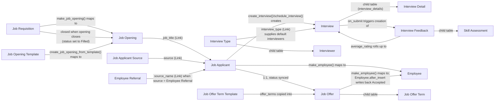

# Recruitment

Note on source location: the codebase does not have an `hrms/recruitment/doctype/` folder.
All recruitment doctypes actually live under `hrms/hr/doctype/` (module `HR` in every doctype
JSON), alongside the `hrms/recruitment/` package which only holds the Recruitment workspace
and sidebar definitions. This file documents the doctypes that make up the recruitment
business domain regardless of their physical package location.

## What business domain this module covers
End-to-end hiring: raising a headcount request (Job Requisition), publishing a vacancy
(Job Opening, optionally from a Job Opening Template), collecting candidates (Job Applicant),
running one or more interview rounds with structured feedback (Interview, Interview Type,
Interviewer, Interview Detail, Interview Feedback), and making an offer (Job Offer, Job
Offer Term, Job Offer Term Template) that on acceptance becomes an Employee record.

## Doctype Map

## Why This Module Exists
Recruitment enforces a funnel with financial and organizational guardrails, not just a
CRM for candidates:

- **Job Requisition before Job Opening** (optional but the sanctioned path): a Job
  Requisition captures who asked for a headcount, why, and at what expected compensation,
  and carries an approval-style status (`Pending → Open & Approved → Filled/Rejected/On
  Hold/Cancelled`). `Job Requisition.make_job_opening()` seeds a Job Opening from it, and
  when that Job Opening is later closed, `Job Opening.update_job_requisition_status()`
  writes `Filled` + `completed_on` back onto the requisition, which drives the `time_to_fill`
  KPI (`Job Requisition.set_time_to_fill()`). This keeps the audit trail of "why did we
  hire this role" intact.
- **Staffing Plan governs both ends of the funnel**: `Job Opening.validate_current_vacancies()`
  refuses to open more positions than a company's active Staffing Plan allows for a
  designation, and `Job Offer.validate_vacancies()` (gated by `HR Settings.check_vacancies`)
  refuses to let submitted offers exceed the plan's vacancy count for the same designation/
  company/period. Two independent checks exist because a Job Opening can attract many
  applicants but only the Job Offer represents an actual commitment to hire.
- **One active Job Offer per Job Applicant**: `Job Offer.validate()` throws if another
  non-cancelled Job Offer already exists for the same applicant — an applicant can only be
  mid-negotiation once.
- **Interview Type standardizes evaluation**: rather than each interview freely defining a
  rubric, an Interview Type pins an expected skillset, expected average rating, and default
  interviewer pool for a designation, so results are comparable across applicants.
- **Interview Feedback is submittable and locked**: only one feedback per interviewer per
  interview is allowed (`validate_duplicate`), and only the interviewer named in the child
  table can submit it, and not before the scheduled date — this prevents retroactive or
  proxy scoring from skewing the average.
- **Status propagation instead of duplicate data entry**: Job Applicant status is not
  hand-maintained in most flows — it is pushed from Interview submission (accept/reject
  dialog), from Job Offer status changes (`on_change` → `update_job_applicant`), and finally
  from Employee creation (`Employee.after_insert` → `update_job_applicant_and_offer`), so a
  single source of truth (the actual downstream event) drives the pipeline stage shown to
  recruiters.

## Doctypes in This Module
- [[Job Requisition]] — headcount request raised by a hiring department; source for a Job Opening.
- [[Job Opening]] — a vacancy, optionally published on the public website (`hrms/www/jobs`).
- [[Job Opening Template]] — reusable defaults (department, pay range, description) for creating Job Openings.
- [[Job Applicant]] — a candidate's application against a Job Opening.
- [[Job Applicant Source]] — lookup list of where an applicant came from (e.g. referral, job board).
- [[Interview]] — one scheduled interview round for a Job Applicant against an Interview Type.
- [[Interview Type]] — reusable rubric/definition of a round (skillset, expected rating, interviewer pool).
- [[Interviewer]] — child table row (User) listing an Interview Type's default interviewers.
- [[Interview Detail]] — child table row (User) listing the interviewers assigned to one Interview.
- [[Interview Feedback]] — a submittable per-interviewer scorecard for one Interview.
- [[Job Offer]] — a submittable compensation/terms offer extended to a Job Applicant.
- [[Job Offer Term]] — child table row (term + value) attached to a Job Offer or template.
- [[Job Offer Term Template]] — reusable set of Job Offer Terms.

## Related Flows
- [[Recruitment to Onboarding]] — the end-to-end lifecycle flow this module feeds into, from Job Requisition through to Employee creation.
- [[Hire to Retire Overview]] — the full employee lifecycle overview, of which this module covers the opening phase.

## Public-Facing Surface
`hrms/www/jobs` (`index.py` + `index.html`) is a Website page, not a doctype — it renders
the public job board by querying `Job Opening` records where `status = "Open"` and
`publish = 1` (`get_job_openings()`), joins in a live applicant count per opening via
`Job Applicant`, and supports filtering by company/department/employment_type/location and
free-text search over job title/description. This is the anonymous entry point candidates
use before a `Job Applicant` record ever exists; `Job Opening` itself is a `WebsiteGenerator`
(`has_web_view: 1`, `website_generators = ["Job Opening"]` in hooks.py) so each opening also
gets its own detail page at `route` (auto-built as `jobs/<company>/<job-title>`).
