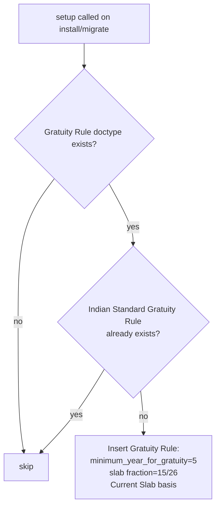

# India - Gratuity Rule Setup

Seeds a default [[Gratuity Rule]] matching India's Payment of Gratuity Act, 1972: an employee who completes 5+ years of continuous service is entitled to gratuity equal to 15 days' wages (out of a 26-working-day month) for every year of service, based on their last drawn salary slab. This is a one-time fixture install so companies don't have to hand-configure the statutory formula themselves.

## Hooked Into

Not a `doc_events` hook — this runs from `hrms/regional/india/setup.py: setup()`, invoked once during app install/regional setup (called alongside `make_custom_fields()` and `add_custom_roles_for_reports()`). It creates a record in the core [[Gratuity Rule]] doctype, which [[Gratuity]] documents reference to compute payouts.

## Logic — What Happens and Why

`create_gratuity_rule_for_india()`:
1. Guards: does nothing if the `Gratuity Rule` doctype isn't installed, or if a rule named `"Indian Standard Gratuity Rule"` already exists (idempotent — safe to re-run setup).
2. Inserts a new `Gratuity Rule` with:
   - `calculate_gratuity_amount_based_on = "Current Slab"` — gratuity is computed from the single slab the employee's tenure falls into, not summed across slabs.
   - `work_experience_calculation_method = "Round Off Work Experience"` — partial years round to the nearest whole year per the Act's convention.
   - `minimum_year_for_gratuity = 5` — statutory minimum continuous service before any gratuity is payable.
   - One slab, `from_year: 0` to `to_year: 0` (i.e. open-ended/all years), with `fraction_of_applicable_earnings = 15/26` — encodes "15 days' wages per year of service out of a 26-day month" directly as a fraction applied to applicable earnings.

## Roles & Permissions

No additional role restriction beyond the base [[Gratuity Rule]] doctype — the setup script inserts with `ignore_permissions=True` since it runs as part of install/migration, not as an interactive user action.
