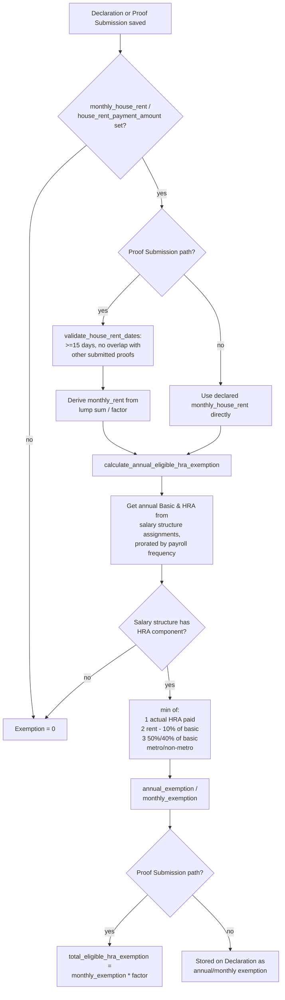

# India - HRA Exemption

Implements the Indian Income Tax Act's House Rent Allowance (HRA) exemption rule (Section 10(13A) / Rule 2A): part of the HRA an employee receives is exempt from tax if they actually pay rent, and the exempt amount is the *minimum* of three statutory limits. This lets employees declare expected rent up front (for TDS projection) and later prove actual rent paid (for final tax settlement), with the exemption computed from real salary-structure data rather than a flat guess.

## Hooked Into

Not wired through `doc_events` — wired through ERPNext's `@erpnext.allow_regional` decorator + `hooks.py: regional_overrides["India"]`, which swaps the no-op stub in `hrms/hr/utils.py` for the India implementation whenever the acting [[Company]]'s country is India:

- `hrms.hr.utils.calculate_annual_eligible_hra_exemption` → `hrms.regional.india.utils.calculate_annual_eligible_hra_exemption`
- `hrms.hr.utils.calculate_hra_exemption_for_period` → `hrms.regional.india.utils.calculate_hra_exemption_for_period`

Called from:
- [[Employee Tax Exemption Declaration]] `calculate_hra_exemption()` (called during `validate`) — projects the *annual* exemption for the whole payroll period from the employee's declared `monthly_house_rent`.
- [[Employee Tax Exemption Proof Submission]] `calculate_hra_exemption()` (called during `validate`) — computes the exemption for the *actual rented period* from proof-submission dates and `house_rent_payment_amount`.

## Logic — What Happens and Why

`calculate_annual_eligible_hra_exemption(doc)` (annual/declaration path):
1. Reads `basic_component` and `hra_component` off the employee's [[Company]] — these tell the function which [[Salary Component]] rows in the salary structure represent Basic and HRA. Throws if either is unset, since the calculation is meaningless without them.
2. Pulls the employee's salary structure assignments for the payroll period via `get_salary_assignments`, clamping each assignment's `from_date` to the payroll period's start date so periods before the period start don't inflate pay.
3. For each assignment whose salary structure actually has an HRA earning row (`has_hra_component`), previews a salary slip (`make_salary_slip(..., for_preview=1)`) to read the real Basic and HRA amounts for that structure, then annualizes them via `get_component_pay`, which scales a single period's component amount by the payroll frequency (Daily × days, Weekly × floor(days/7), Fortnightly × floor(days/14), Monthly × month_diff, Bimonthly × month_diff/2) — this correctly prorates when an employee's salary structure changes mid-period.
4. If `doc.monthly_house_rent` is set, calls `calculate_hra_exemption()` to get the annual exempt amount, then divides by 12 for `monthly_exemption`.

`calculate_hra_exemption(salary_structure, annual_basic, annual_hra, monthly_house_rent, rented_in_metro_city)` — the statutory three-case minimum:
- Case 1: HRA actually paid by the employer (`annual_hra`).
- Case 2: Actual rent paid minus 10% of annual basic (`monthly_house_rent * 12 - annual_basic * 0.1`).
- Case 3: 50% of annual basic if `rented_in_metro_city`, else 40%.
- Returns `min()` of the three — the exemption can never exceed what's legally allowed even if declared rent is very high.

`calculate_hra_exemption_for_period(doc)` (proof-submission path, for a specific rented date range rather than the whole year):
1. Calls `validate_house_rent_dates(doc)` first — requires both `rented_from_date`/`rented_to_date`, and enforces the rented span is at least 15 days, and checks (via a QB query on other submitted Proof Submissions for the same employee/payroll period) that the date range doesn't overlap another already-submitted claim — prevents double-claiming the same rented days.
2. Converts the lump-sum `house_rent_payment_amount` into an equivalent `monthly_rent`, using a `factor` = (days rented + 1)/30, rounded to the nearest 0.5 — an approximation treating 30 days as one month.
3. Sets `doc.monthly_house_rent = monthly_rent` and re-uses `calculate_annual_eligible_hra_exemption(doc)` to get the monthly exemption rate, then multiplies by the same `factor` to get `total_eligible_hra_exemption` for the actual period claimed (rather than a full year).

## Roles & Permissions

No additional role restriction beyond the base doctype — the calculation runs inside `validate()` of [[Employee Tax Exemption Declaration]] and [[Employee Tax Exemption Proof Submission]] for whichever user has write access to those doctypes; the override itself performs no permission checks.
