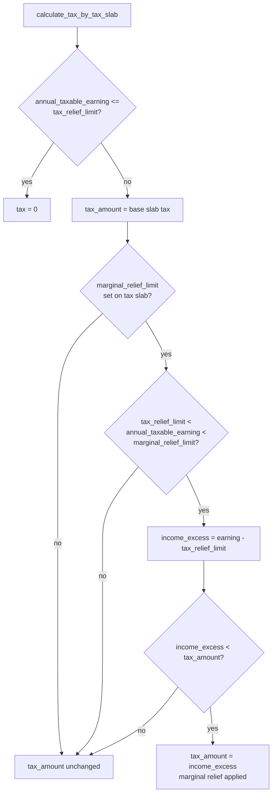

# India - Marginal Relief Tax Calculation

Implements "marginal relief" under the Indian TDS/Income Tax rules: when an employee's taxable income is only slightly above the tax-exempt threshold, the tax charged should not exceed the amount by which income exceeds that threshold — otherwise a tiny raise could leave the employee with less take-home pay than someone just under the threshold. Without this, salary-slip TDS deduction could produce that perverse (and legally incorrect) outcome for employees near the relief limit.

## Hooked Into

Wired through `@erpnext.allow_regional` + `hooks.py: regional_overrides["India"]`:

- `hrms.hr.utils.calculate_tax_with_marginal_relief` → `hrms.regional.india.utils.calculate_tax_with_marginal_relief`

Called from `calculate_tax_by_tax_slab()` in [[Income Tax Slab]] (`hrms/payroll/doctype/income_tax_slab/income_tax_slab.py`), which is itself used during salary-slip TDS computation.

## Logic — What Happens and Why

`calculate_tax_by_tax_slab(annual_taxable_earning, tax_slab, ...)`:
1. If `annual_taxable_earning <= tax_slab.tax_relief_limit`, tax is 0 outright — below relief limit, no tax at all.
2. Otherwise computes `tax_amount` from the normal slab rates (`calculate_base_tax_from_tax_slabs`).
3. Calls `calculate_tax_with_marginal_relief(tax_slab, tax_amount, annual_taxable_earning)` and, if it returns a truthy value, uses that as the (possibly reduced) `tax_amount`.

`calculate_tax_with_marginal_relief(tax_slab, tax_amount, annual_taxable_earning)`:
1. No-ops (returns unmodified `tax_amount`... actually returns it as passed through only if `tax_slab.marginal_relief_limit` is set — the field only applies when the country/tax regime defines this limit, i.e. this is India-specific and controlled by the `marginal_relief_limit` custom field added to [[Income Tax Slab]] by `india/setup.py`).
2. If `annual_taxable_earning` is strictly between `tax_relief_limit` and `marginal_relief_limit`:
   - `income_excess_over_tax_relief = annual_taxable_earning - tax_slab.tax_relief_limit`
   - If that excess is **less than** the computed `tax_amount`, marginal relief applies: tax payable is capped at just the excess income over the relief limit (`tax_amount = income_excess_over_tax_relief`) — so post-tax income for someone just over the threshold is never lower than for someone just at it.
3. Otherwise returns the original `tax_amount` unchanged.

## Roles & Permissions

No additional role restriction beyond the base doctype — this is a pure calculation invoked during payroll/tax-slab processing, not a user-facing document action.
