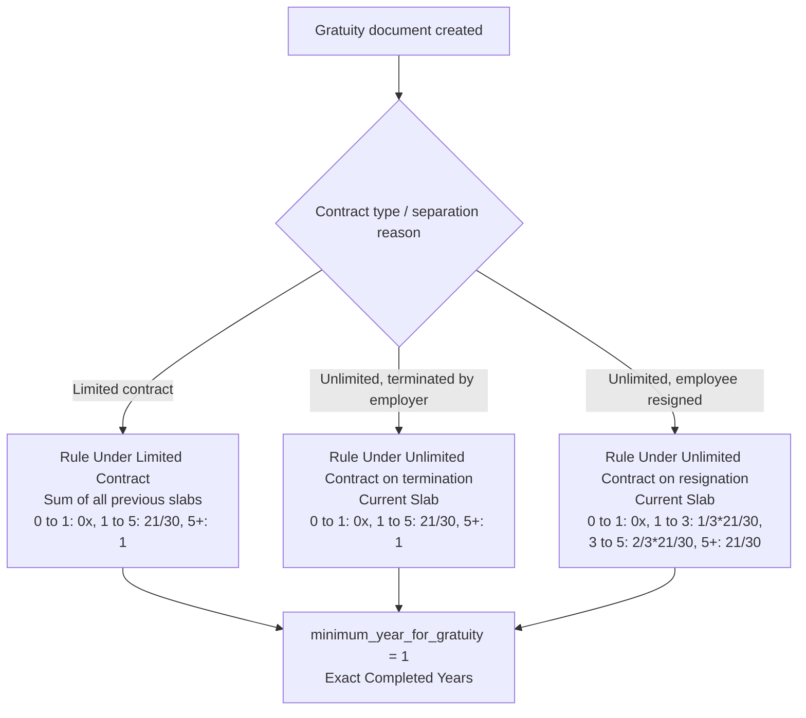

# UAE - Gratuity Rules

Seeds three [[Gratuity Rule]] fixtures implementing UAE End of Service Benefit (EOSB) / gratuity calculation as set out in UAE labour law, which differs by contract type (limited vs. unlimited) and, for unlimited contracts, by whether the employee resigned or was terminated — each has a different slab structure for "21 days' wages per year" (21/30 fraction) scaling up to "30 days' wages per year" (full fraction) at longer tenures.

## Hooked Into

Not a `doc_events` hook — runs from `hrms/regional/united_arab_emirates/setup.py: setup()`, invoked once during app install/regional setup. Unlike the India module, there is **no** entry for `"United Arab Emirates"` in `hooks.py: regional_overrides` — no core calculation function is swapped out for UAE; these are purely seeded configuration records in the core [[Gratuity Rule]] doctype, which [[Gratuity]] documents select from and use unmodified core gratuity-calculation logic against.

## Logic — What Happens and Why

`create_gratuity_rules_for_uae()` iterates `get_gratuity_rules()` and inserts each with `ignore_if_duplicate=True, ignore_permissions=True, ignore_mandatory=True` — idempotent and safe to re-run. All three rules use `work_experience_calculation_method = "Take Exact Completed Years"` (no rounding, unlike India) and `minimum_year_for_gratuity = 1` (UAE law requires at least one year of service before gratuity is payable, versus 5 years in India).

1. **"Rule Under Limited Contract (UAE)"** — `calculate_gratuity_amount_based_on = "Sum of all previous slabs"` (progressive: amount for each completed slab is added up, not just the current one):
   - Years 0–1: fraction `0` — no gratuity in the first year.
   - Years 1–5: fraction `21/30` — 21 days' wages per year (of a 30-day month).
   - Years 5+: fraction `1` — full 30 days' wages per year for service beyond year 5.

2. **"Rule Under Unlimited Contract on termination (UAE)"** — `calculate_gratuity_amount_based_on = "Current Slab"` (only the slab matching total tenure applies, not summed):
   - Same slab boundaries and fractions as the limited-contract rule (0 / 21/30 / 1) — termination under an unlimited contract gets the full entitlement per current slab.

3. **"Rule Under Unlimited Contract on resignation (UAE)"** — `calculate_gratuity_amount_based_on = "Current Slab"`, but with reduced fractions reflecting UAE law's resignation penalty:
   - Years 0–1: fraction `0` — no gratuity.
   - Years 1–3: fraction `1/3 * 21/30` — only one-third of the standard 21/30 entitlement.
   - Years 3–5: fraction `2/3 * 21/30` — two-thirds of the standard entitlement.
   - Years 5+: fraction `21/30` — full 21-day entitlement (never reaches the 30-day/full-fraction tier, unlike termination/limited-contract rules) — resignation is never as favorable as termination under UAE law.

## Roles & Permissions

No additional role restriction beyond the base [[Gratuity Rule]] doctype — the setup script inserts with `ignore_permissions=True` since it runs as part of install/migration, not as an interactive user action. Selecting which of the three rules applies to a given [[Gratuity]] record is a manual choice made by whoever has create/write access to Gratuity — the setup script does not enforce which rule is used for which employee.
