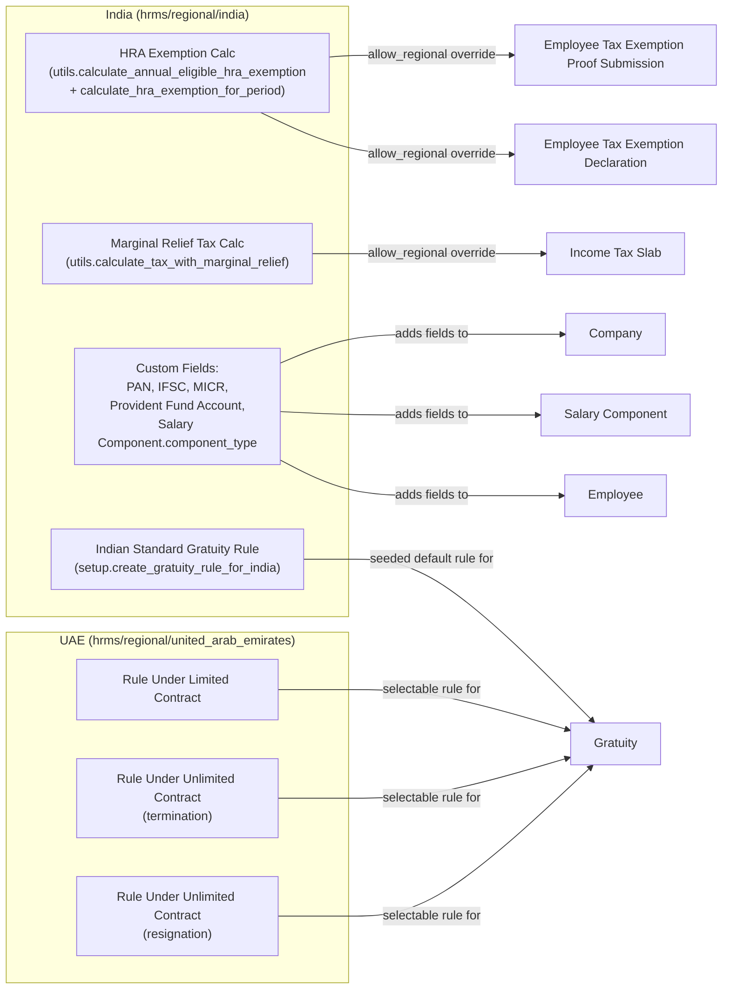

# Regional

HRMS localizes country-specific HR/payroll behavior through a narrow override mechanism rather than separate doctypes. Two pieces make this work:

1. **`erpnext.allow_regional`** — a small number of functions in `hrms/hr/utils.py` (and `hrms/payroll/doctype/income_tax_slab/income_tax_slab.py`) are decorated with `@erpnext.allow_regional`. Undecorated, they return an empty/`None` stub (e.g. `calculate_annual_eligible_hra_exemption` just returns `{}`). The decorator makes ERPNext's regional-override dispatcher look up the current company's country in `hooks.py`'s `regional_overrides` map and, if a replacement is registered, call that instead.
2. **`hooks.py: regional_overrides`** — maps a country name to a dict of `{original_dotted_path: override_dotted_path}`. Today only `"India"` is registered:
   ```python
   regional_overrides = {
       "India": {
           "hrms.hr.utils.calculate_annual_eligible_hra_exemption": "hrms.regional.india.utils.calculate_annual_eligible_hra_exemption",
           "hrms.hr.utils.calculate_hra_exemption_for_period": "hrms.regional.india.utils.calculate_hra_exemption_for_period",
           "hrms.hr.utils.calculate_tax_with_marginal_relief": "hrms.regional.india.utils.calculate_tax_with_marginal_relief",
       },
   }
   ```
   There is no `"United Arab Emirates"` entry — the UAE folder does not override any core calculation function at all.

The `hrms/regional/<country>/setup.py` files are a separate mechanism: they run once (called from the app's install/migrate flow) to seed country-specific fixtures — custom fields and default [[Gratuity Rule]] records — rather than to hook into document events. Regional customization in this codebase is therefore **not** implemented via `doc_events` in `hooks.py` at all (unlike most other modules); it is either (a) a swapped-in calculation function via `allow_regional`/`regional_overrides`, or (b) one-time setup fixtures.

Note on scope actually found in source: this codebase's `hrms/regional/` tree contains only India HRA-exemption/tax-relief logic plus India and UAE Gratuity Rule seeding and a handful of India-only custom fields (PAN, IFSC, MICR, Provident Fund Account, Component Type). There is no ESI, Form 16, LWF, or WPS override code present under `hrms/regional/` — those are either handled by generic core doctypes (e.g. [[Salary Component]] configured manually) or not implemented in this app at all.

## Regional Feature Map



## Files in This Module

- [[India - HRA Exemption]] — annual/period HRA exemption calculation used by Employee Tax Exemption Declaration and Proof Submission.
- [[India - Marginal Relief Tax Calculation]] — reduces income tax payable near the tax-relief threshold, used by Income Tax Slab.
- [[India - Gratuity Rule Setup]] — seeds the default Indian gratuity slab (15/26 of last drawn salary per year, after 5 years).
- [[India - Custom Fields]] — India-only fields added to Employee, Company, Salary Component, and the tax exemption doctypes.
- [[UAE - Gratuity Rules]] — seeds the three UAE end-of-service gratuity slab rules (limited contract, unlimited contract termination, unlimited contract resignation).

These regional overrides feed directly into the [[Payroll Run Lifecycle]]: HRA exemption and marginal-relief tax calculations change the TDS deducted on each [[Salary Slip]], and the seeded Gratuity Rules determine the payout when a [[Gratuity]] record is processed at separation.
