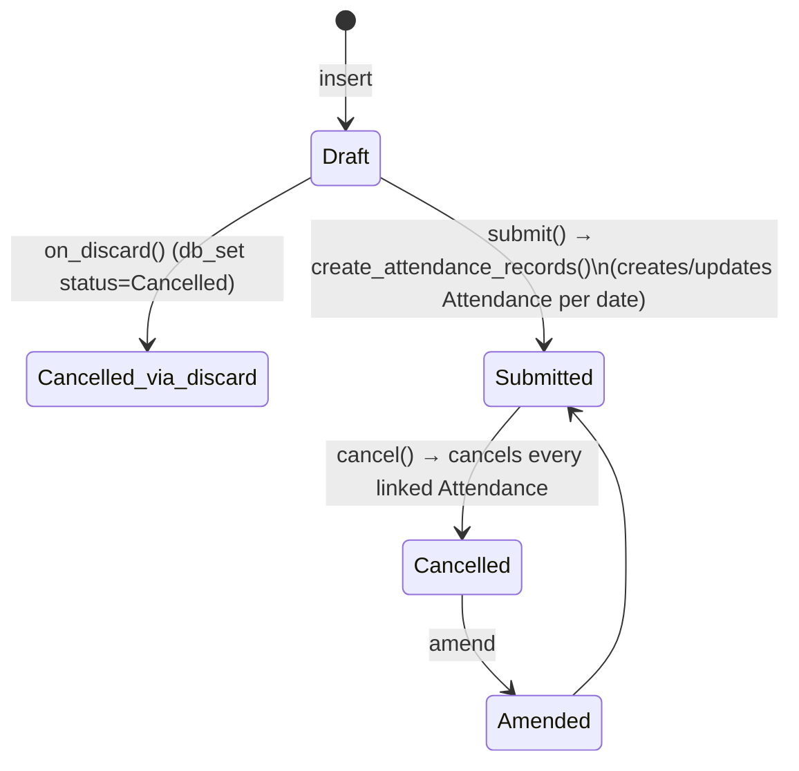

# Attendance Request

A retroactive (or advance) correction mechanism: an employee or HR declares that for a date range the employee was actually working (On Duty) or Working From Home, so that Attendance records for those dates should reflect that instead of being left unmarked or wrongly marked absent. It exists because Employee Checkin-based auto-attendance and manual entry can't always capture legitimate exceptions (forgotten badge, off-site work, WFH) — this doctype is the audited, approvable paper trail for those exceptions and is the *only* Shift & Attendance doctype whose submission directly writes/overwrites Attendance in bulk over a date range.

## Key Fields

| Field | Type | Purpose |
|---|---|---|
| `employee` | Link | Employee the request is for |
| `from_date` / `to_date` | Date | Date range covered |
| `half_day` / `half_day_date` | Check / Date | Marks one day within the range as Half Day instead of full Present/WFH |
| `include_holidays` | Check | If unset, holidays within the range are skipped rather than marked |
| `shift` | Link (Shift Type) | Optional; auto-filled from an active Shift Assignment if the employee has exactly one; required if ambiguous. Does not overwrite the shift on an already-existing Attendance record. |
| `reason` | Select | "Work From Home" or "On Duty" — drives the resulting Attendance status |
| `explanation` | Small Text | Free-text justification |

## Relationships

- [[Employee]] — subject of the request; must be Active.
- [[Shift Type]] — via `shift`; also used indirectly through [[Shift Assignment]] lookup to auto-fill it.
- [[Shift Assignment]] — `get_active_shifts()` queries submitted assignments covering the full request period to infer the shift.
- [[Attendance]] — on submit, creates or updates one Attendance record per eligible day in the range, stamping `attendance_request` back onto it; on cancel, cancels every Attendance it created.
- [[Leave Application]] — days with an approved, submitted Leave Application are skipped (no attendance created/changed for that day).

## Logic — What Happens and Why

**`validate()`**: `validate_active_employee`; `validate_dates` (from-date ≤ to-date); `validate_shifts` — if the employee has exactly one active Shift Assignment spanning the whole period and no shift was chosen, auto-fills it; if multiple, forces the user to pick one (ambiguity must be resolved manually, since Attendance created without a shift can't be told apart later); `validate_half_day` — half-day date must fall within the range; `validate_request_overlap` (`get_overlapping_request`, shift-scoped when `shift` is set) — throws `OverlappingAttendanceRequestError` if another non-cancelled request for the employee already covers an overlapping period; `validate_no_attendance_to_create` — pre-flights `get_attendance_warnings()` and blocks submission entirely if *every* day in the range would be skipped (all holidays/leave/unchanged) and none would even overwrite an existing record — prevents a no-op request from being submitted.

**`get_attendance_warnings()`** (whitelisted, used by the UI to preview before submit): for each date in range, classifies it as Holiday+Skip (unless `include_holidays`), On Leave+Skip, "status unchanged"+Skip (`status_unchanged` compares what the request would set against the existing Attendance), or "already marked"+Overwrite.

**`on_submit()`** → `create_attendance_records()`: for each date, `should_mark_attendance` filters out holidays (unless included) and days with an approved Leave Application; then `create_or_update_attendance`:
- If an Attendance already exists for that employee/date/shift and status differs, it's updated via `db_set` (bypassing full validate) and stamped `attendance_request = self.name`, with a comment logging the status change (audit trail).
- If it's a Half Day record with `half_day_status == "Absent"` and this request marks the whole day (not itself a half-day override), the other-half status is flipped to "Present" — because the request effectively vouches for the whole day now.
- If no Attendance exists yet, a brand-new one is created (`ignore_permissions=True`, since the *submitting* user might not have direct Attendance create rights) with `status` from `get_attendance_status` (Half Day / Work From Home / Present) and submitted immediately.

**`on_cancel()`**: finds every submitted Attendance stamped with this request's name and cancels each — because those Attendance records only exist/hold that status due to this request; undoing the request must undo its effects.

**`on_discard()`**: sets status to "Cancelled" directly via `db_set` for a draft that's discarded rather than formally cancelled post-submit.

**`on_update`/`after_delete`**: `publish_update()` refetches `hrms:my_attendance_requests` (employee) and `hrms:team_attendance_requests` (manager) realtime resources — portal UI freshness only.

## Roles & Permissions

| Role | Can Do | Notes |
|---|---|---|
| [[System Manager]] | Full CRUD + Submit/Cancel/Amend | |
| [[HR Manager]] | Full CRUD + Submit/Cancel/Amend | |
| [[HR User]] | Full CRUD + Submit/Cancel/Amend | Same operational rights as HR Manager. |
| [[Employee]] | Create/Read/Write/Delete | No submit/cancel right in the DocType permissions — `validate_no_attendance_to_create` and the workflow imply requests are meant to be reviewed before submission, but there is no explicit approver/workflow field on this doctype itself (unlike Shift Request's `approver`); submission gating for Employee is enforced purely by the absence of the `submit` permission bit. |

## Mermaid: State/Flow

