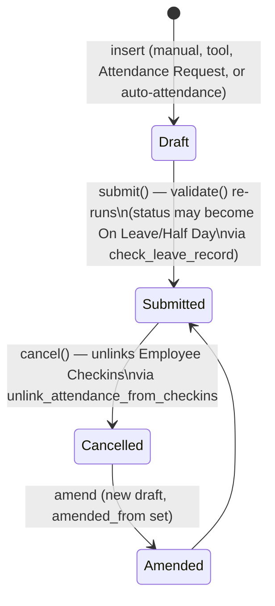

# Attendance

The system of record for whether an employee was present, absent, on leave, half-day, or working from home on a given calendar date. It is the ground truth that payroll (working days, LOP), leave balances, and compliance reporting are built on. Every other attendance-adjacent doctype in this module (Employee Checkin, Attendance Request, Shift Type's auto-marking, Employee Attendance Tool) exists only to produce or correct Attendance records — this is the terminal, submittable doctype.

## Key Fields

| Field | Type | Purpose |
|---|---|---|
| `employee` / `employee_name` | Link / Data | Employee the record belongs to |
| `attendance_date` | Date | The calendar day being marked |
| `status` | Select | Present / Absent / On Leave / Half Day / Work From Home |
| `half_day_status` | Select | For Half Day records: whether the *other* half was Present or Absent |
| `modify_half_day_status` | Check (hidden) | Internal flag marking a Half Day record as still eligible for the other-half status to be auto-updated (e.g. by a later Attendance Request or auto-attendance run) |
| `shift` | Link (Shift Type) | Shift the attendance is tied to; used for overlap and shift-scoped duplicate checks |
| `in_time` / `out_time` | Datetime | First check-in / last check-out used to compute working hours |
| `working_hours` | Float | Computed total hours worked (from Employee Checkin logs) |
| `late_entry` / `early_exit` | Check | Set when auto-attendance detects check-in/out outside shift grace periods |
| `leave_type` / `leave_application` | Link | Populated automatically when an approved Leave Application covers the date |
| `attendance_request` | Link | Set when the record was created/updated by an Attendance Request |
| `overtime_type` / `standard_working_hours` / `actual_overtime_duration` | Link/Float | Overtime bookkeeping when the shift's `allow_overtime` is enabled |
| `amended_from` | Link | Standard amendment trail for a cancelled+resubmitted record |

## Relationships

- [[Employee]] — every Attendance belongs to exactly one Employee; blocked if inactive.
- [[Shift Type]] — linked via `shift`; drives overlap checks and (upstream) is the source of auto-marking.
- [[Employee Checkin]] — checkins link back to the Attendance they were consumed into (`Employee Checkin.attendance`); cancelling Attendance unlinks them.
- [[Attendance Request]] — creates or updates Attendance records for its date range; cancelling the request cancels the Attendance it created.
- [[Leave Application]] — an approved, submitted Leave Application covering the date forces status to On Leave or Half Day.
- [[Shift Assignment]] — cannot be cancelled while an Attendance record references its `shift_type`/date range (checked from the Shift Assignment side).

## Logic — What Happens and Why

**Creation paths** — Attendance is created by (a) manual HR entry, (b) `Employee Attendance Tool.mark_employee_attendance`, (c) `Attendance Request.create_attendance_records` on submit, or (d) automatically by Shift Type's `process_auto_attendance` from Employee Checkin logs. All paths funnel through the same `validate()`.

**`before_insert`**: normalizes an empty-string `half_day_status` to `None` so later `isnull()`/empty checks behave consistently.

**`validate()`** runs, in order:
1. `validate_status` (ERPNext) — restricts `status` to the five allowed values.
2. `validate_active_employee` — throws if the employee is not Active (defense in depth with `validate_employee_status`).
3. `validate_attendance_date` — attendance date cannot precede the employee's `date_of_joining`.
4. `validate_duplicate_record` (`get_duplicate_attendance_record`) — throws `DuplicateAttendanceError` if another non-cancelled Attendance exists for the same employee/date, *unless* the existing one is a Half Day record still open for modification (`modify_half_day_status` truthy) — that case is meant to be updated in place rather than treated as a dup. If `self.shift` is set, the duplicate check is shift-aware: a record with no shift, or the same shift, counts as duplicate; a record for a *different* shift does not (multi-shift-per-day is allowed at this stage).
5. `validate_overlapping_shift_attendance` (`get_overlapping_shift_attendance`) — even if the other Attendance is for a different shift, throws `OverlappingShiftAttendanceError` if that other shift's timings actually overlap this one's (via `has_overlapping_timings`). This is the real guard against double-counting a single physical shift under two shift types.
6. `validate_employee_status` — redundant explicit check that the linked Employee's `status` isn't "Inactive".
7. `check_leave_record` — queries approved, submitted Leave Applications covering `attendance_date`. If found: sets `leave_type`/`leave_application`, and forces `status` to "Half Day" (if `half_day_date` matches) or "On Leave" otherwise, with a `msgprint`. If the current status is On Leave/Half Day but *no* leave record is found, it's treated as an error state — `half_day_status` is forced to "Absent" and `modify_half_day_status` cleared, with an alert (this prevents leave-linked statuses from surviving after the underlying leave is cancelled). Otherwise, if a stale `leave_type` exists on a non-leave status, it is cleared.

**On submit**: no explicit `on_submit` hook — submission is a plain `docstatus` transition; all business validation already happened in `validate()`.

**`on_cancel`**: calls `unlink_attendance_from_checkins`, which clears the `attendance` field on every Employee Checkin that pointed at this record (so those checkins become "unmarked" again and can be reprocessed), and shows the list of unlinked checkins to the user. This is why Employee Checkin blocks editing `time` while `attendance` is still set — cancel Attendance first.

**`on_update` / `after_delete`**: both call `publish_update()`, which triggers a realtime `hrms:attendance_calendar_events` refetch for the employee's portal/desk calendar — pure UI-freshness, no business rule.

**Whitelisted helpers**: `mark_attendance()` and `process_bulk_attendance_in_batches()` are the insert+submit helpers used by Attendance Request and the bulk tool; both wrap creation in a DB savepoint and roll back silently on `DuplicateAttendanceError`/`OverlappingShiftAttendanceError` rather than surfacing the error to a bulk operation. `get_employee_shift()` and `get_unmarked_days()` are read helpers used by the portal calendar and the Employee Attendance Tool/bulk marking to find gaps.

## Roles & Permissions

| Role | Can Do | Notes |
|---|---|---|
| [[System Manager]] | Read/Write/Create/Delete/Submit/Cancel | Full admin control. |
| [[HR User]] | Read/Write/Create/Delete/Submit/Cancel/Import/Export | Same operational rights as HR Manager, no title role. |
| [[HR Manager]] | Read/Write/Create/Delete/Submit/Cancel | Standard HR administration of attendance. |
| [[Employee]] | Read/Export/Print/Select | Not enforced further in code beyond the standard role permission; `select` lets employees pick their own Attendance as a link target elsewhere. No create/write in the DocType permissions — self-service attendance marking (if any) happens via a different whitelisted endpoint, not direct doc creation. |

## Mermaid: State/Flow

