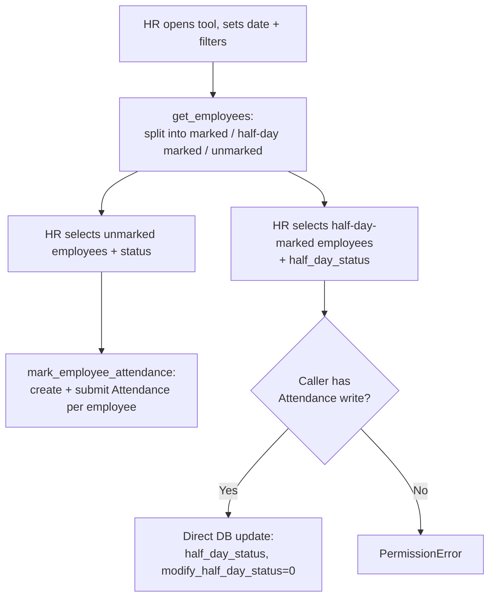

# Employee Attendance Tool

A virtual bulk-marking utility (`issingle: 1`, `is_virtual: 1` — it has no real database table; `db_insert`/`db_update`/`delete`/`save` are all deliberately no-ops) that lets HR mark attendance for many employees on one date in a single action, and see who's already marked/unmarked for that date. It exists as the manual counterpart to Shift Type's automated checkin-based attendance marking — for shops or days where auto-attendance doesn't apply (no checkins, non-shift staff, manual overrides).

## Key Fields

| Field | Type | Purpose |
|---|---|---|
| `date` | Date | The day being marked (defaults Today) |
| `department`, `branch`, `company`, `employment_type`, `designation`, `employee_grade` | Link | Filters to narrow which employees are fetched |
| `shift` / `filter_by_shift` | Link/Check | Optionally restrict the employee list to those on this shift (assigned or default) |
| `status` | Select | Present/Absent/Half Day/Work From Home to bulk-apply to selected unmarked employees |
| `half_day_status` | Select | Present/Absent — status for the "other half" when bulk-marking Half Day employees |
| `late_entry` / `early_exit` | Check | Flags applied to the created Attendance records |
| `unmarked_employees_html`, `marked_attendance_html`, `half_marked_employees_html` | HTML | Client-rendered result grids; not persisted data |

## Relationships

- [[Employee]] — the population being listed and marked.
- [[Attendance]] — this tool's entire purpose is to create/update Attendance records in bulk; it reads existing Attendance for the date to compute "marked" vs "unmarked" and creates new ones for selected unmarked employees.
- [[Shift Assignment]] / [[Shift Type]] — consulted when `filter_by_shift` narrows the candidate list to employees actually on (or defaulted to) the chosen shift.

## Logic — What Happens and Why

Since this is a virtual doctype, all logic lives in whitelisted module functions rather than document lifecycle hooks — there is no validate/submit/cancel to speak of.

**`get_employees(date, ...)`** (whitelisted): builds the Active-employee filter (`date_of_joining <= date`, plus any of department/branch/company/employment_type/designation/employee_grade supplied), then separately fetches: `attendance_list` — submitted Attendance for the date that are *not* still-open half-day records (`modify_half_day_status = 0`); `half_day_attendance_list` — submitted Attendance for the date that *are* still-open half-day records with a `leave_type` set (`modify_half_day_status = 1`); and computes `unmarked_attendance` as every Active employee not appearing in either list (`_get_unmarked_attendance`). If `filter_by_shift`, `_get_unmarked_attendance_with_shift` further restricts the unmarked list to employees with a Shift Assignment for that shift (starting on/before the date) or whose `default_shift` matches. Returns all three buckets so the UI can render "marked", "half-day marked", and "unmarked" employee lists side by side.

**`mark_employee_attendance(employee_list, status, date, ...)`** (whitelisted): for the plain (non-half-day) `employee_list`, creates and submits a new Attendance per employee with the given `status`/`shift`/`late_entry`/`early_exit` — note `leave_type` is hard-reset to `None` inside the loop before the `if status == "On Leave" and leave_type` check, so **On Leave via this tool never actually attaches a leave_type** (the condition can never be true against the just-cleared local variable) — a quirk of the implementation rather than a documented restriction; effectively this tool doesn't support attaching a Leave Type when bulk-marking. If `mark_half_day` is set, requires explicit `Attendance write` permission (`frappe.has_permission(..., throw=True)`, since this path touches existing Half Day Attendance records that may belong to other employees rather than newly-created ones the current save cycle owns), then for each employee in `half_day_employee_list` finds their existing submitted Attendance for the date and updates it via direct `frappe.qb` UPDATE (bypassing controller validate) — setting `half_day_status`, `shift`, `late_entry`, `early_exit`, and clearing `modify_half_day_status` — closing out the half-day record rather than creating a new one, per-record permission-checked again before the update.

## Roles & Permissions

| Role | Can Do | Notes |
|---|---|---|
| [[HR Manager]] | Read/Write/Create | Sole role granted on this tool per the DocType JSON. The half-day bulk-update path additionally requires the caller to hold `Attendance write` permission independently (checked at runtime via `frappe.has_permission`), so an HR Manager without broader Attendance write rights would still be blocked from that specific action — not enforced further for the plain (non-half-day) creation path, which relies on `Attendance.insert()`/`submit()`'s own standard permission checks. |

## Mermaid: State/Flow

Note: This doctype is virtual and single — it has no stored records, no submit/cancel lifecycle, and no `amended_from`; every "state" above is a transient UI action against real [[Attendance]] records.
