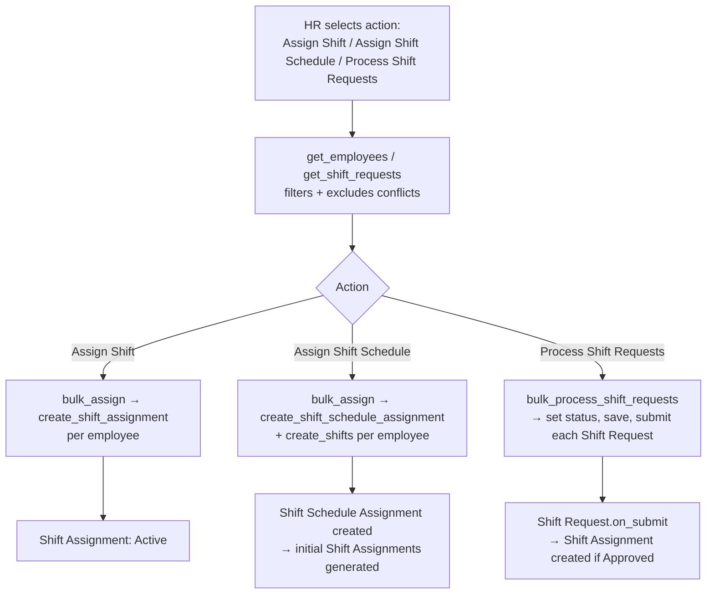

# Shift Assignment Tool

A single/virtual bulk-operations doctype (not a data record — `issingle: 1`) used as the backing form for three HR bulk actions: mass-assigning a shift, mass-attaching a recurring Shift Schedule, or bulk-approving/rejecting pending Shift Requests. It exists so HR doesn't have to open and submit dozens of individual Shift Assignment / Shift Schedule Assignment / Shift Request records by hand.

## Key Fields

| Field | Type | Purpose |
|---|---|---|
| `action` | Select | Assign Shift / Assign Shift Schedule / Process Shift Requests — determines which of the three flows runs |
| `company`, `start_date`, `end_date` | Link/Date | Common parameters for the assign flows |
| `shift_type` | Link | Required for "Assign Shift" |
| `shift_schedule` | Link | Required for "Assign Shift Schedule" |
| `shift_location` | Link | Optional, passed to generated assignments |
| `status` | Select | Active/Inactive stamped on generated Shift Assignments; "Inactive" also relaxes the conflict-exclusion filter (conflicting-active-shift employees aren't excluded from the candidate list) |
| `branch`, `department`, `designation`, `employment_type`, `grade` | Link | Quick filters to narrow the employee candidate list |
| `shift_type_filter`, `approver`, `from_date`, `to_date` | Link/Date | Filters specific to "Process Shift Requests" |
| `filter_list` (HTML) / `employees_html` (HTML) | — | Client-side advanced filter builder and results grid; not persisted business data |

## Relationships

- [[Employee]] — the population being filtered/assigned across all three actions.
- [[Shift Type]] — target shift for "Assign Shift" and for exclusion-overlap checks.
- [[Shift Schedule]] — target pattern for "Assign Shift Schedule".
- [[Shift Schedule Assignment]] — created by `create_shift_schedule_assignment` for each selected employee under "Assign Shift Schedule".
- [[Shift Assignment]] — created via the shared `create_shift_assignment` factory for "Assign Shift" (also reused by [[Shift Schedule Assignment]]'s own generation logic).
- [[Shift Request]] — bulk-approved/rejected under "Process Shift Requests"; doing so submits each with the new status, which (per Shift Request's own `on_submit`) creates its Shift Assignment.

## Logic — What Happens and Why

**`get_employees(advanced_filters)`** (whitelisted): dispatches on `action`. For "Process Shift Requests" → `get_shift_requests` (joins Employee to Draft Shift Requests, optionally filtered by shift type/approver/date range). For the two assignment actions → `get_employees_for_assigning_shift`: base filter is Active employees whose `date_of_joining` is on/before `start_date` and not yet relieved by `start_date` (and, if `end_date` given, not relieved before `end_date` either); then **excludes** employees who would conflict:
  - "Assign Shift Schedule": excludes employees already on a Shift Schedule Assignment covering any of the same weekdays (`get_query_for_employees_with_same_shift_schedule`), further narrowed to genuinely overlapping shift *timings* if `allow_multiple_shift_assignments` is on (via `get_query_checking_overlapping_shift_timings`, which normalizes overnight shifts to a 48-hour clock for comparison).
  - "Assign Shift" with `status == "Active"`: excludes employees with an existing Active Shift Assignment overlapping the date range (`get_query_for_employees_with_shifts`), same overlapping-timings refinement applies. If `status == "Inactive"` is chosen for the *new* assignment, this exclusion is skipped — an inactive assignment being created doesn't need to avoid conflicts, since the docstatus-level uniqueness enforcement lives in Shift Assignment's own `validate_overlapping_shifts`, which itself skips validation when `status == "Inactive"`.

**`bulk_assign(employees)`** (whitelisted): validates mandatory fields per action (`shift_type` for Assign Shift, `shift_schedule` for Assign Shift Schedule, plus `company`/`start_date` always) via `validate_bulk_tool_fields`, then either runs inline (`_bulk_assign`, only if ≤30 employees and action is "Assign Shift") or enqueues a background job — mirroring the same 30-record inline/queue threshold pattern used by Attendance's bulk marking.

**`_bulk_assign(employees)`**: per employee, wrapped in a savepoint so one failure doesn't abort the batch: creates either a Shift Schedule Assignment (`create_shift_schedule_assignment`, then immediately calls its `create_shifts` to materialize the first Shift Assignments) or a plain Shift Assignment (`create_shift_assignment`). Failures are rolled back to the savepoint and logged per-employee; success/failure lists are published via `frappe.publish_realtime` (`completed_bulk_shift_assignment` / `completed_bulk_shift_schedule_assignment`) so the client-side progress UI can report results without polling.

**`bulk_process_shift_requests(shift_requests, status)`** (whitelisted): same ≤30-inline / else-enqueue pattern; `_bulk_process_shift_requests` loads each selected Shift Request, sets `status`, saves, and submits it — triggering that document's own `on_submit` Shift Assignment creation. Publishes `completed_bulk_shift_request_processing` on completion.

**`create_shift_schedule_assignment(employee)`**: builds a Shift Schedule Assignment doc; sets `enabled = 0` if an `end_date` was given on the tool (a bounded assignment shouldn't keep auto-generating past that point) else `enabled = 1`; sets `create_shifts_after = start_date` (the watermark future generation starts from).

**Module-level `create_shift_assignment(...)`**: the single shared factory for creating+submitting a Shift Assignment used by both this tool and [[Shift Schedule Assignment]]'s `create_individual_assignment` — keeping assignment-creation logic in one place.

## Roles & Permissions

| Role | Can Do | Notes |
|---|---|---|
| [[HR User]] | Read/Write/Create | Sole role with access to this tool per the DocType JSON; being a virtual single doctype, "create" effectively means opening/using the tool form itself, and the real authorization checks happen on the underlying doctypes each action writes to (Shift Assignment, Shift Schedule Assignment, Shift Request — each enforces its own role and `ignore_permissions` usage as documented on those pages). Not enforced further in code as to whether HR Manager/System Manager also implicitly get access — only "HR User" appears in `permissions`. |

## Mermaid: State/Flow

