# Shift Assignment

Records that a specific employee is assigned to a specific Shift Type for a date range. This is the operative link between an employee and their working hours — it's what every shift-resolution helper (checkin shift-fetching, auto-attendance's absence sweep, the portal calendar) actually queries to know "what shift is this employee on, on this date".

## Key Fields

| Field | Type | Purpose |
|---|---|---|
| `employee` | Link | Assignee |
| `shift_type` | Link | Which shift |
| `start_date` / `end_date` | Date | Assignment period; open-ended if `end_date` is blank |
| `status` | Select | Active / Inactive — allowed on submit (`allow_on_submit`); Inactive means the assignment no longer counts for overlap/shift-resolution purposes |
| `shift_location` | Link | Optional site; used for geofenced check-in radius validation |
| `overtime_type` | Link | Fetched from `shift_type.overtime_type` if not set explicitly |
| `shift_request` | Link | Set when the assignment was created as a result of an approved Shift Request |
| `shift_schedule_assignment` | Link | Set when generated by a Shift Schedule Assignment's recurring rota |

## Relationships

- [[Employee]] — must be Active.
- [[Shift Type]] — the assigned shift; also checked for timing overlaps against the employee's other active assignments.
- [[Shift Location]] — optional site tie-in for geofencing.
- [[Shift Request]] — one-way: an approved+submitted Shift Request creates exactly one Shift Assignment and stamps it back here.
- [[Shift Schedule Assignment]] — a recurring schedule's `create_shifts` generates individual Shift Assignment records, stamping this field.
- [[Employee Checkin]] / [[Attendance]] — cannot cancel a Shift Assignment while checkins or attendance exist for the employee/shift within its date range.

## Logic — What Happens and Why

**`validate()`**: `validate_active_employee`; `validate_from_to_dates` if `end_date` set; `validate_overlapping_shifts` — unless `status == "Inactive"` (inactive assignments don't need to be conflict-free), fetches other active, submitted assignments overlapping the date range (`get_overlapping_dates`) and: if HR Settings' `allow_multiple_shift_assignments` is on, just warns (unless already submitted, to avoid duplicate warnings); otherwise throws `MultipleShiftError` outright — this is a deliberate policy toggle between "one shift at a time" (default) and "employee can hold concurrent shifts" shops. Even when multiple assignments are permitted at the date level, `throw_overlap_error` still blocks if the *actual shift timings* overlap (`has_overlapping_timings`) — you can have two shifts covering the same dates only if their hours don't clash.

**`on_update_after_submit()`**: re-runs the same date/overlap validation, because `end_date` and `status` are both `allow_on_submit` — a submitted assignment can still be shortened/extended or flipped Inactive, and that must not silently create a new overlap.

**`on_cancel()`**: `validate_employee_checkin` — blocks cancellation if any Employee Checkin exists for this employee+shift+time window (those logs depend on this assignment's shift context); `validate_attendance` — likewise blocks if any Attendance exists for this employee+shift+date range. Only if both are clear does it proceed to `db_set("status", "Inactive")` (bypassing validate/modified-timestamp) — cancellation always demotes the assignment to Inactive rather than leaving it Active-but-cancelled.

**`has_overlapping_timings(shift_1, shift_2)`** (module-level, shared with Attendance/Shift Request): compares two Shift Types' start/end times, normalizing overnight shifts by adding 24h to `end_time` when `end_time <= start_time`, then checks standard interval overlap. This single function is the timing-conflict authority used across Attendance, Shift Assignment, and Shift Request.

**`mark_expired_shift_assignments_as_inactive()`** (daily scheduled job): finds submitted, Active assignments whose `end_date` was before yesterday and flips them to Inactive — this is why `Attendance Request.get_active_shifts()` deliberately still considers assignments regardless of this auto-expiry (comment in that code notes expired assignments are "auto-marked Inactive" but should still count for backdated corrections).

**Shift-resolution engine** (module-level functions, used throughout the module — by Employee Checkin's `fetch_shift`, Shift Type's absence sweep, Attendance's `get_employee_shift`, the portal calendar): `get_employee_shift` → `get_shift_for_timestamp` → `get_shifts_for_date` (queries assignments overlapping a date, including adjacent days for overnight-shift margins) → `get_shift_for_time`/`get_exact_shift` (resolves which exact shift, accounting for grace-period margins and adjusting overlapping adjacent shifts via `_adjust_overlapping_shifts`) → `get_shift_details`/`get_shift_timings` (computes actual start/end datetimes for a specific calendar occurrence of the shift, handling overnight spans). `get_employee_shift_timings` additionally resolves prev/current/next shift together and trims their boundaries against each other. This engine is what "true shift at time X" actually means everywhere else in the module — it is not duplicated logic in Attendance or Employee Checkin, they call into it.

## Roles & Permissions

| Role | Can Do | Notes |
|---|---|---|
| [[Employee]] | Read | View own/team assignments only as permitted by standard record-level rules; no write. |
| [[HR Manager]] | Read/Write/Create/Delete/Submit/Cancel/Amend | Full lifecycle control. |
| [[HR User]] | Read/Write/Create/Submit | No delete/cancel/amend — can create and submit new assignments but not unwind them; cancellation of a live assignment is an HR Manager action. |

## Mermaid: State/Flow

```mermaid
stateDiagram-v2
    [*] --> Draft: insert (manual, Shift Request approval,\nor Shift Schedule Assignment.create_shifts)
    Draft --> Active: submit() — validate_overlapping_shifts
    Active --> Active: on_update_after_submit (edit end_date/status,\nre-validated)
    Active --> Inactive_manual: status set to Inactive (allow_on_submit)
    Active --> Inactive_expired: mark_expired_shift_assignments_as_inactive\n(daily, end_date < yesterday)
    Active --> Cancelled: cancel() — blocked if Checkins/Attendance\nexist in range; else db_set status=Inactive
    Cancelled --> Amended: amend
```

