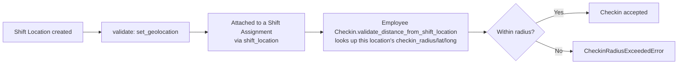

# Shift Location

A named physical site (with coordinates and an allowed check-in radius) that shift work happens at. It exists purely to support geofenced attendance: it is the object [[Employee Checkin]] validates the punch's coordinates against so remote/off-site check-ins can be rejected.

## Key Fields

| Field | Type | Purpose |
|---|---|---|
| `location_name` | Data | Unique name, also the autoname/primary key (`autoname: field:location_name`) |
| `checkin_radius` | Int | Meters within which a checkin is accepted; `0` (or unset) effectively disables the geofence check for this location |
| `latitude` / `longitude` / `geolocation` | Float/Geolocation | The site's coordinates |

## Relationships

- [[Shift Assignment]] — an assignment can pin an employee's shift to a Shift Location; that's the record `Employee Checkin.validate_distance_from_shift_location` actually queries to find which location applies.
- [[Shift Schedule Assignment]] / [[Shift Assignment Tool]] — both can pass a `shift_location` through when generating Shift Assignments.
- [[Employee Checkin]] — indirectly, via the Shift Assignment lookup; this doctype itself has no direct link field back to Checkin.

## Logic — What Happens and Why

**`validate()`** → `set_geolocation()` (whitelisted): derives the `geolocation` field from the entered `latitude`/`longitude` — pure data-normalization, no business rule enforcement here. All enforcement of the radius (`checkin_radius <= 0` skips the check; otherwise a haversine-style `get_distance_between_coordinates` comparison against the checkin's own coordinates) happens in [[Employee Checkin]], not here — this doctype is passive reference data.

## Roles & Permissions

| Role | Can Do | Notes |
|---|---|---|
| [[System Manager]] | Read/Write/Create/Delete | |
| [[HR Manager]] | Read/Write/Create/Delete | |
| [[HR User]] | Read/Write/Create/Delete | Same full rights as HR Manager for this reference data. |
| [[Employee]] | Read | View-only. |

## Mermaid: State/Flow

Note: Shift Location is not submittable — it has no draft/submit/cancel lifecycle, only plain create/edit/delete.
